[](https://github.com/sindresorhus/awesome)
[](https://arxiv.org/abs/2504.11734)

# Overview

> 🏆 **A Curated List of 3D Object and Scene Generation Papers**
>
> 📅 **Scope**: This repository primarily collects high-quality literature published between **2020 and 2025** in **top-tier conferences and journals** across the fields of Computer Graphics, Computer Vision, and Artificial Intelligence (including but not limited to **SIGGRAPH, TOG, CVPR, ICCV, ECCV, NeurIPS, and ICLR**).
>
> 📝 **Notation**: The term "Pub." in the fourth column is an abbreviation for "Publication," denoting the specific venue (conference or journal) where the paper was published.
>
> 🔄 **Maintenance**: This repository is actively maintained. If you identify any errors or omissions during your review, please feel free to submit an Issue for correction.
>
> 🤝 **Contribution**: We warmly welcome recommendations for the latest research in the field of 3D Content Generation (3D AIGC). Your contributions will significantly enhance the academic value and robustness of this repository.
>
> 🌟 **Citation**: If this repository offers insight or assistance to your research, please consider citing us!
>
> ```
> @article{tang2025recent,
>   title={Recent Advance in 3D Object and Scene Generation: A Survey},
>   author={Tang, Xiang and Li, Ruotong and Fan, Xiaopeng},
>   journal={arXiv preprint arXiv:2504.11734},
>   year={2025}
> }
> ```

# 3D Object Generation Methods

## Shape

### Variational Autoencoders

|                   Preview                   | Title                                                        | Year | Pub. |                            Links                             |
| :-----------------------------------------: | :----------------------------------------------------------- | ---- | :--: | :----------------------------------------------------------: |
| 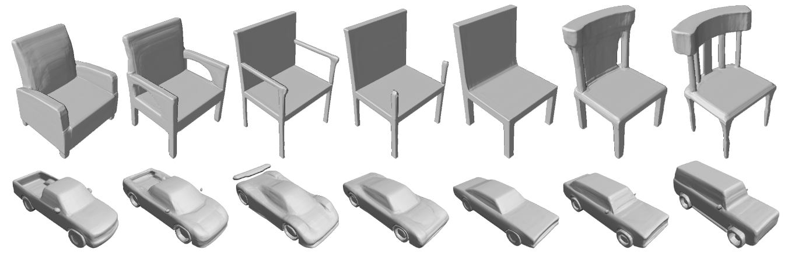 | [DeepSDF: Learning Continuous Signed Distance Functions for Shape Representation](https://arxiv.org/abs/1901.05103) | 2019 | CVPR | [](https://github.com/facebookresearch/DeepSDF) |
| 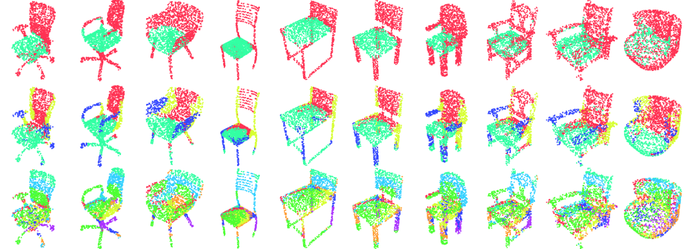  | [SetVAE: Learning Hierarchical Composition for Generative Modeling of Set-Structured Data](https://arxiv.org/abs/2103.15619) | 2021 | CVPR | [](https://github.com/jw9730/setvae) |

### Generative Adversarial Networks

|                   Preview                   | Title                                                        | Year | Pub. |                            Links                             |
| :-----------------------------------------: | :----------------------------------------------------------- | ---- | :--: | :----------------------------------------------------------: |
| 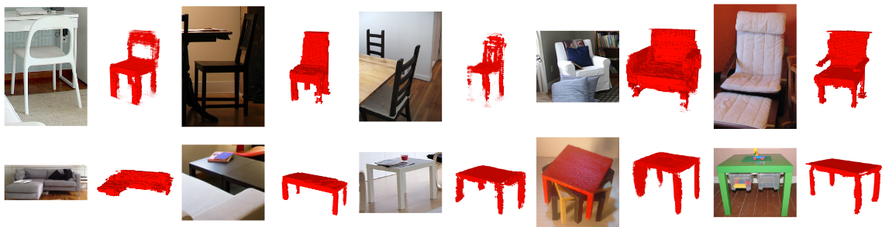  | [Learning a Probabilistic Latent Space of Object Shapes via 3D Generative-Adversarial Modeling](https://arxiv.org/abs/1610.07584) | 2016 | NIPS | [](https://github.com/black0017/3D-GAN-pytorch) |
| 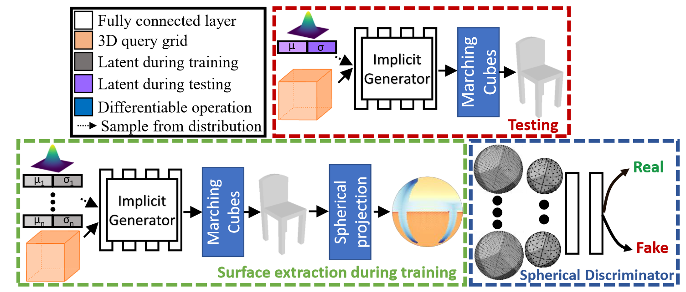 | [SurfGen: Adversarial 3D Shape Synthesis with Explicit Surface Discriminators](https://arxiv.org/abs/2201.00112) | 2022 | ICCV | [](https://github.com/aluo-x/NeuralRaycaster) |

### Autoregressive Models

|                      Preview                      | Title                                                        | Year | Pub. |                            Links                             |
| :-----------------------------------------------: | :----------------------------------------------------------- | ---- | :--: | :----------------------------------------------------------: |
|   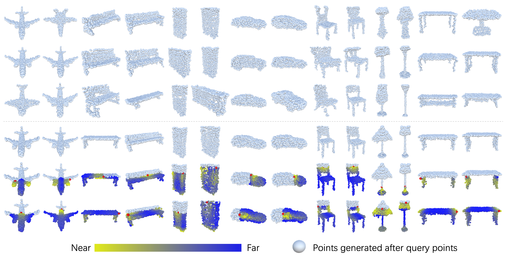   | [PointGrow: Autoregressively Learned Point Cloud Generation with Self-Attention](https://arxiv.org/abs/1810.05591) | 2018 | WACV | [](https://github.com/syb7573330/PointGrow)[](https://liuziwei7.github.io/projects/PointGrow) |
|    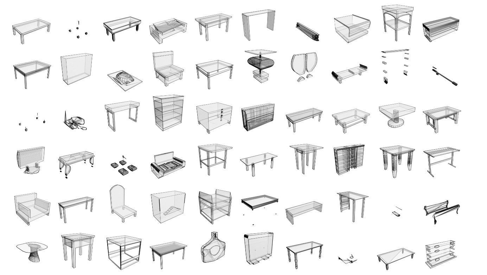    | [PolyGen: An Autoregressive Generative Model of 3D Meshes](https://arxiv.org/abs/2002.10880) | 2020 | ICML | [](https://github.com/google-deepmind/deepmind-research) |
|  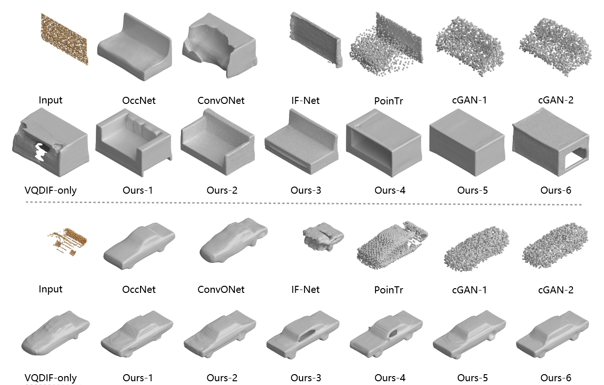  | [ShapeFormer: Transformer-based Shape Completion via Sparse Representation](https://arxiv.org/abs/2201.10326) | 2022 | CVPR | [](https://github.com/qheldiv/shapeformer)[](https://shapeformer.github.io/) |
|    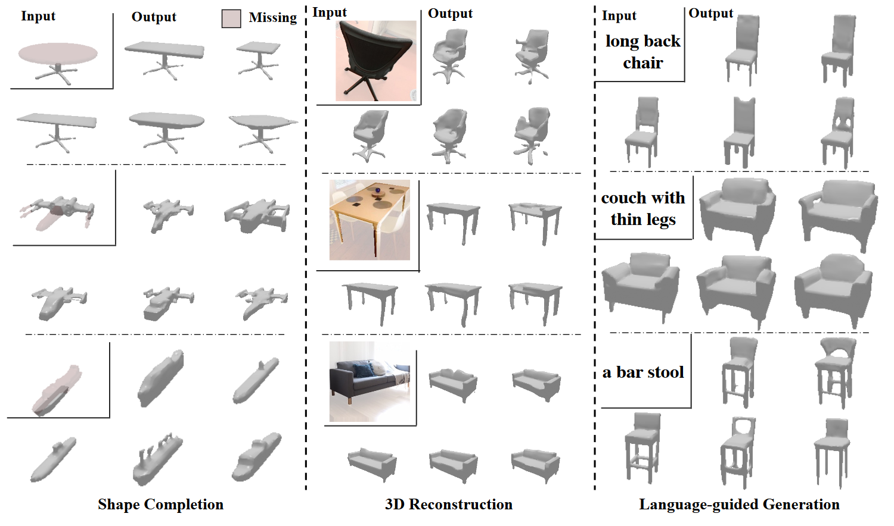    | [AutoSDF: Shape Priors for 3D Completion, Reconstruction and Generation](https://arxiv.org/abs/2203.09516) | 2022 | CVPR | [](https://github.com/yccyenchicheng/AutoSDF)[](https://yccyenchicheng.github.io/AutoSDF/) |
| 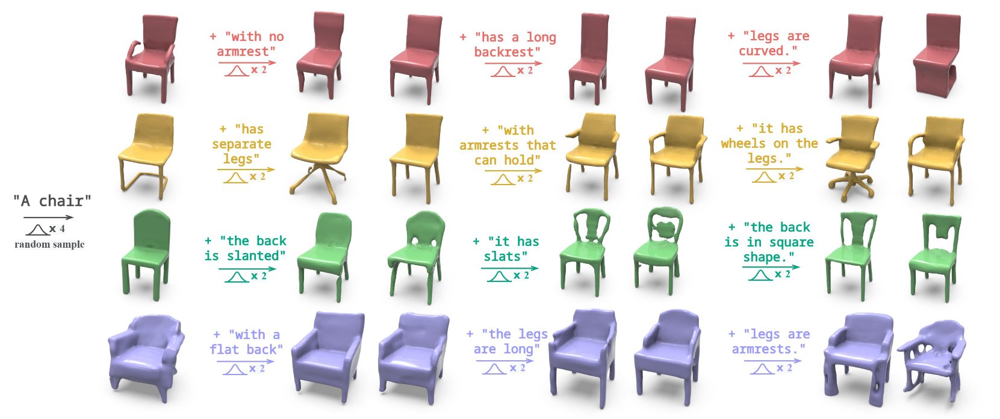  | [ShapeCrafter: A Recursive Text-Conditioned 3D Shape Generation Model](https://arxiv.org/abs/2207.09446) | 2022 | NIPS | [](https://github.com/FreddieRao/ShapeCrafter)[](https://ivl.cs.brown.edu/research/shapecrafter.html) |
| 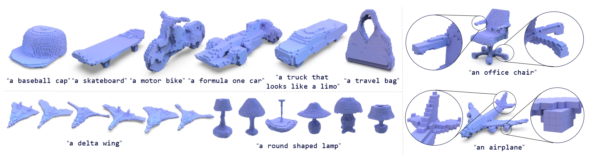 | [CLIP-Sculptor: Zero-Shot Generation of High-Fidelity and Diverse Shapes from Natural Language](https://arxiv.org/abs/2211.01427) | 2022 | CVPR | [](https://ivl.cs.brown.edu/research/clip-sculptor.html) |
|    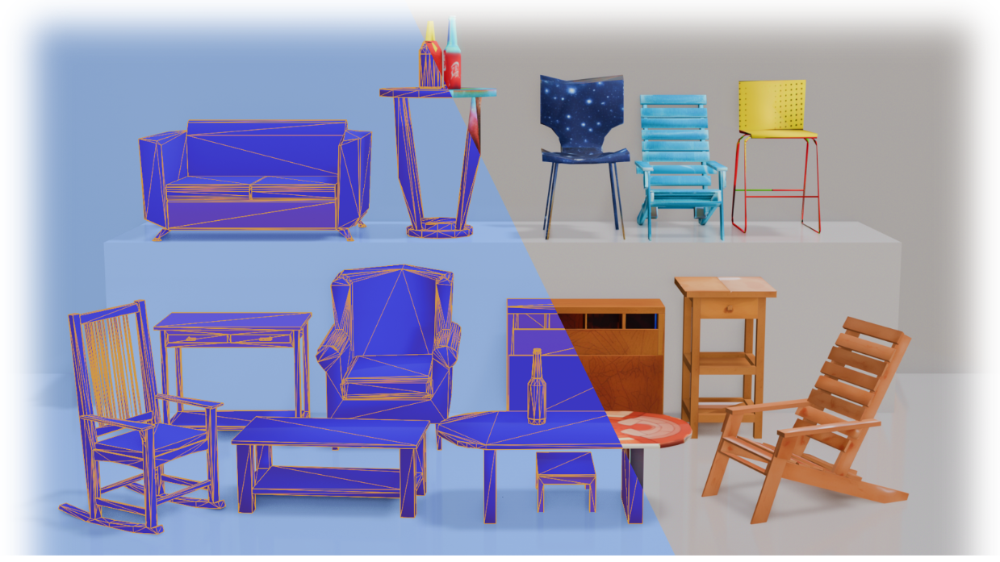     | [MeshXL: Neural Coordinate Field for Generative 3D Foundation Models](https://arxiv.org/abs/2405.20853) | 2024 | NIPS | [](https://github.com/OpenMeshLab/MeshXL)[](https://meshxl.github.io/) |

### Diffusion Models

|                     Preview                      | Title                                                        | Year | Pub.  |                            Links                             |
| :----------------------------------------------: | ------------------------------------------------------------ | ---- | :---: | :----------------------------------------------------------: |
|     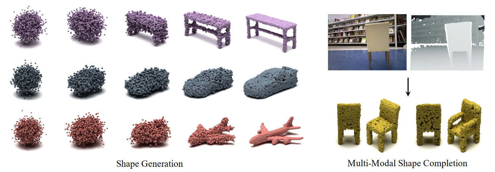      | [3D Shape Generation and Completion through Point-Voxel Diffusion](https://arxiv.org/abs/2104.03670) | 2021 | ICCV  | [](https://github.com/alexzhou907/PVD)[](https://alexzhou907.github.io/pvd) |
|   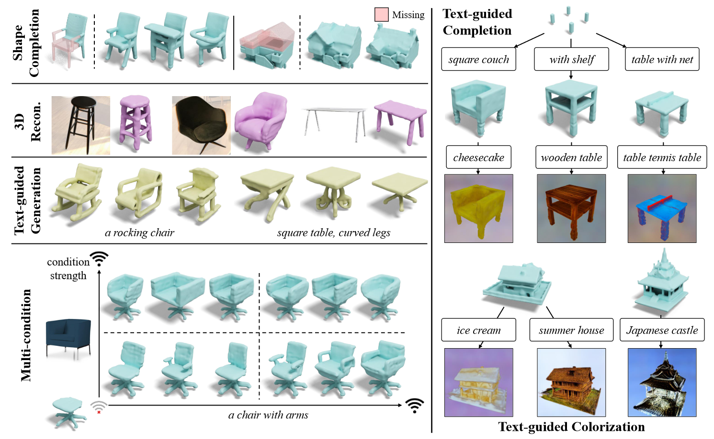   | [SDFusion: Multimodal 3D Shape Completion, Reconstruction, and Generation](https://arxiv.org/abs/2212.04493) | 2022 | CVPR  | [](https://github.com/yccyenchicheng/SDFusion)[](https://yccyenchicheng.github.io/SDFusion/) |
| 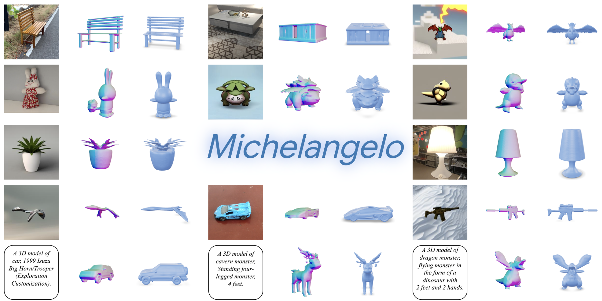 | [Michelangelo: Conditional 3D Shape Generation based on Shape-Image-Text Aligned Latent Representation](https://arxiv.org/abs/2306.17115) | 2023 | NIPS  | [](https://github.com/NeuralCarver/Michelangelo)[](https://neuralcarver.github.io/michelangelo/) |
|   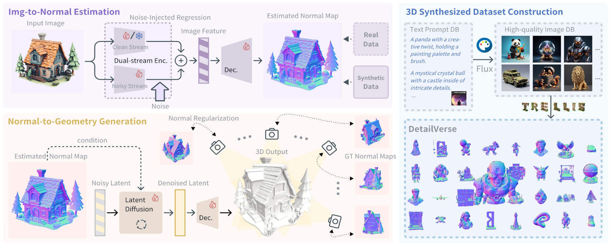    | [Hi3DGen: High-fidelity 3D Geometry Generation from Images via Normal Bridging](https://arxiv.org/abs/2503.22236) | 2025 | ICCV  | [](https://stable-x.github.io/Hi3DGen/)[](https://stable-x.github.io/Hi3DGen/) |
|   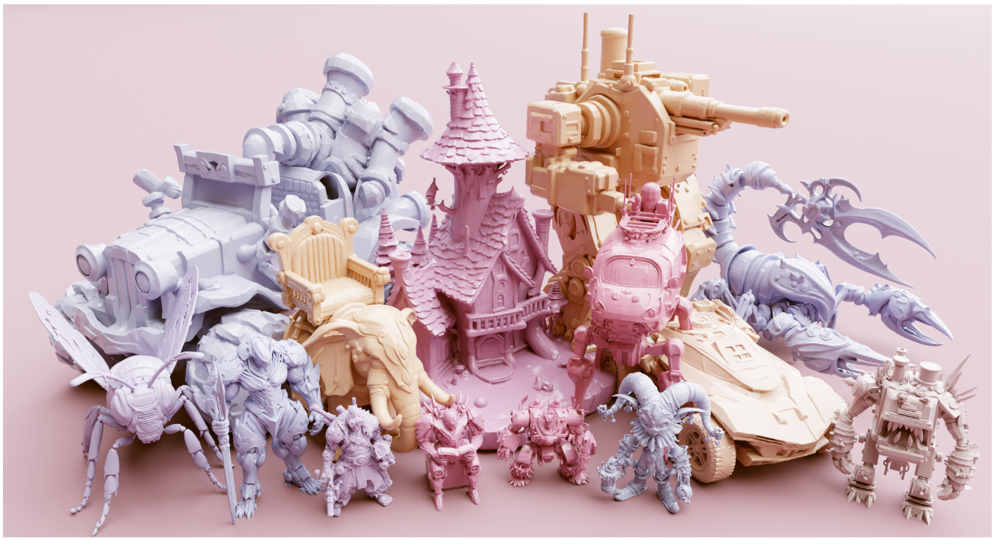   | [Direct3D-S2: Gigascale 3D Generation Made Easy with Spatial Sparse Attention](https://arxiv.org/abs/2505.17412) | 2025 | NIPS  | [](https://github.com/DreamTechAI/Direct3D-S2)[](https://www.neural4d.com/research-page/direct3d-s2/index.html) |
|   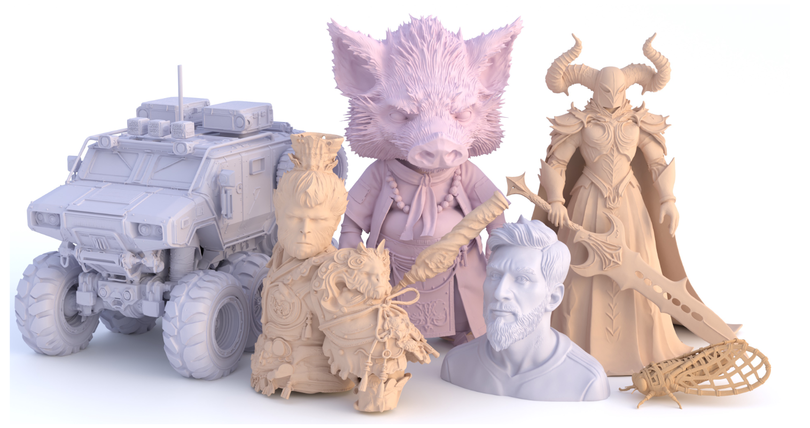    | [Ultra3D: Efficient and High-Fidelity 3D Generation with Part Attention](https://arxiv.org/abs/2507.17745) | 2025 | Arxiv | [](https://buaacyw.github.io/ultra3d/) |

## Texture

|                     Preview                      | Title                                                        | Year |     Pub.      |                            Links                             |
| :----------------------------------------------: | ------------------------------------------------------------ | ---- | :-----------: | :----------------------------------------------------------: |
|   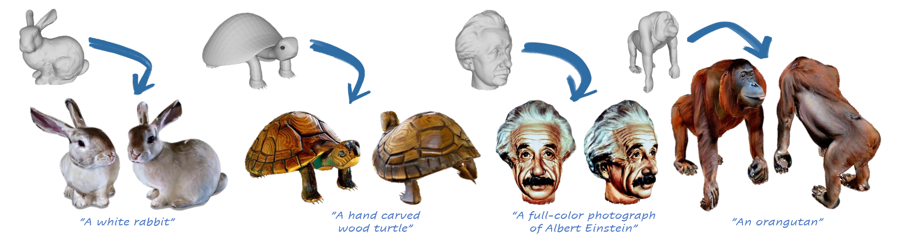    | [TEXTure: Text-Guided Texturing of 3D Shapes](https://arxiv.org/abs/2302.01721) | 2023 |   SIGGRAPH    | [](https://github.com/TEXTurePaper/TEXTurePaper)[](https://texturepaper.github.io/TEXTurePaper/) |
|   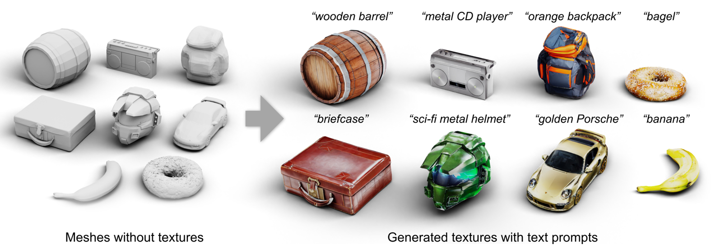   | [Text2Tex: Text-driven Texture Synthesis via Diffusion Models](https://arxiv.org/abs/2303.11396) | 2023 |     ICCV      | [](https://github.com/daveredrum/Text2Tex)[](https://daveredrum.github.io/Text2Tex/) |
|  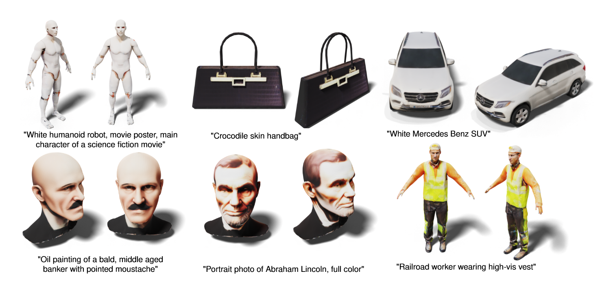   | [TexFusion: Synthesizing 3D Textures with Text-Guided Image Diffusion Models](https://arxiv.org/abs/2310.13772) | 2023 |     ICCV      | [](https://research.nvidia.com/labs/toronto-ai/texfusion/) |
|   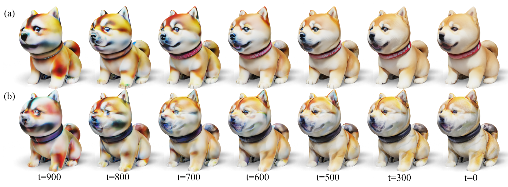    | [Text-Guided Texturing by Synchronized Multi-View Diffusion](https://arxiv.org/abs/2311.12891) | 2023 | SIGGRAPH Aisa | [](https://github.com/LIU-Yuxin/SyncMVD) |
|   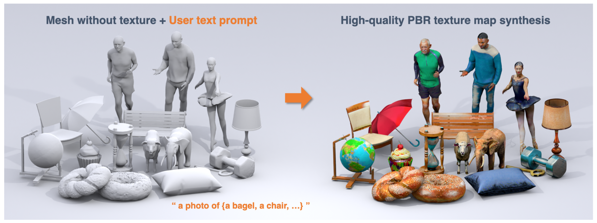    | [Paint-it: Text-to-Texture Synthesis via Deep Convolutional Texture Map Optimization and Physically-Based Rendering](https://arxiv.org/abs/2312.11360) | 2023 |     CVPR      | [](https://github.com/kaist-ami/Paint-it)[](https://kim-youwang.github.io/paint-it) |
|  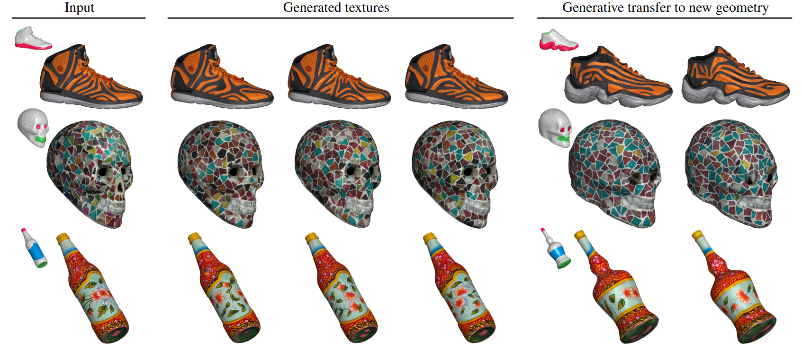  | [Single Mesh Diffusion Models with Field Latents for Texture Generation](https://arxiv.org/abs/2312.09250) | 2023 |     CVPR      | [](https://github.com/google-research/google-research/tree/master/mesh_diffusion)[](https://single-mesh-diffusion.github.io/) |
|   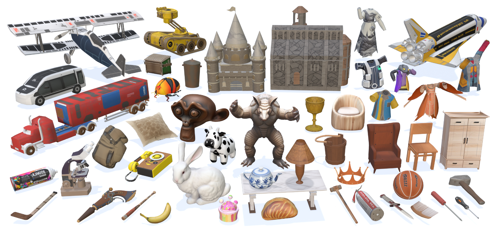    | [Paint3D: Paint Anything 3D with Lighting-Less Texture Diffusion Models](https://arxiv.org/abs/2312.13913) | 2023 |     Arxiv     | [](https://github.com/OpenTexture/Paint3D)[](https://paint3d.github.io/) |
|    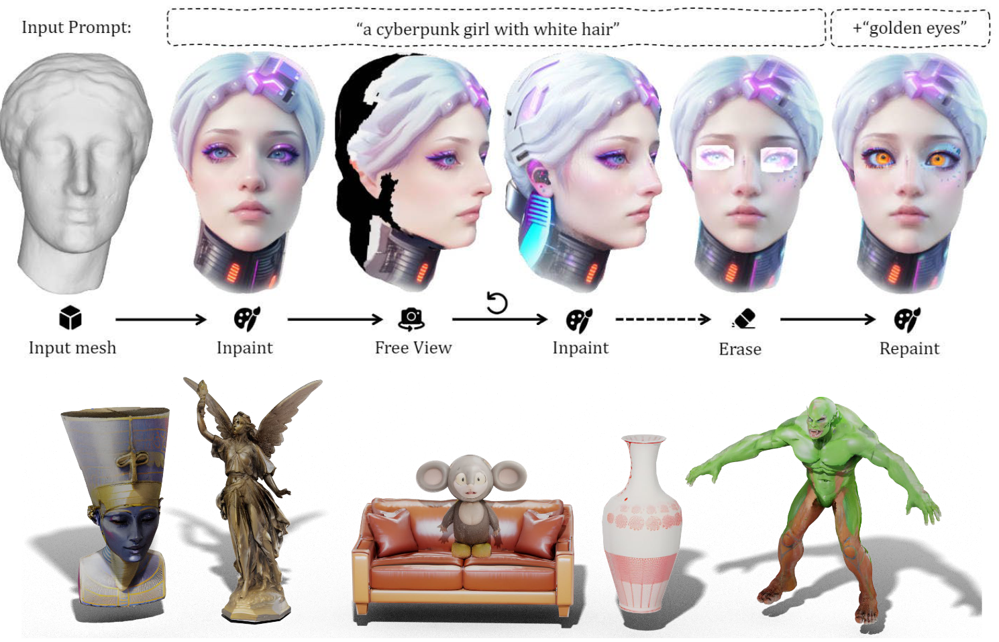     | [InTeX: Interactive Text-to-texture Synthesis via Unified Depth-aware Inpainting](https://arxiv.org/abs/2403.11878) | 2024 |     Arxiv     | [](https://github.com/ashawkey/InTeX)[](https://me.kiui.moe/intex/) |
|     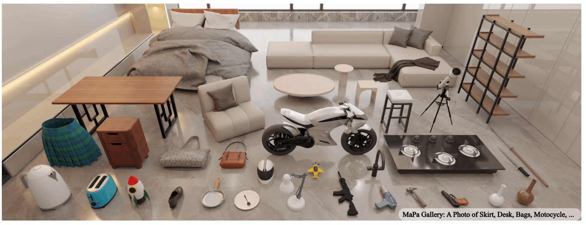     | [MaPa: Text-driven Photorealistic Material Painting for 3D Shapes](https://arxiv.org/abs/2404.17569) | 2024 |   SIGGRAPH    |                              /                               |
|     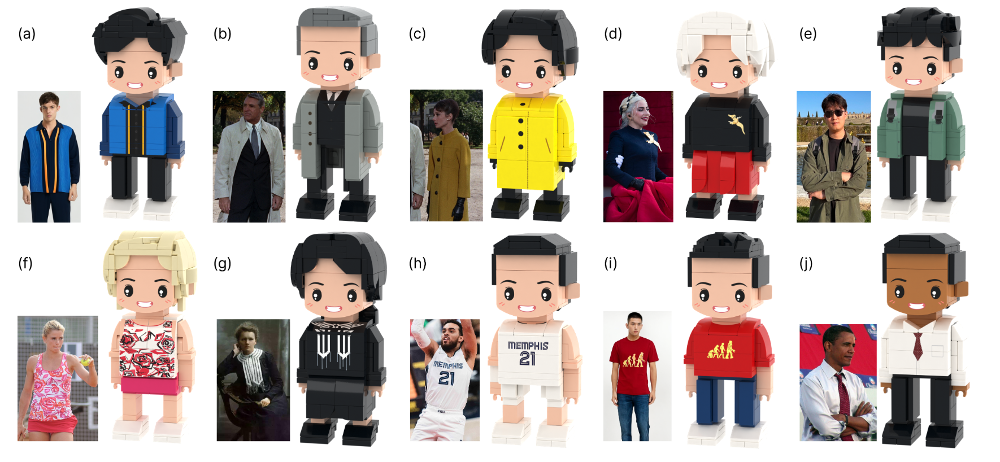     | [Creating LEGO Figurines from Single Images](https://dl.acm.org/doi/abs/10.1145/3658167) | 2024 |   SIGGRAPH    |                              /                               |
|  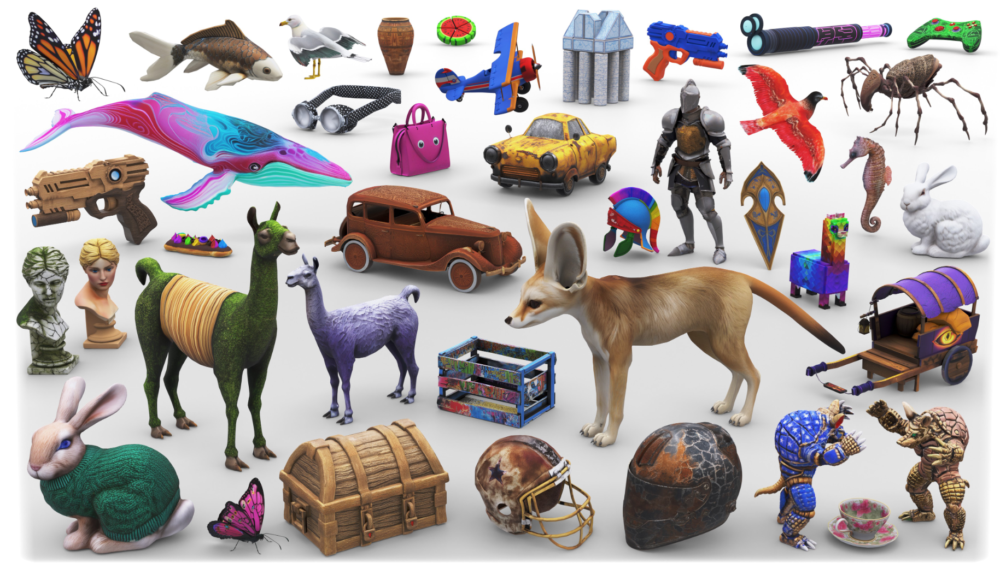   | [Meta 3D TextureGen: Fast and Consistent Texture Generation for 3D Objects](https://arxiv.org/abs/2407.02430) | 2024 |     Arxiv     |                              /                               |
|    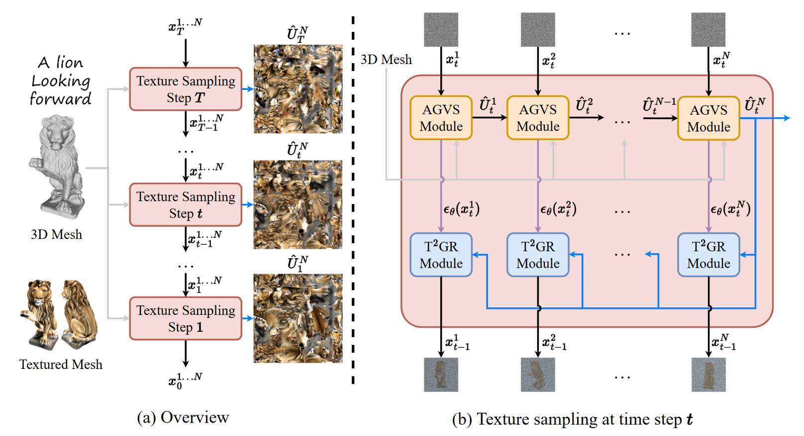    | [TexGen: Text-Guided 3D Texture Generation with Multi-view Sampling and Resampling](https://arxiv.org/abs/2408.01291) | 2024 |     ECCV      | [](https://dong-huo.github.io/TexGen/) |
|   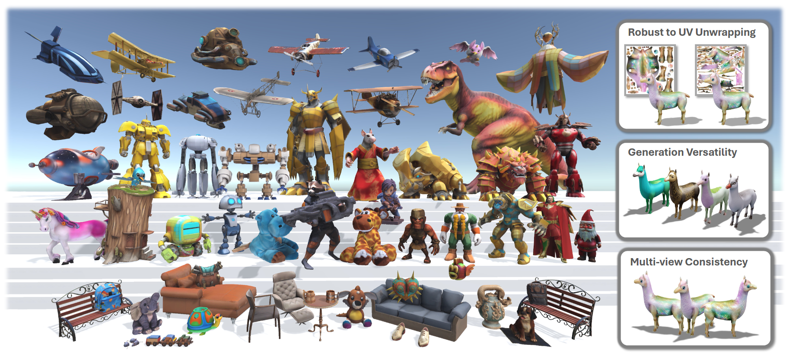    | [MVPaint: Synchronized Multi-View Diffusion for Painting Anything 3D](https://arxiv.org/abs/2411.02336) | 2024 |     CVPR      | [](https://github.com/3DTopia/MVPaint)[](https://mvpaint.github.io/) |
| 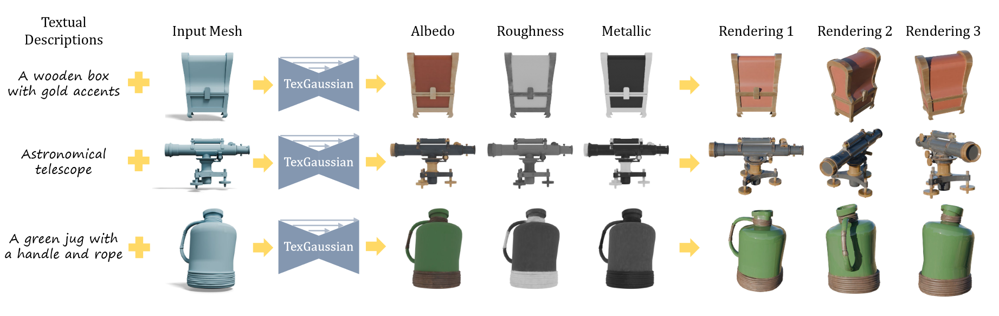  | [TexGaussian: Generating High-quality PBR Material via Octree-based 3D Gaussian Splatting](https://arxiv.org/abs/2411.19654) | 2024 |     CVPR      | [](https://github.com/ymxbj/TexGaussian)[](https://3d-aigc.github.io/TexGaussian/) |
|    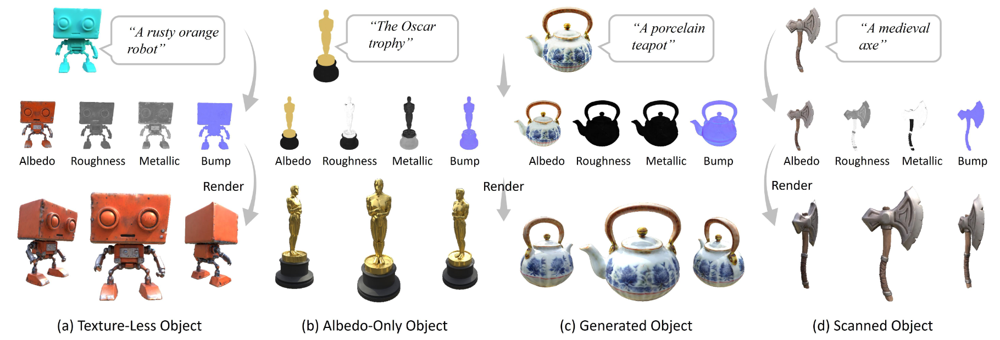    | [Material Anything: Generating Materials for Any 3D Object via Diffusion](https://arxiv.org/abs/2411.15138) | 2024 |     Arxiv     | [](https://github.com/3DTopia/MaterialAnything)[](https://xhuangcv.github.io/MaterialAnything/) |
|  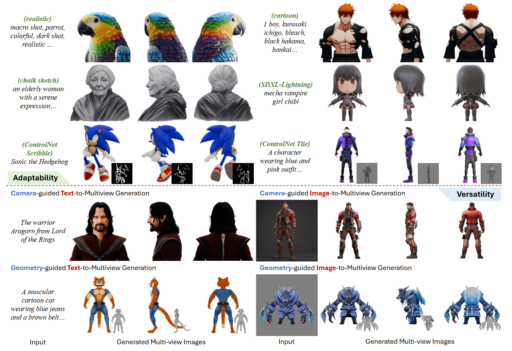   | [MV-Adapter: Multi-view Consistent Image Generation Made Easy](https://arxiv.org/abs/2412.03632) | 2024 |     ICCV      | [](https://github.com/huanngzh/MV-Adapter)[](https://huanngzh.github.io/MV-Adapter-Page/) |
| 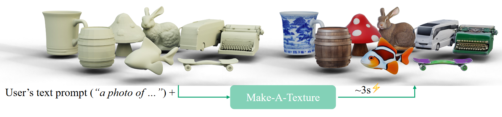 | [Make-A-Texture: Fast Shape-Aware Texture Generation in 3 Seconds](https://arxiv.org/abs/2412.07766) | 2024 |     WACV      | [](https://mukosame.github.io/make-a-texture/) |
|   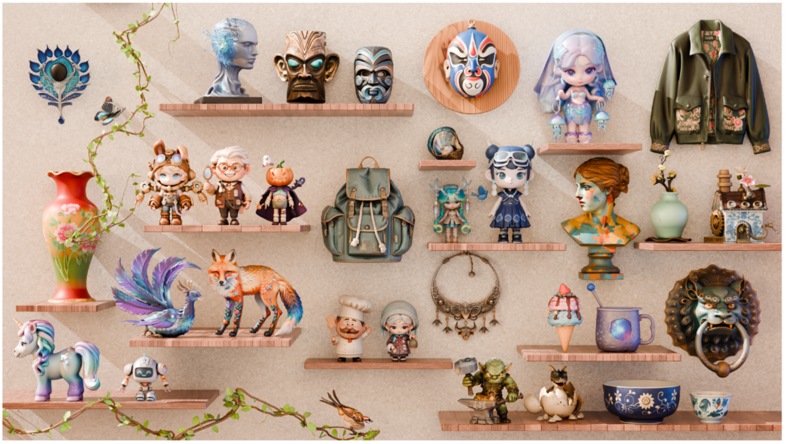   | [RomanTex: Decoupling 3D-aware Rotary Positional Embedded Multi-Attention Network for Texture Synthesis](https://arxiv.org/abs/2503.19011) | 2025 |     ICCV      | [](https://github.com/oakshy/RomanTex)[](https://oakshy.github.io/RomanTex/) |
|    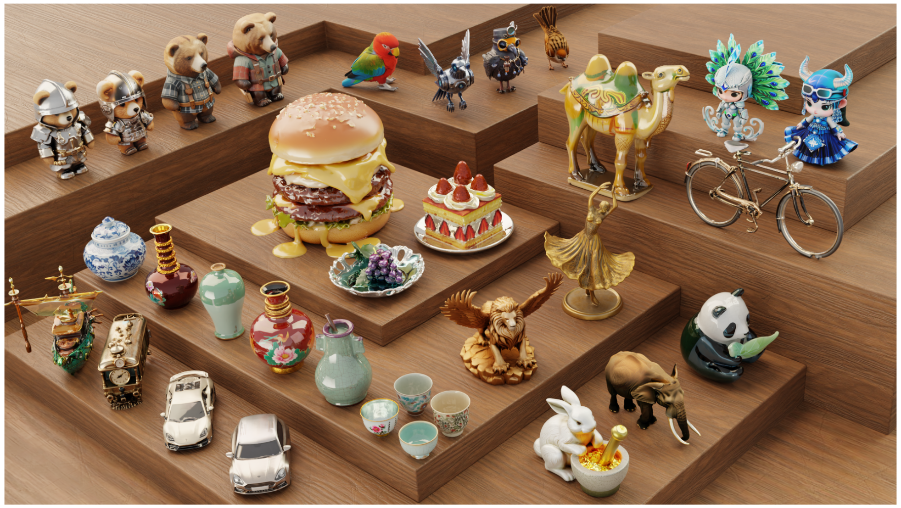    | [MaterialMVP: Illumination-Invariant Material Generation via Multi-view PBR Diffusion](https://arxiv.org/abs/2503.10289) | 2025 |     ICCV      | [](https://github.com/ZebinHe/MaterialMVP)[](https://zebinhe.github.io/MaterialMVP/) |

## Both

### Generative Adversarial Networks

|                     Preview                     | Title                                                        | Year | Pub. |                            Links                             |
| :---------------------------------------------: | ------------------------------------------------------------ | ---- | :--: | :----------------------------------------------------------: |
| 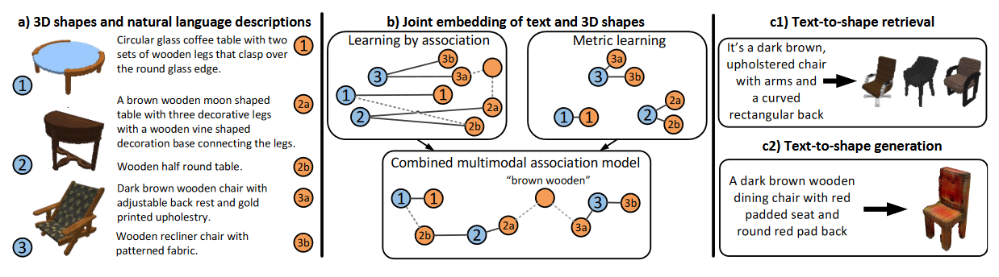  | [Text2Shape: Generating Shapes from Natural Language by Learning Joint Embeddings](https://arxiv.org/abs/1803.08495) | 2018 | ACCV | [](https://github.com/kchen92/text2shape)[](http://text2shape.stanford.edu/) |
|   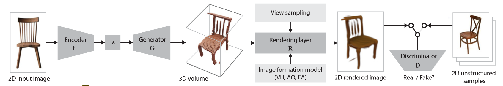    | [Escaping Plato's Cave: 3D Shape From Adversarial Rendering](https://arxiv.org/abs/1811.11606) | 2018 | ICCV | [](https://github.com/henzler/platonicgan)[](https://geometry.cs.ucl.ac.uk/projects/2019/platonicgan/) |
|   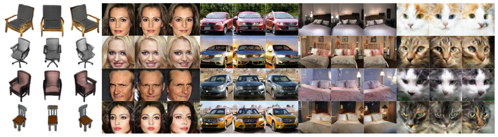   | [HoloGAN: Unsupervised learning of 3D representations from natural images](https://arxiv.org/abs/1904.01326) | 2019 | ICCV | [](https://github.com/thunguyenphuoc/HoloGAN)[](https://www.monkeyoverflow.com/#/hologan-unsupervised-learning-of-3d-representations-from-natural-images/) |
|  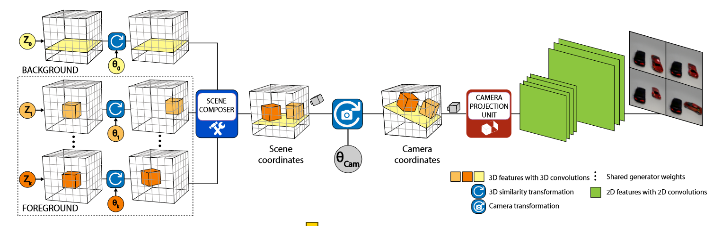   | [BlockGAN: Learning 3D Object-aware Scene Representations from Unlabelled Images](https://arxiv.org/abs/2002.08988) | 2020 | NIPS | [](https://github.com/thunguyenphuoc/BlockGAN)[](https://www.monkeyoverflow.com/#/blockgan/) |
|  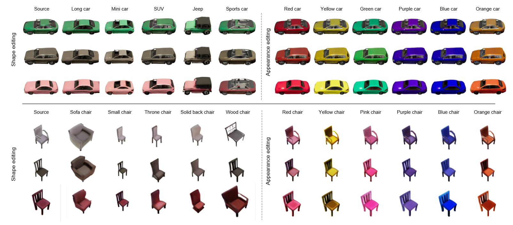   | [CLIP-NeRF: Text-and-Image Driven Manipulation of Neural Radiance Fields](https://arxiv.org/abs/2112.05139) | 2021 | CVPR | [](https://github.com/cassiePython/CLIPNeRF)[](https://cassiepython.github.io/clipnerf/) |
|    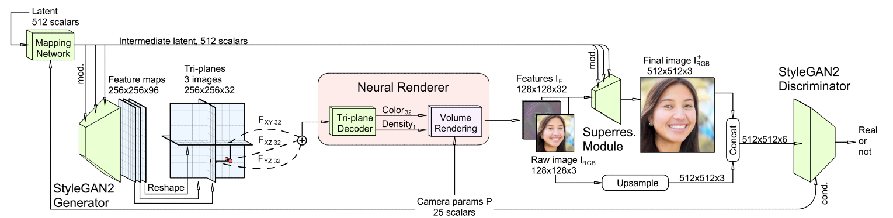     | [Efficient Geometry-aware 3D Generative Adversarial Networks](https://arxiv.org/abs/2112.07945) | 2021 | CVPR | [](https://github.com/NVlabs/eg3d)[](https://nvlabs.github.io/eg3d/) |
|    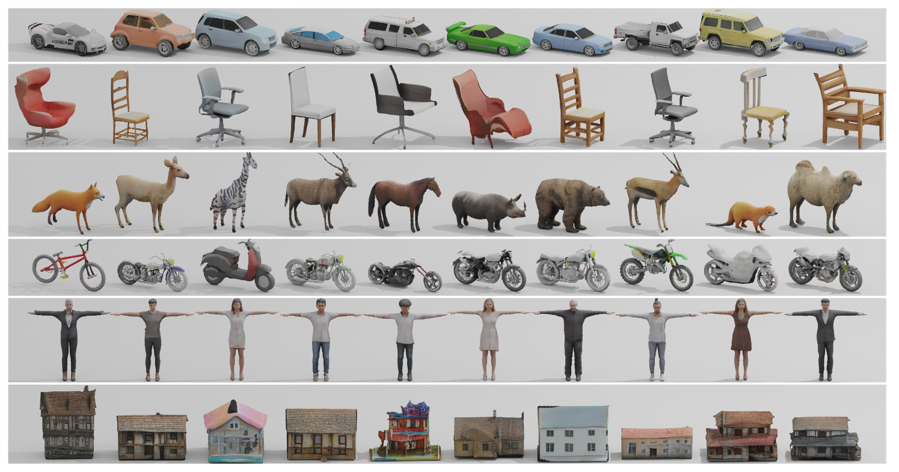    | [GET3D: A Generative Model of High Quality 3D Textured Shapes Learned from Images](https://arxiv.org/abs/2209.11163) | 2022 | NIPS | [](https://github.com/nv-tlabs/GET3D)[](https://research.nvidia.com/labs/toronto-ai/GET3D/) |
| 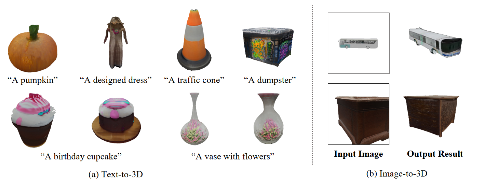 | [TextField3D: Towards Enhancing Open-Vocabulary 3D Generation with Noisy Text Fields](https://arxiv.org/abs/2309.17175) | 2023 | ICLR | [](https://tyhuang0428.github.io/textfield3d.html) |
|    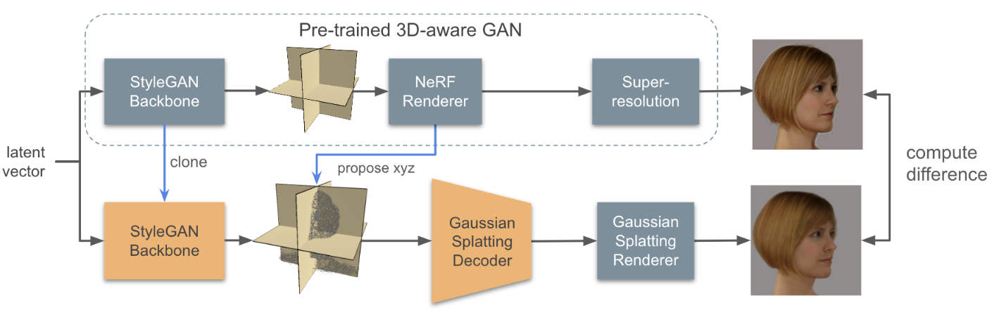    | [Gaussian Splatting Decoder for 3D-aware Generative Adversarial Networks](https://arxiv.org/abs/2404.10625) | 2024 | CVPR | [](https://github.com/fraunhoferhhi/gaussian_gan_decoder) |

### Diffusion Models

**Optimization-based Methods via Score Distillation**

|                       Preview                       | Title                                                        | Year | Pub. |                            Links                             |
| :-------------------------------------------------: | ------------------------------------------------------------ | ---- | :--: | :----------------------------------------------------------: |
|   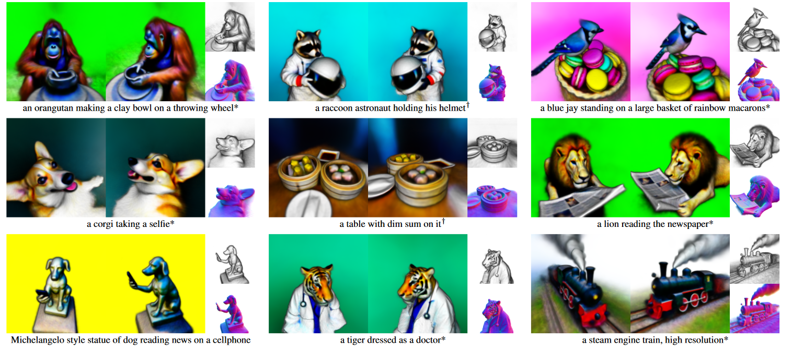   | [DreamFusion: Text-to-3D using 2D Diffusion](https://arxiv.org/abs/2209.14988) | 2022 | ICLR | [](https://github.com/ashawkey/stable-dreamfusion)[](https://dreamfusion3d.github.io/) |
|     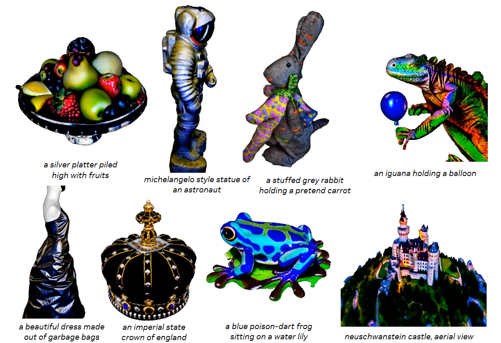     | [Magic3D: High-Resolution Text-to-3D Content Creation](https://arxiv.org/abs/2211.10440) | 2022 | CVPR | [](https://research.nvidia.com/labs/dir/magic3d/) |
|     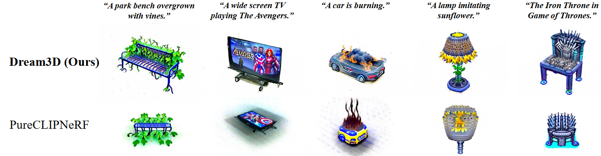     | [Dream3D: Zero-Shot Text-to-3D Synthesis Using 3D Shape Prior and Text-to-Image Diffusion Models](https://arxiv.org/abs/2212.14704) | 2022 | CVPR | [](https://www.youtube.com/watch?v=rjomF5oe4_M) |
|   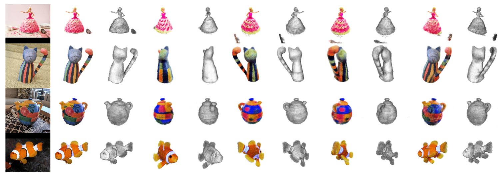    | [RealFusion: 360° Reconstruction of Any Object from a Single Image](https://arxiv.org/abs/2302.10663) | 2023 | CVPR | [](https://github.com/lukemelas/realfusion)[](https://lukemelas.github.io/realfusion/) |
|    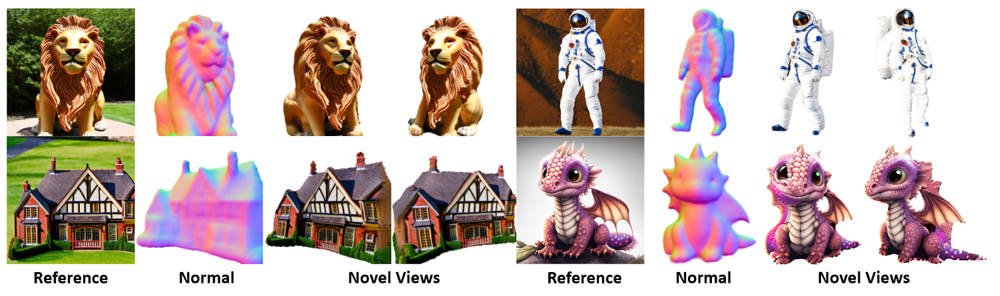     | [Make-It-3D: High-Fidelity 3D Creation from A Single Image with Diffusion Prior](https://arxiv.org/abs/2303.14184) | 2023 | ICCV | [](https://github.com/junshutang/Make-It-3D)[](https://make-it-3d.github.io/) |
|   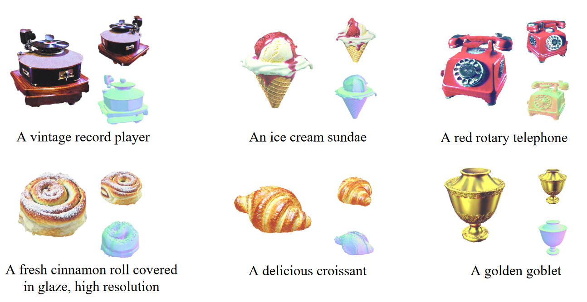    | [Fantasia3D: Disentangling Geometry and Appearance for High-quality Text-to-3D Content Creation](https://arxiv.org/abs/2303.13873) | 2023 | ICCV | [](https://github.com/Gorilla-Lab-SCUT/Fantasia3D)[](https://fantasia3d.github.io/) |
|    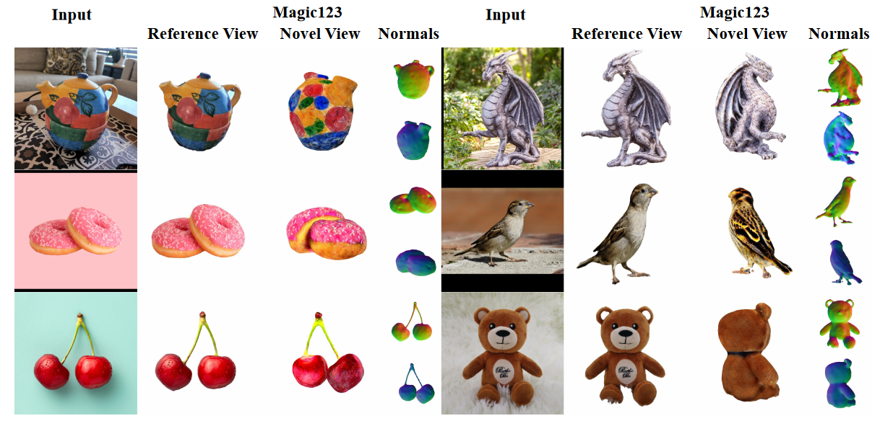     | [Magic123: One Image to High-Quality 3D Object Generation Using Both 2D and 3D Diffusion Priors](https://arxiv.org/abs/2306.17843) | 2023 | ICLR | [](https://github.com/guochengqian/Magic123)[](https://guochengqian.github.io/project/magic123/) |
|  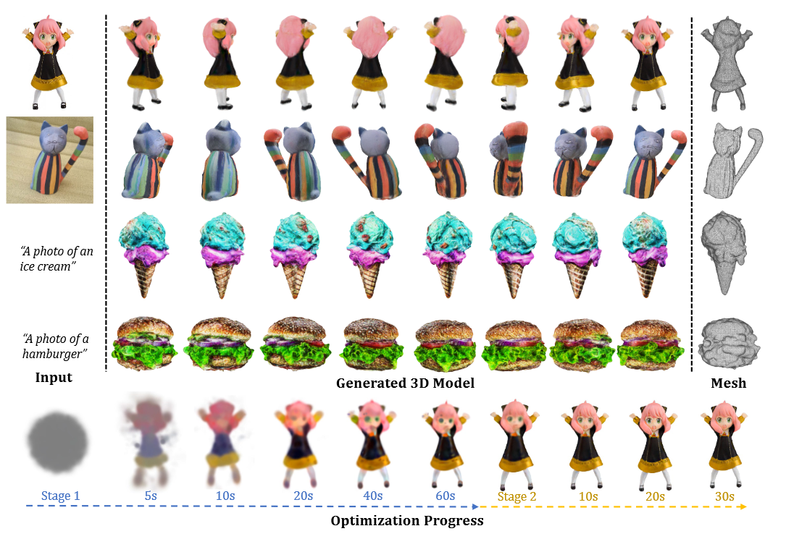  | [DreamGaussian: Generative Gaussian Splatting for Efficient 3D Content Creation](https://arxiv.org/abs/2309.16653) | 2023 | ICLR | [](https://github.com/dreamgaussian/dreamgaussian)[](https://dreamgaussian.github.io/) |
|  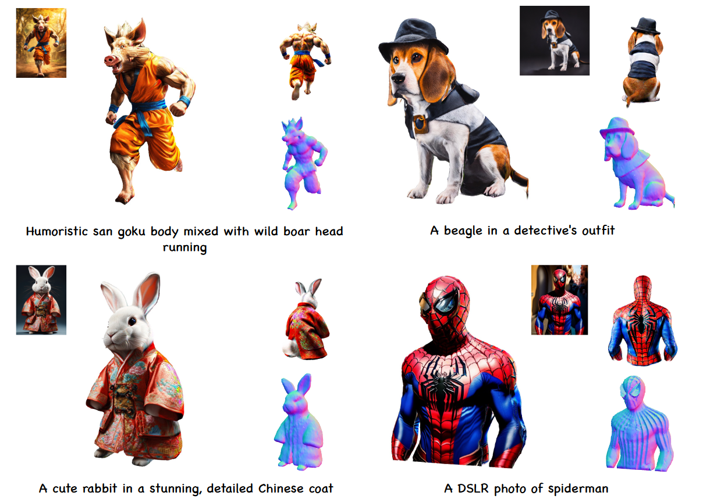   | [DreamCraft3D: Hierarchical 3D Generation with Bootstrapped Diffusion Prior](https://arxiv.org/abs/2310.16818) | 2023 | ICLR | [](https://github.com/deepseek-ai/DreamCraft3D)[](https://mrtornado24.github.io/DreamCraft3D/) |
| 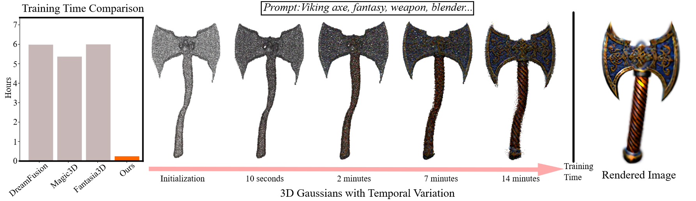 | [GaussianDreamer: Fast Generation from Text to 3D Gaussians by Bridging 2D and 3D Diffusion Models](https://arxiv.org/abs/2310.08529) | 2023 | CVPR | [](https://github.com/hustvl/GaussianDreamer)[](https://taoranyi.com/gaussiandreamer/) |
|  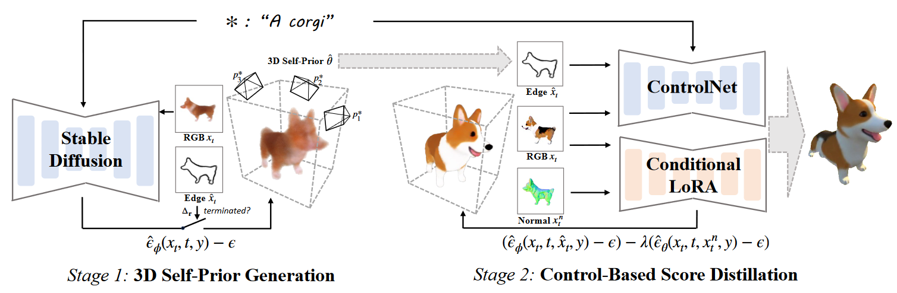   | [DreamControl: Control-Based Text-to-3D Generation with 3D Self-Prior](https://arxiv.org/abs/2312.06439) | 2023 | CVPR | [](https://github.com/tyhuang0428/DreamControl) |
|    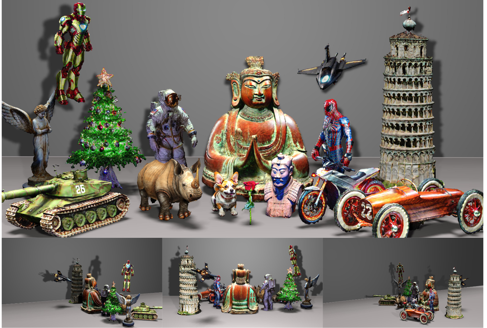     | [Sherpa3D: Boosting High-Fidelity Text-to-3D Generation via Coarse 3D Prior](https://arxiv.org/abs/2312.06655) | 2023 | CVPR | [](https://github.com/liuff19/Sherpa3D)[](https://liuff19.github.io/Sherpa3D/) |

**Improved Variants of SDS**

|                        Preview                         | Title                                                        | Year | Pub.  |                            Links                             |
| :----------------------------------------------------: | ------------------------------------------------------------ | ---- | :---: | :----------------------------------------------------------: |
|  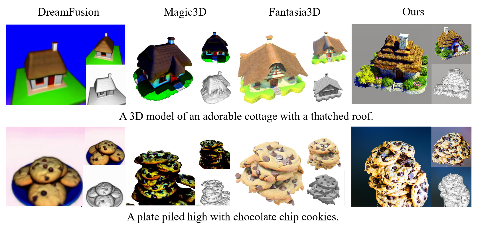   | [ProlificDreamer: High-Fidelity and Diverse Text-to-3D Generation with Variational Score Distillation](https://arxiv.org/abs/2305.16213) | 2023 | NIPS  | [](https://github.com/thu-ml/prolificdreamer)[](https://ml.cs.tsinghua.edu.cn/prolificdreamer/) |
|        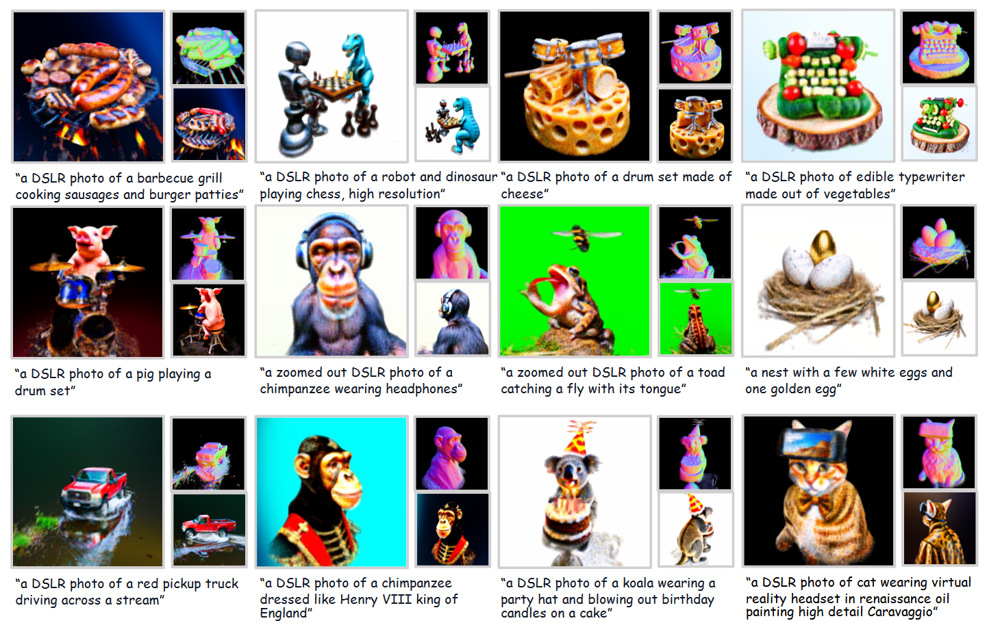         | [Text-to-3D with Classifier Score Distillation](https://arxiv.org/abs/2310.19415) | 2023 | Arxiv | [](https://github.com/CVMI-Lab/Classifier-Score-Distillation)[](https://xinyu-andy.github.io/Classifier-Score-Distillation/) |
|    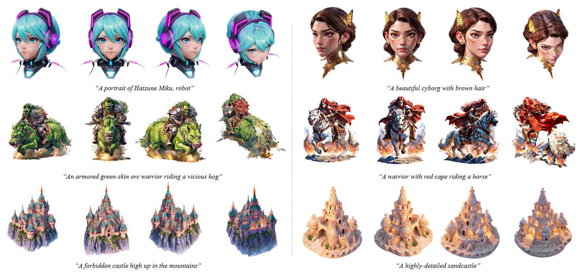    | [LucidDreamer: Towards High-Fidelity Text-to-3D Generation via Interval Score Matching](https://arxiv.org/abs/2311.11284) | 2023 | CVPR  | [](https://github.com/EnVision-Research/LucidDreamer) |
|      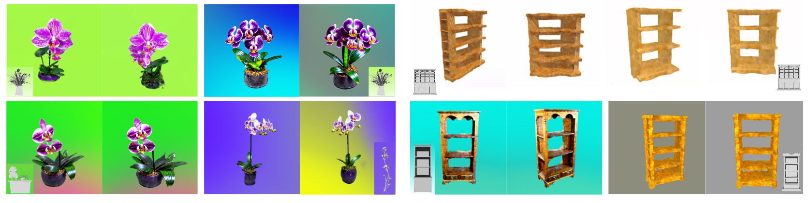      | [Sculpt3D: Multi-View Consistent Text-to-3D Generation with Sparse 3D Prior](https://arxiv.org/abs/2403.09140) | 2024 | CVPR  | [](https://github.com/StellarCheng/Scuplt_3d)[](https://stellarcheng.github.io/Sculpt3D/) |
| 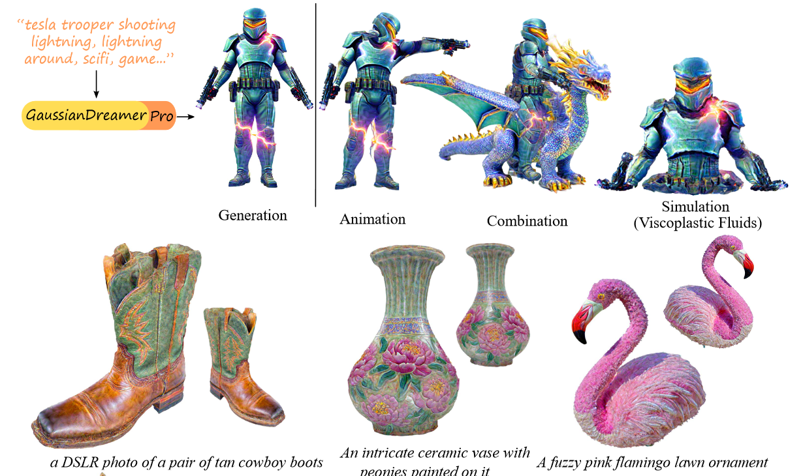 | [GaussianDreamerPro: Text to Manipulable 3D Gaussians with Highly Enhanced Quality](https://arxiv.org/abs/2406.18462) | 2024 | Arxiv | [](https://github.com/hustvl/GaussianDreamerPro)[](https://taoranyi.com/gaussiandreamerpro/) |
|    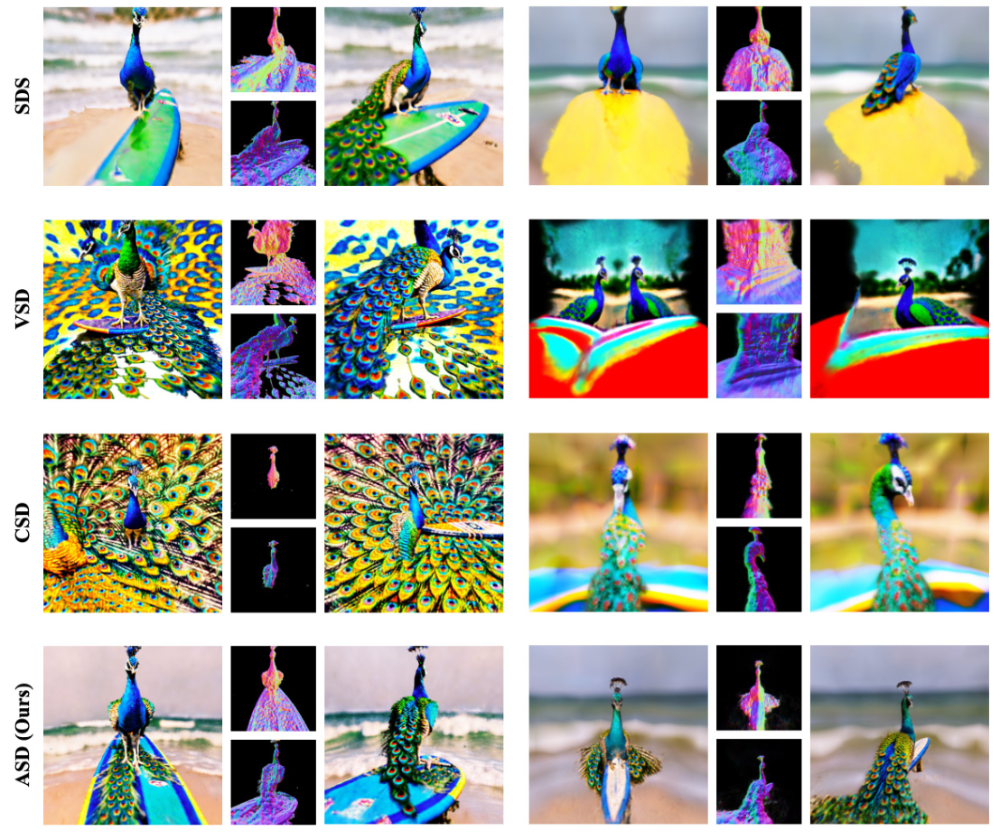    | [ScaleDreamer: Scalable Text-to-3D Synthesis with Asynchronous Score Distillation](https://arxiv.org/abs/2407.02040) | 2024 | ECCV  | [](https://github.com/theEricMa/ScaleDreamer)[](https://sites.google.com/view/scaledreamer-release/) |

**Multi-view Consistency**

|                      Preview                      | Title                                                        | Year | Pub.  |                            Links                             |
| :-----------------------------------------------: | ------------------------------------------------------------ | ---- | :---: | :----------------------------------------------------------: |
|    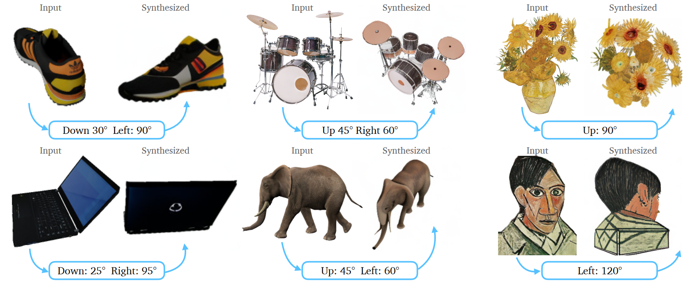    | [Zero-1-to-3: Zero-shot One Image to 3D Object](https://arxiv.org/abs/2303.11328) | 2023 | ICCV  | [](https://github.com/cvlab-columbia/zero123)[](https://zero123.cs.columbia.edu/) |
|     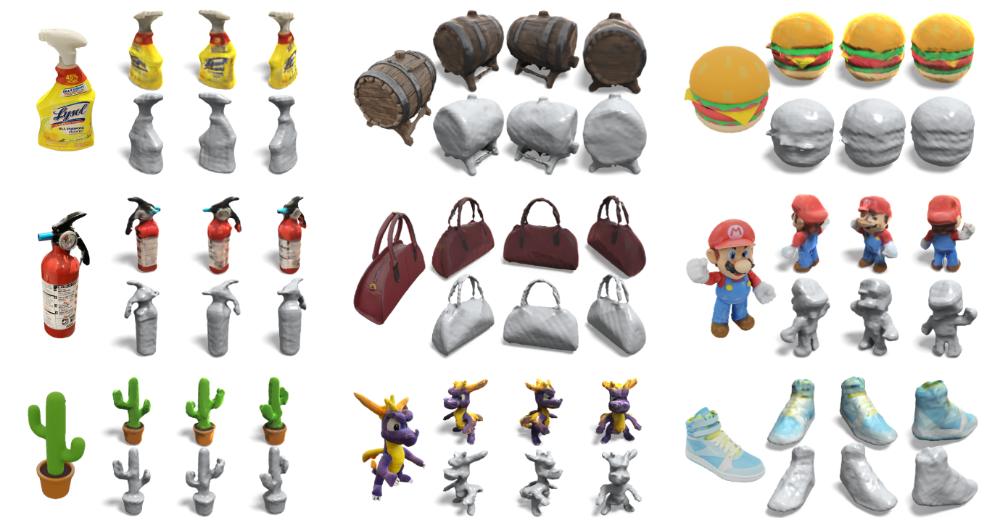     | [One-2-3-45: Any Single Image to 3D Mesh in 45 Seconds without Per-Shape Optimization](https://arxiv.org/abs/2306.16928) | 2023 | NIPS  | [](https://github.com/One-2-3-45/One-2-3-45)[](https://one-2-3-45.github.io/) |
|    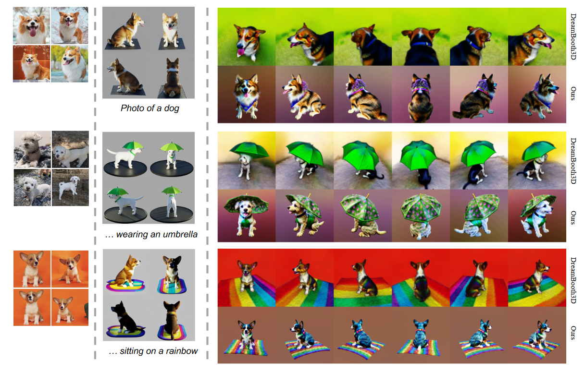    | [MVDream: Multi-view Diffusion for 3D Generation](https://arxiv.org/abs/2308.16512) | 2023 | ICLR  | [](https://github.com/bytedance/MVDream)[](https://mv-dream.github.io/) |
|  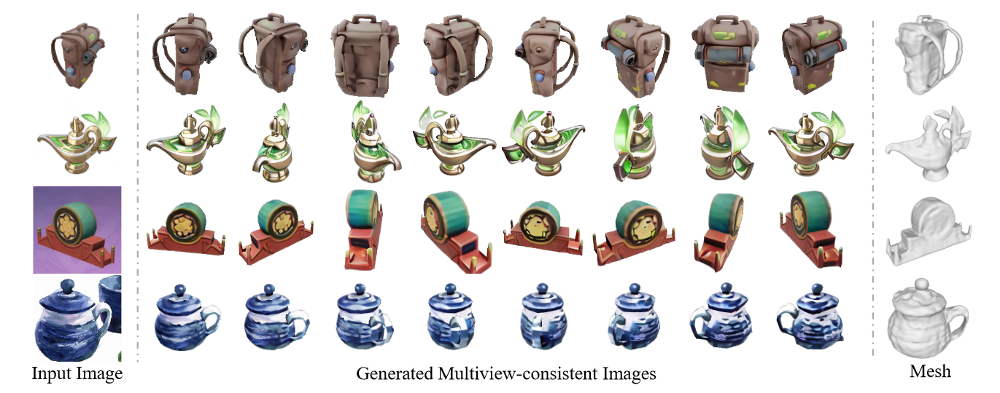  | [SyncDreamer: Generating Multiview-consistent Images from a Single-view Image](https://arxiv.org/abs/2309.03453) | 2023 | ICLR  | [](https://github.com/liuyuan-pal/SyncDreamer)[](https://liuyuan-pal.github.io/SyncDreamer/) |
|   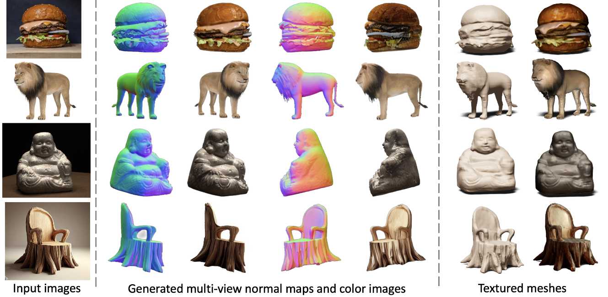    | [Wonder3D: Single Image to 3D using Cross-Domain Diffusion](https://arxiv.org/abs/2310.15008) | 2023 | CVPR  | [](https://github.com/xxlong0/Wonder3D)[](https://www.xxlong.site/Wonder3D/) |
|   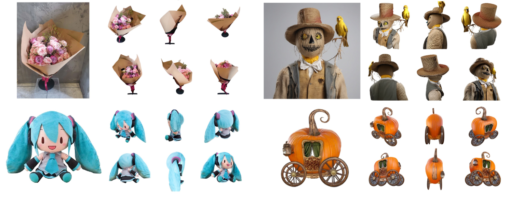   | [Zero123++: a Single Image to Consistent Multi-view Diffusion Base Model](https://arxiv.org/abs/2310.15110) | 2023 | Arxiv | [](https://github.com/SUDO-AI-3D/zero123plus) |
|   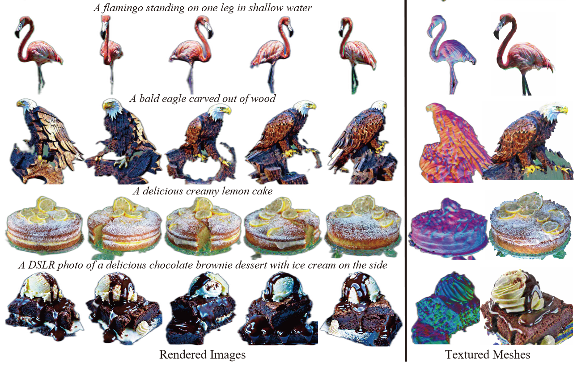    | [GeoDream: Disentangling 2D and Geometric Priors for High-Fidelity and Consistent 3D Generation](https://arxiv.org/abs/2311.17971) | 2023 | Arxiv | [](https://github.com/baaivision/GeoDream/)[](https://mabaorui.github.io/GeoDream_page/) |
|    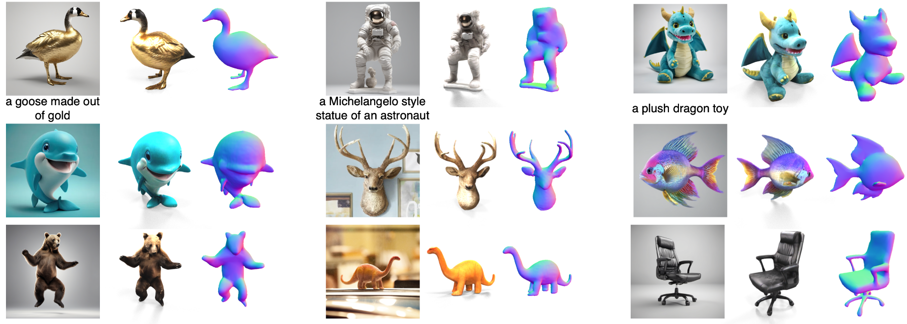    | [One-2-3-45++: Fast Single Image to 3D Objects with Consistent Multi-View Generation and 3D Diffusion](https://arxiv.org/abs/2311.07885) | 2023 | CVPR  | [](https://github.com/SUDO-AI-3D/One2345plus)[](https://sudo-ai-3d.github.io/One2345plus_page/) |
|     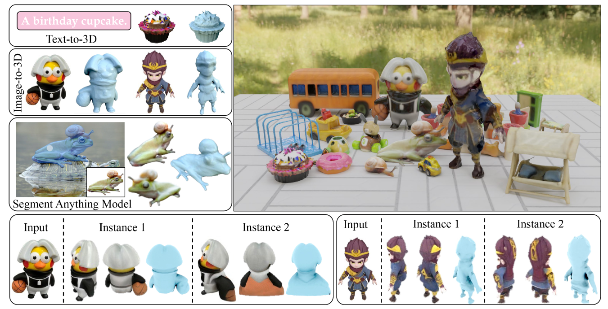     | [DMV3D: Denoising Multi-View Diffusion using 3D Large Reconstruction Model](https://arxiv.org/abs/2311.09217) | 2023 | ICLR  | [](https://justimyhxu.github.io/projects/dmv3d/) |
|   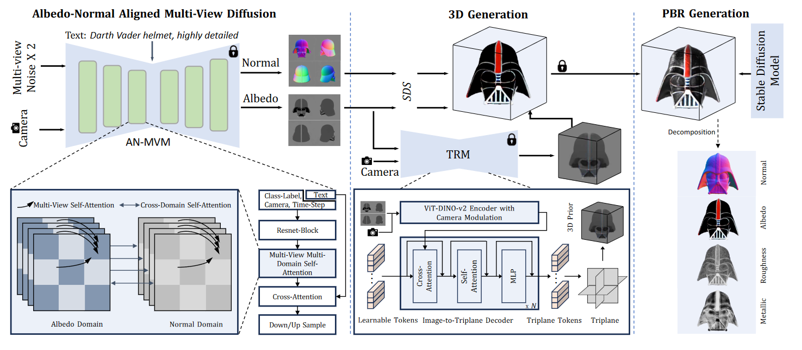    | [UniDream: Unifying Diffusion Priors for Relightable Text-to-3D Generation](https://arxiv.org/abs/2312.08754) | 2023 | ECCV  | [](https://github.com/YG256Li/UniDream)[](https://yg256li.github.io/UniDream/) |
| 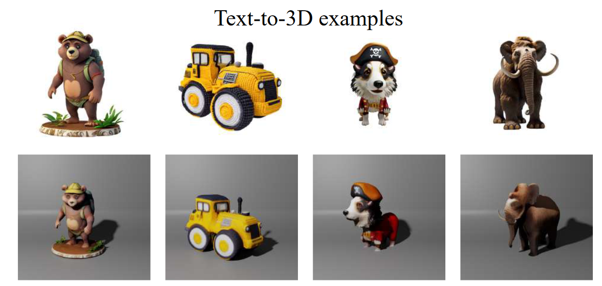 | [MVDiffusion++: A Dense High-resolution Multi-view Diffusion Model for Single or Sparse-view 3D Object Reconstruction](https://arxiv.org/abs/2402.12712) | 2024 | ECCV  | [](https://github.com/Tangshitao/MVDiffusion_plusplus)[](https://mvdiffusion-plusplus.github.io/) |
|   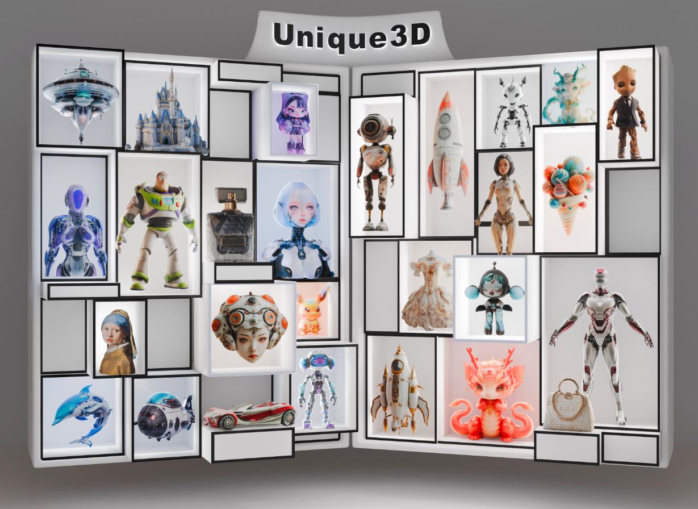    | [Unique3D: High-Quality and Efficient 3D Mesh Generation from a Single Image](https://arxiv.org/abs/2405.20343) | 2024 | NIPS  | [](https://github.com/AiuniAI/Unique3D)[](https://wukailu.github.io/Unique3D/) |
|   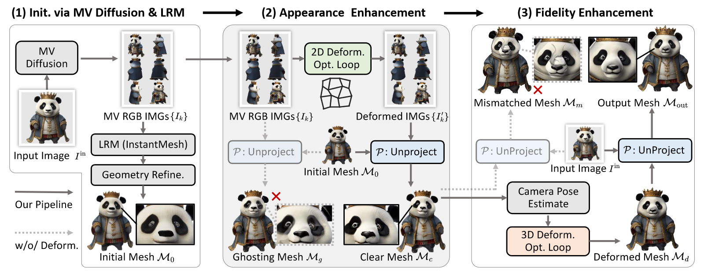    | [Fancy123: One Image to High-Quality 3D Mesh Generation via Plug-and-Play Deformation](https://arxiv.org/abs/2411.16185) | 2024 | CVPR  | [](https://github.com/YuQiao0303/Fancy123) |

**Feed-forward Generation**

|                     Preview                      | Title                                                        | Year | Pub.  |                            Links                             |
| :----------------------------------------------: | ------------------------------------------------------------ | ---- | :---: | :----------------------------------------------------------: |
|    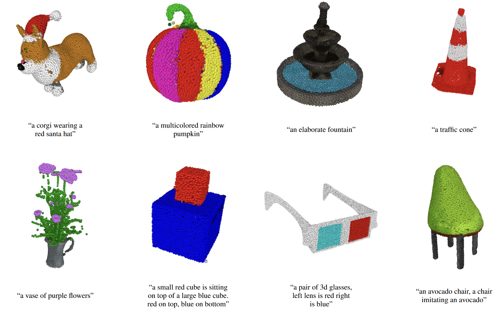    | [Point-E: A System for Generating 3D Point Clouds from Complex Prompts](https://arxiv.org/abs/2212.08751) | 2022 | Arxiv | [](https://github.com/openai/point-e)[](https://openai.com/index/point-e/) |
|    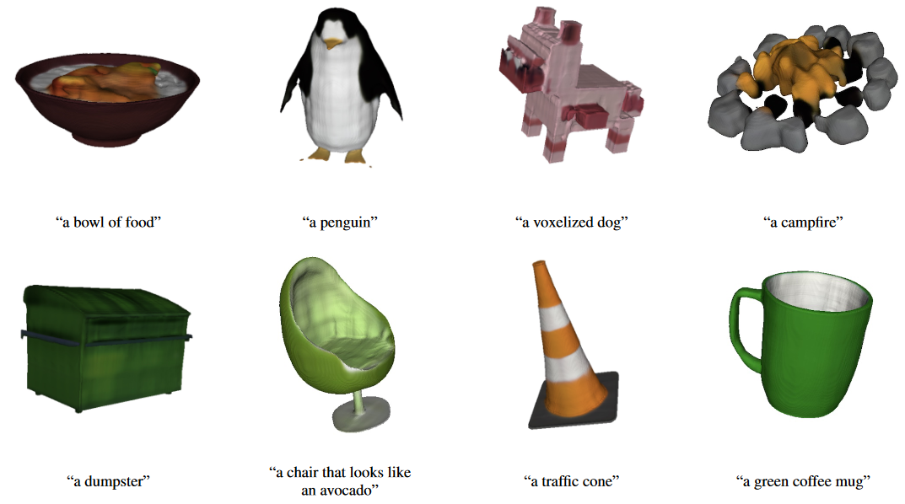     | [Shap-E: Generating Conditional 3D Implicit Functions](https://arxiv.org/abs/2305.02463) | 2023 | Arxiv | [](https://github.com/openai/shap-e) |
| 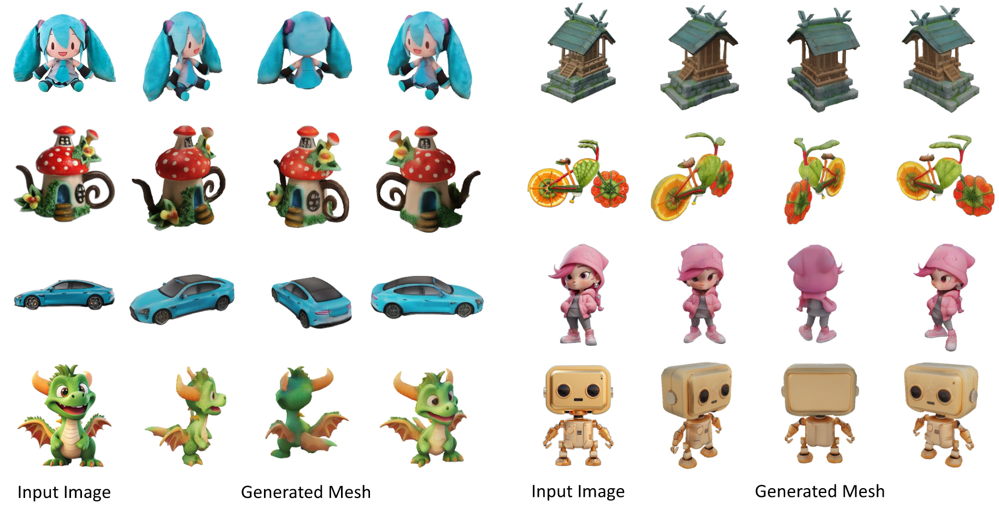  | [InstantMesh: Efficient 3D Mesh Generation from a Single Image with Sparse-view Large Reconstruction Models](https://arxiv.org/abs/2404.07191) | 2024 | Arxiv | [](https://github.com/TencentARC/InstantMesh) |
|   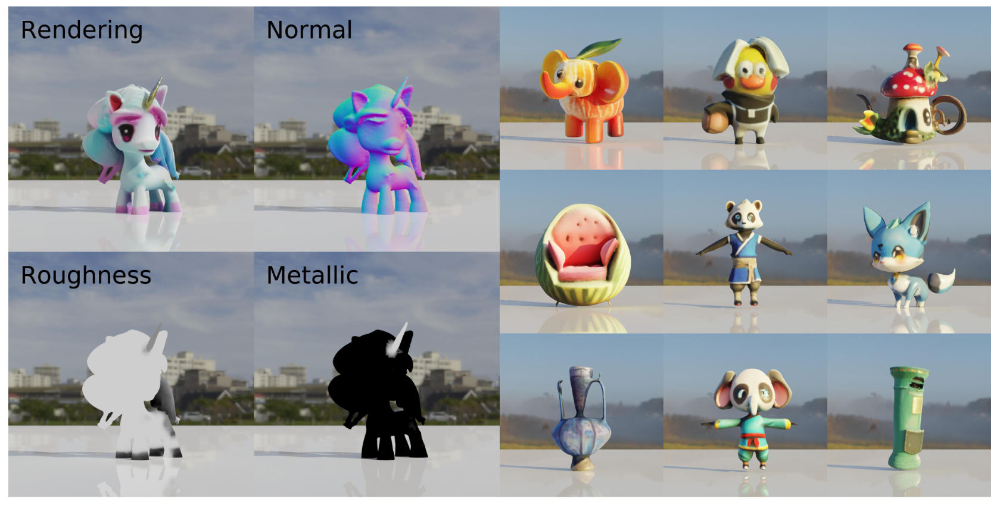    | [3DTopia-XL: Scaling High-quality 3D Asset Generation via Primitive Diffusion](https://arxiv.org/abs/2409.12957) | 2024 | CVPR  | [](https://github.com/3DTopia/3DTopia-XL)[](https://3dtopia.github.io/3DTopia-XL/) |
|   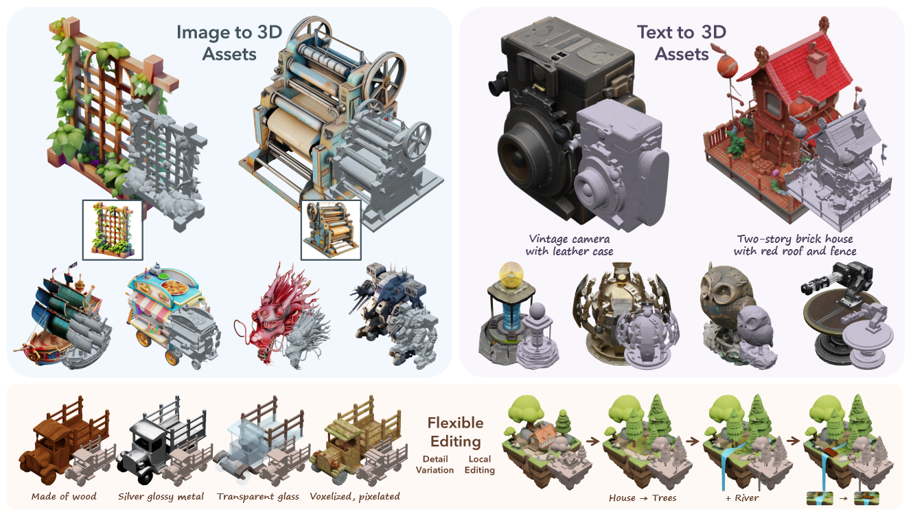    | [Structured 3D Latents for Scalable and Versatile 3D Generation](https://arxiv.org/abs/2412.01506) | 2024 | Arxiv | [](https://github.com/Microsoft/TRELLIS)[](https://microsoft.github.io/TRELLIS/) |
|   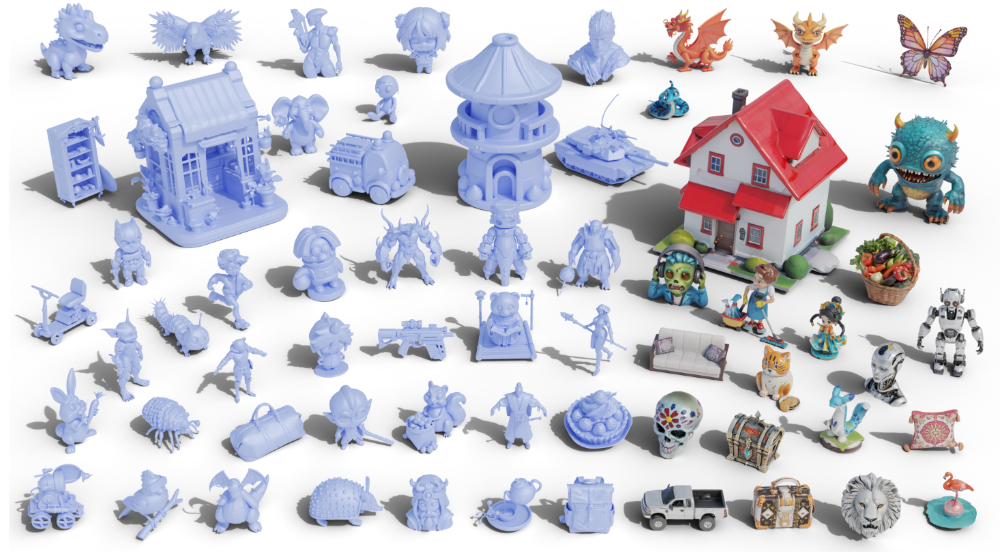    | [TripoSG: High-Fidelity 3D Shape Synthesis using Large-Scale Rectified Flow Models](https://arxiv.org/abs/2502.06608) | 2025 | Arxiv | [](https://github.com/VAST-AI-Research/TripoSG)[](https://yg256li.github.io/TripoSG-Page/) |
| 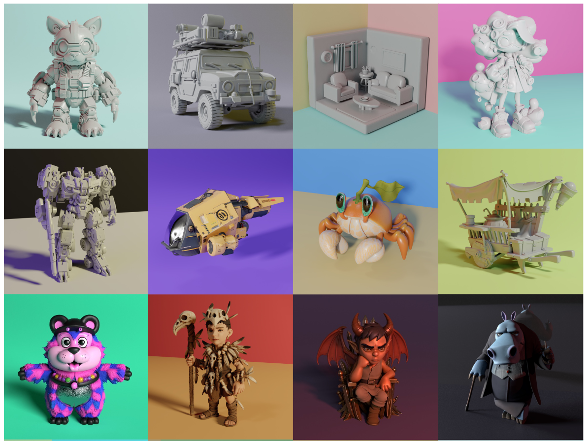 | [Hunyuan3D 2.5: Towards High-Fidelity 3D Assets Generation with Ultimate Details](https://arxiv.org/abs/2506.16504) | 2025 | Arxiv | [](https://github.com/Tencent-Hunyuan/Hunyuan3D-2)[](https://3d-models.hunyuan.tencent.com/) |
|   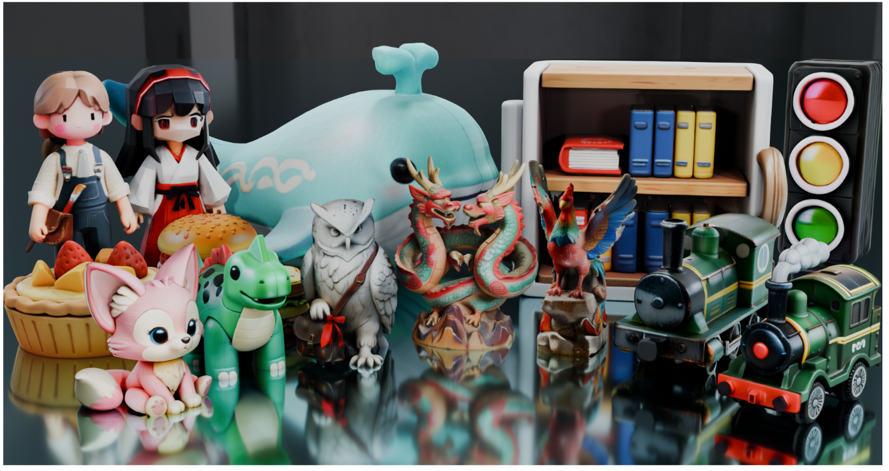   | [UniLat3D: Geometry-Appearance Unified Latents for Single-Stage 3D Generation](https://arxiv.org/abs/2509.25079) | 2025 | Arxiv | [](https://github.com/UniLat3D/UniLat3D)[](https://unilat3d.github.io/) |

## Structure

**Implicit Space**

|                     Preview                      | Title                                                        | Year |     Pub.      |                            Links                             |
| :----------------------------------------------: | ------------------------------------------------------------ | ---- | :-----------: | :----------------------------------------------------------: |
|    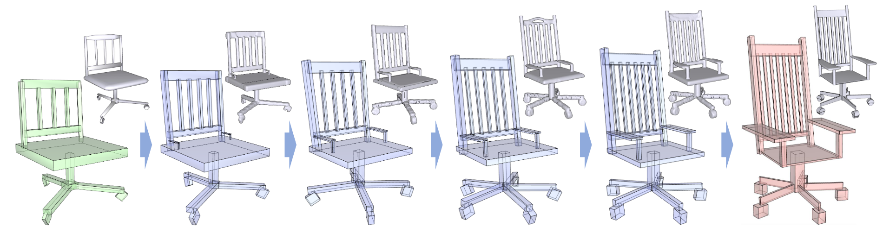     | [GRASS: Generative Recursive Autoencoders for Shape Structures](https://arxiv.org/abs/1705.02090) | 2017 |      TOG      | [](https://github.com/junli-lj/grass)[](https://kevinkaixu.net/projects/grass.html) |
| 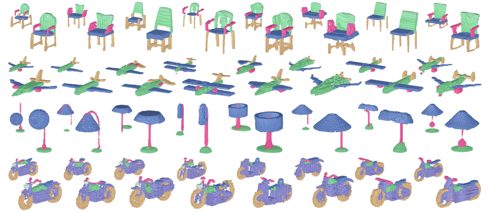 | [Learning Part Generation and Assembly for Structure-aware Shape Synthesis](https://arxiv.org/abs/1906.06693) | 2019 |     AAAI      |                              /                               |
|    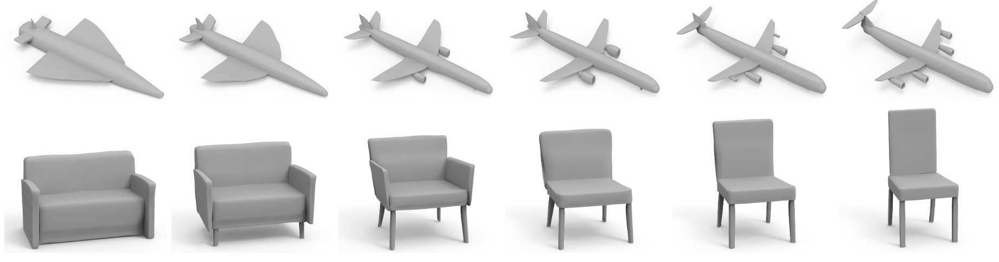    | [SDM-NET: Deep Generative Network for Structured Deformable Mesh](https://arxiv.org/abs/1908.04520) | 2019 | SIGGRAPH Asia | [](https://github.com/gaolinorange/SDMNET_stamp) |
|    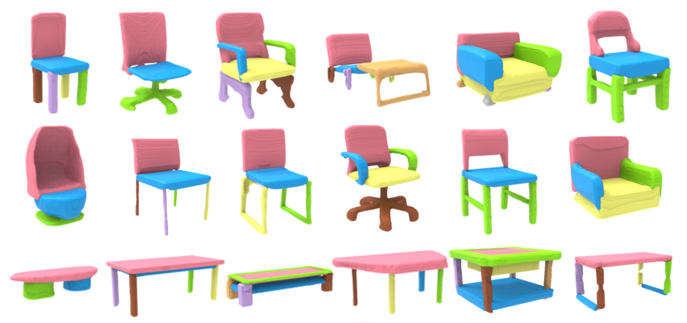     | [PQ-NET: A Generative Part Seq2Seq Network for 3D Shapes](https://arxiv.org/abs/1911.10949) | 2019 |     CVPR      | [](https://github.com/rundiwu/PQ-NET) |
|    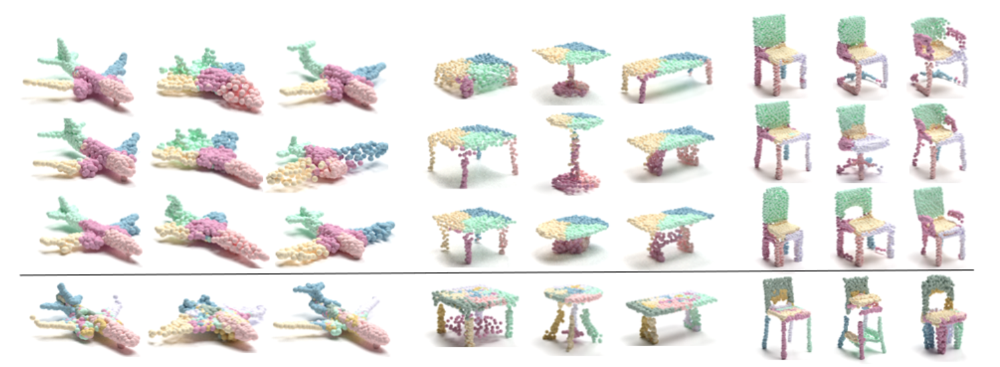     | [MRGAN: Multi-Rooted 3D Shape Generation with Unsupervised Part Disentanglement](https://arxiv.org/abs/2007.12944) | 2020 |     ICCV      |                              /                               |
|    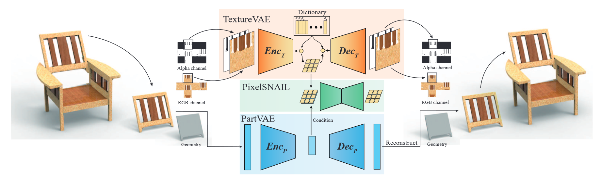     | [TM-NET: Deep Generative Networks for Textured Meshes](https://arxiv.org/abs/2010.06217) | 2020 |      TOG      | [](https://github.com/IGLICT/TM-NET) |

**Diffusion Models**

|                     Preview                      | Title                                                        | Year |     Pub.      |                            Links                             |
| :----------------------------------------------: | ------------------------------------------------------------ | ---- | :-----------: | :----------------------------------------------------------: |
|  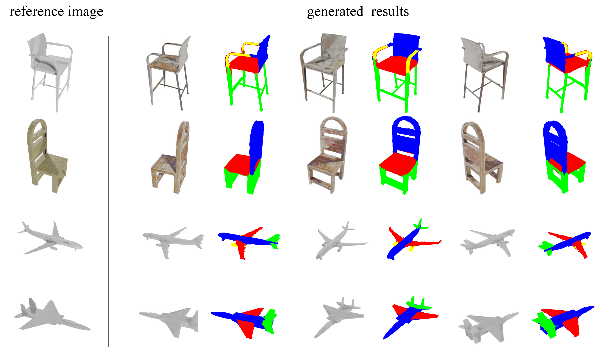   | [Part-aware Shape Generation with Latent 3D Diffusion of Neural Voxel Fields](https://arxiv.org/abs/2405.00998) | 2024 |     TVCG      |                              /                               |
|   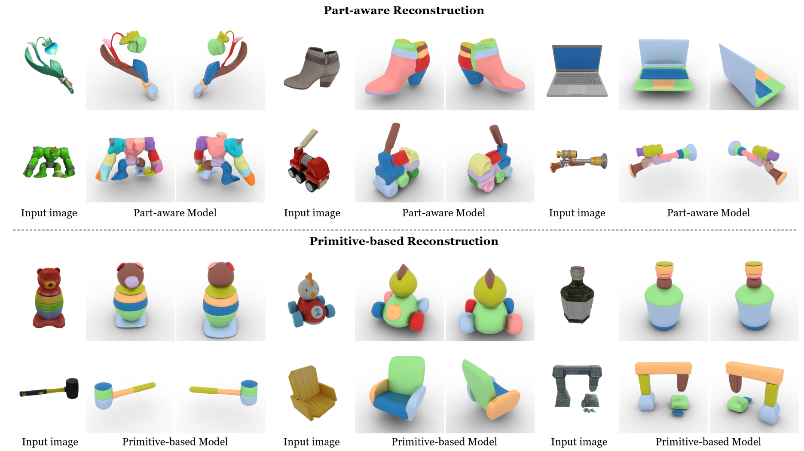    | [Part123: Part-aware 3D Reconstruction from a Single-view Image](https://arxiv.org/abs/2405.16888) | 2024 |   SIGGRAPH    | [](https://github.com/liuar0512/part123)[](https://liuar0512.github.io/part123_official_page/) |
|   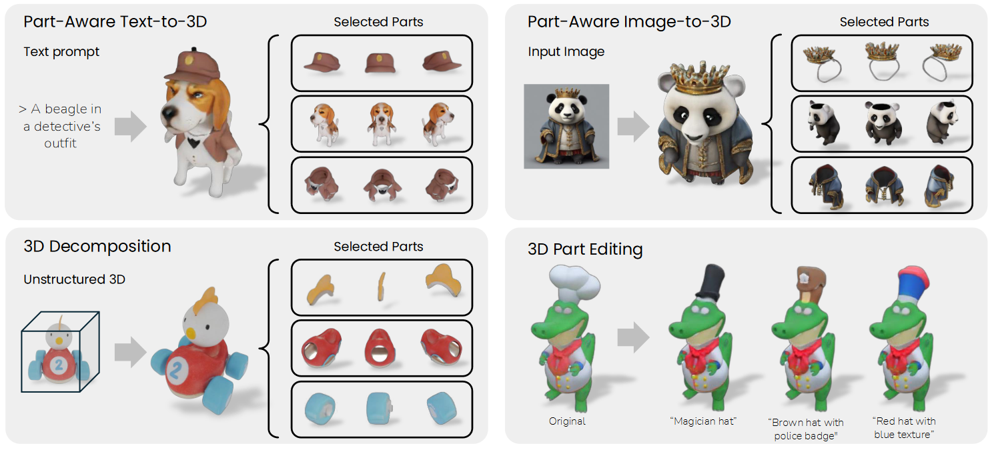    | [PartGen: Part-level 3D Generation and Reconstruction with Multi-View Diffusion Models](https://arxiv.org/abs/2412.18608) | 2024 |     CVPR      | [](https://silent-chen.github.io/PartGen/) |
|  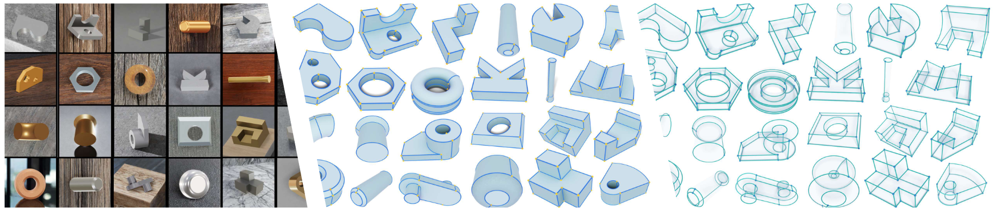  | [CADDreamer: CAD Object Generation from Single-view Images](https://arxiv.org/abs/2502.20732) | 2025 |     CVPR      | [](https://github.com/lidan233/CADDreamer)[](https://lidan233.github.io/caddreamer/) |
|   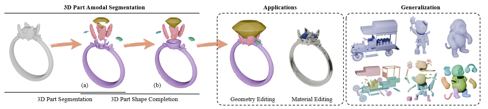   | [HoloPart: Generative 3D Part Amodal Segmentation](https://arxiv.org/abs/2504.07943) | 2025 |     Arxiv     | [](https://github.com/VAST-AI-Research/HoloPart)[](https://vast-ai-research.github.io/HoloPart/) |
|   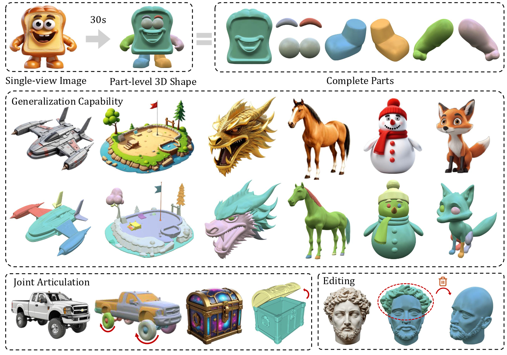    | [Efficient Part-level 3D Object Generation via Dual Volume Packing](https://arxiv.org/abs/2506.09980) | 2025 |     Arxiv     | [](https://github.com/NVlabs/PartPacker)[](https://research.nvidia.com/labs/dir/partpacker/) |
| 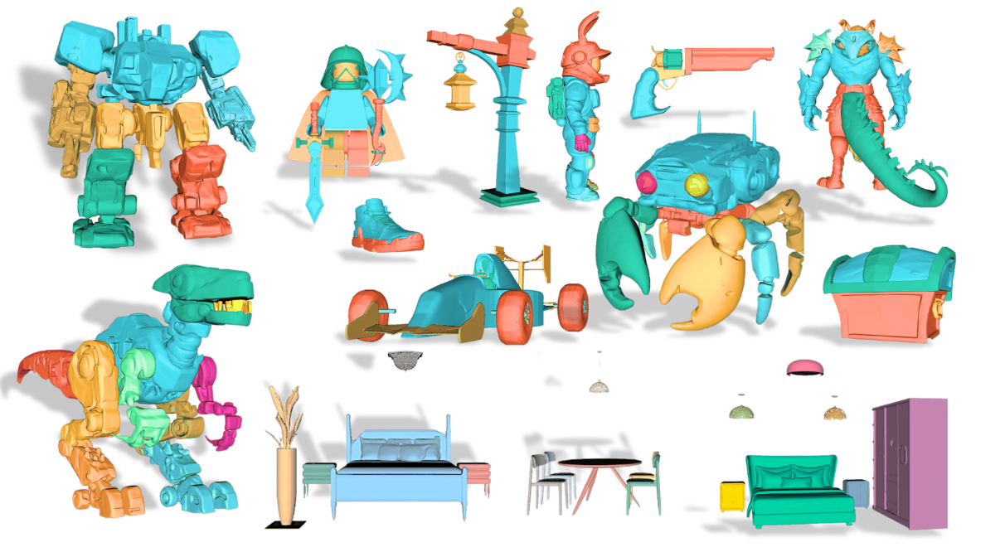  | [PartCrafter: Structured 3D Mesh Generation via Compositional Latent Diffusion Transformers](https://arxiv.org/abs/2506.05573) | 2025 |     NIPS      | [](https://github.com/wgsxm/PartCrafter)[](https://wgsxm.github.io/projects/partcrafter/) |
|   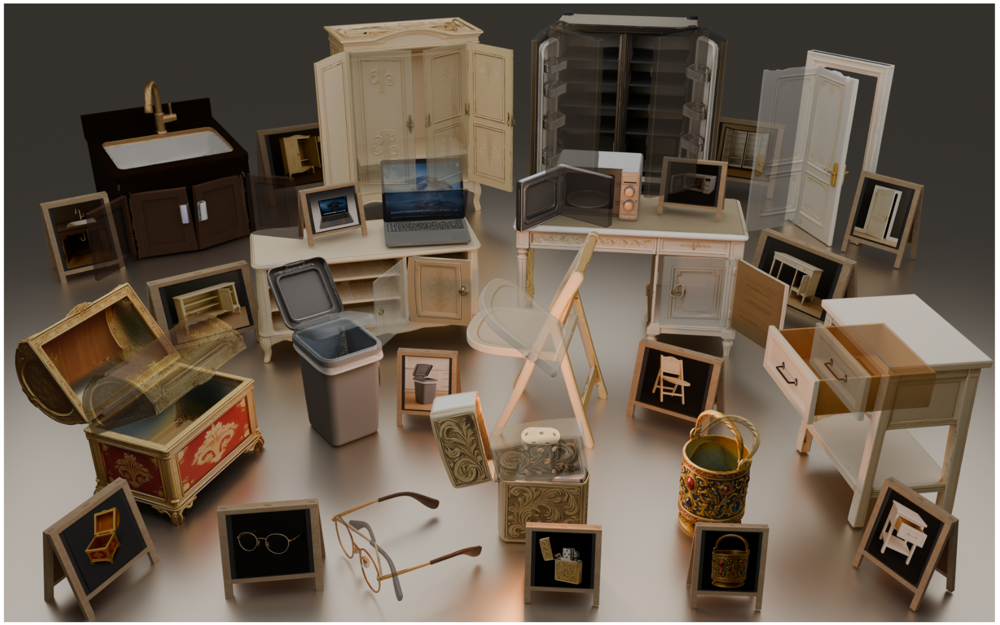   | [DreamArt: Generating Interactable Articulated Objects from a Single Image](https://arxiv.org/abs/2507.05763) | 2025 |     Arxiv     | [](https://dream-art-0.github.io/DreamArt/) |
| 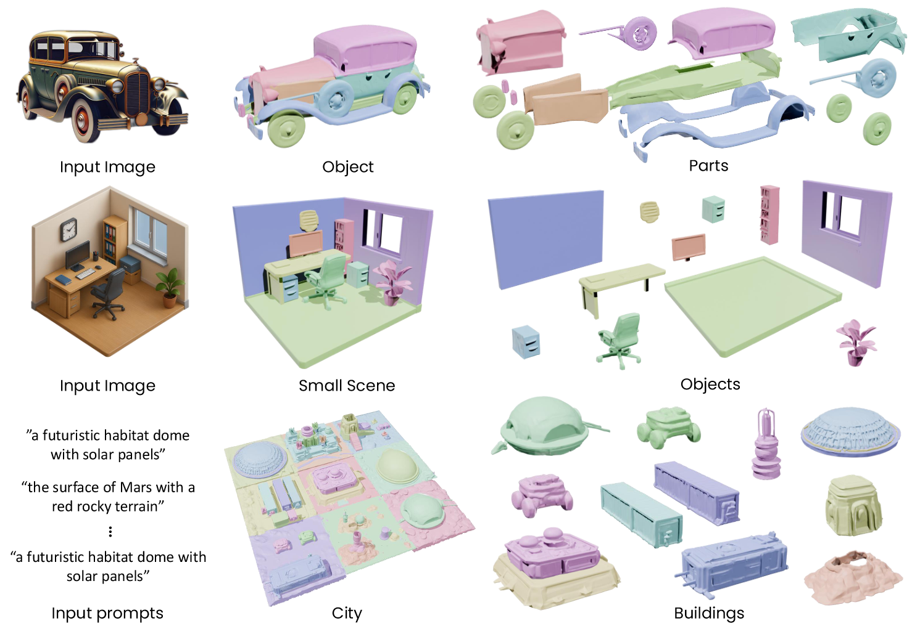  | [AutoPartGen: Autogressive 3D Part Generation and Discovery](https://arxiv.org/abs/2507.13346) | 2025 |     Arxiv     | [](https://github.com/silent-chen/AutoPartGen) |
|  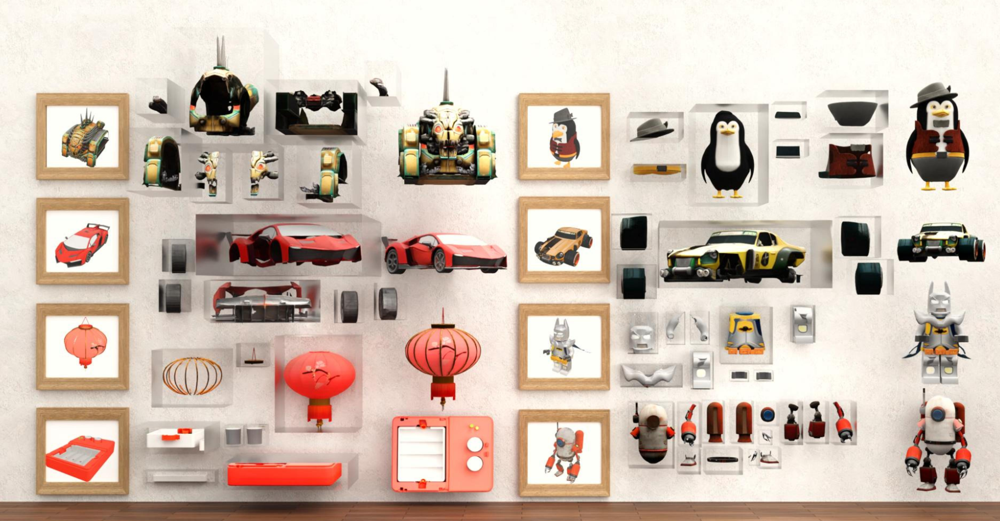   | [OmniPart: Part-Aware 3D Generation with Semantic Decoupling and Structural Cohesion](https://arxiv.org/abs/2507.06165) | 2025 | SIGGRAPH Asia | [](https://github.com/HKU-MMLab/OmniPart)[](https://omnipart.github.io/) |
|    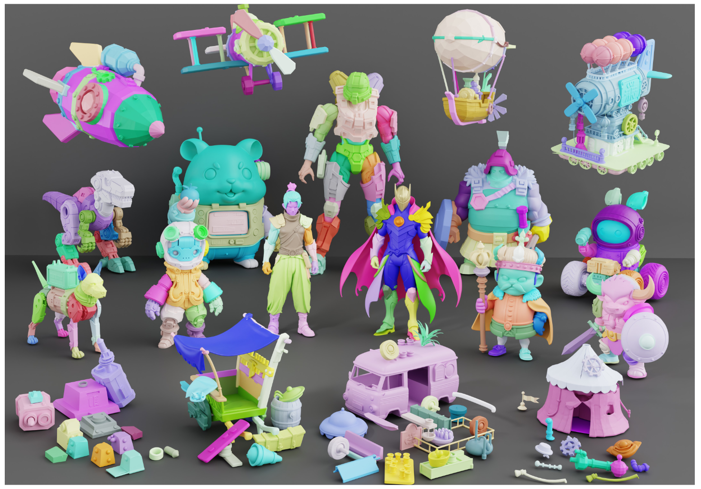     | [X-Part: high fidelity and structure coherent shape decomposition](https://arxiv.org/abs/2509.08643) | 2025 |     Arxiv     | [](https://github.com/Tencent-Hunyuan/Hunyuan3D-Part)[](https://3d.hunyuan.tencent.com/) |
|   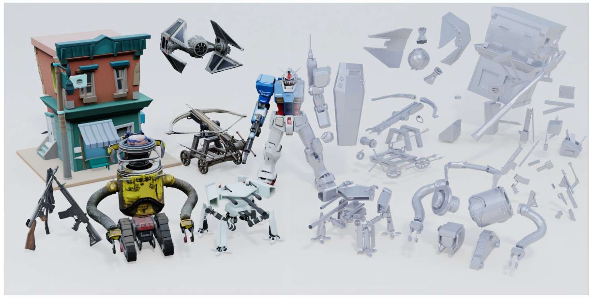   | [FullPart: Generating each 3D Part at Full Resolution](https://arxiv.org/abs/2510.26140) | 2025 |     Arxiv     | [](https://github.com/hkdsc/fullpart)[](https://fullpart3d.github.io/) |
| 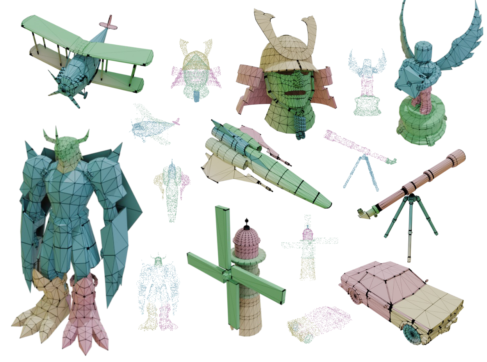 | [PartDiffuser: Part-wise 3D Mesh Generation via Discrete Diffusion](https://arxiv.org/abs/2511.18801) | 2025 |     Arxiv     |                              /                               |
|    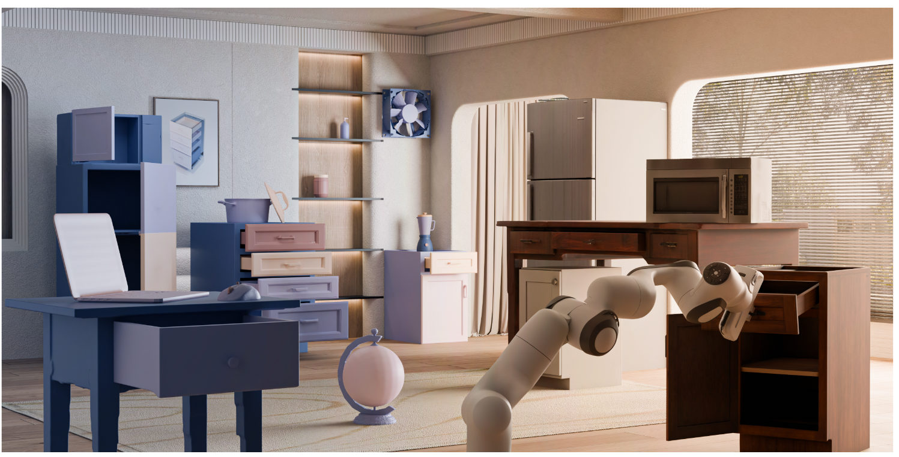     | [SPARK: Sim-ready Part-level Articulated Reconstruction with VLM Knowledge](https://arxiv.org/abs/2512.01629) | 2025 |     Arxiv     | [](https://github.com/YumengHe/SPARK)[](https://heyumeng.com/SPARK/index.html) |

**Procedural Modeling**

|                     Preview                      | Title                                                        | Year | Pub.  |                            Links                             |
| :----------------------------------------------: | ------------------------------------------------------------ | ---- | :---: | :----------------------------------------------------------: |
| 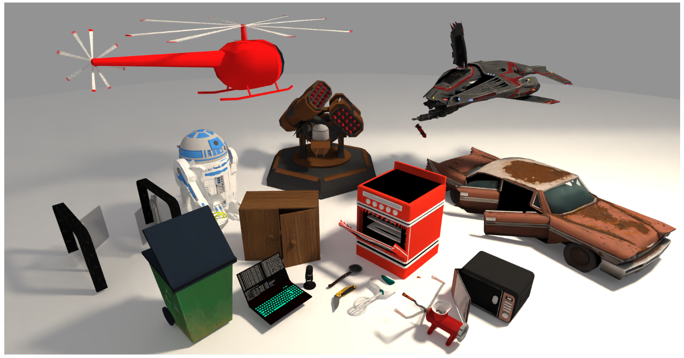  | [Articulate-Anything: Automatic Modeling of Articulated Objects via a Vision-Language Foundation Model](https://arxiv.org/abs/2410.13882) | 2024 | ICLR  | [](https://github.com/vlongle/articulate-anything)[](https://articulate-anything.github.io/) |
| 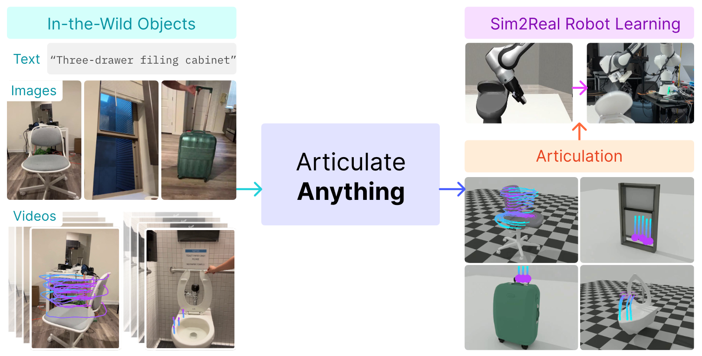 | [Articulate AnyMesh: Open-Vocabulary 3D Articulated Objects Modeling](https://arxiv.org/abs/2502.02590) | 2025 | Arxiv | [](https://articulate-anymesh.github.io/#) |
| 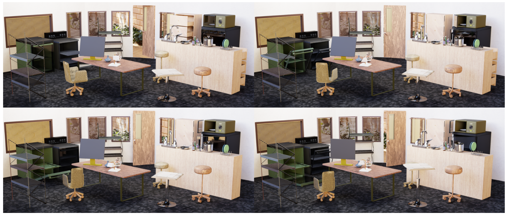  | [Infinite Mobility: Scalable High-Fidelity Synthesis of Articulated Objects via Procedural Generation](https://arxiv.org/abs/2503.13424) | 2025 | Arxiv | [](https://github.com/InternRobotics/Infinite-Mobility) |
|     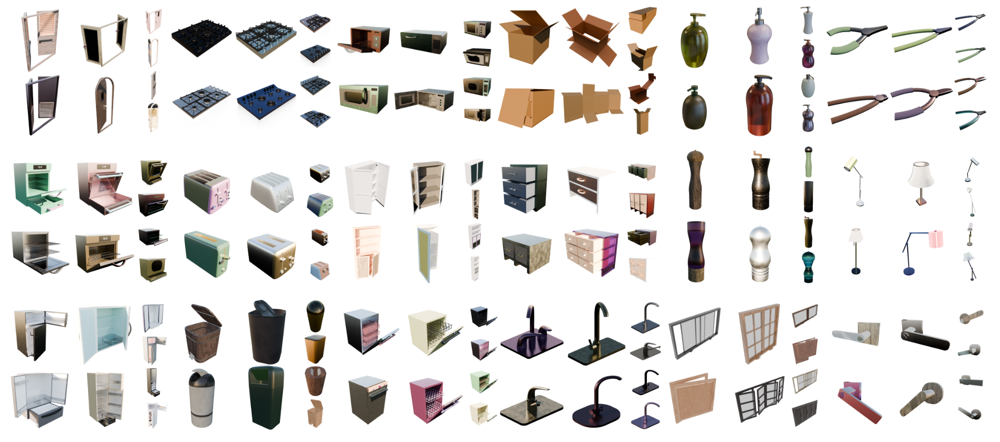      | [Procedural Generation of Articulated Simulation-Ready Assets](https://arxiv.org/abs/2505.10755) | 2025 | Arxiv | [](https://github.com/princeton-vl/infinigen)[](https://infinigen.org/) |
|  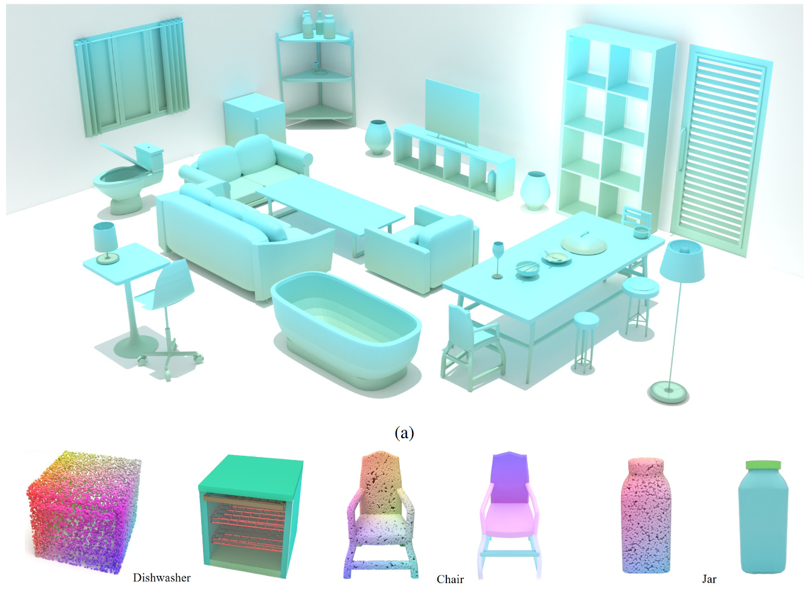   | [MeshCoder: LLM-Powered Structured Mesh Code Generation from Point Clouds](https://arxiv.org/abs/2508.14879) | 2025 | Arxiv | [](https://github.com/InternRobotics/MeshCoder)[](https://daibingquan.github.io/MeshCoder/) |

# 3D Scene Generation

## Layout-guided

**Explicit Geometry and Spatial Relationship Priors**

|                       Preview                       | Title                                                        | Year | Pub.  |                            Links                             |
| :-------------------------------------------------: | ------------------------------------------------------------ | ---- | :---: | :----------------------------------------------------------: |
|    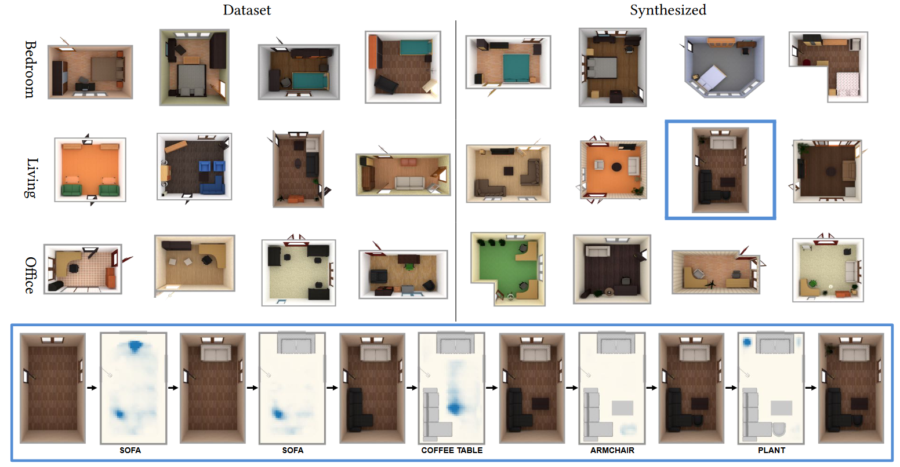     | [Deep Convolutional Priors for Indoor Scene Synthesis](https://dritchie.github.io/pdf/deepsynth.pdf) | 2018 |  TOG  | [](https://github.com/brownvc/deep-synth) |
|     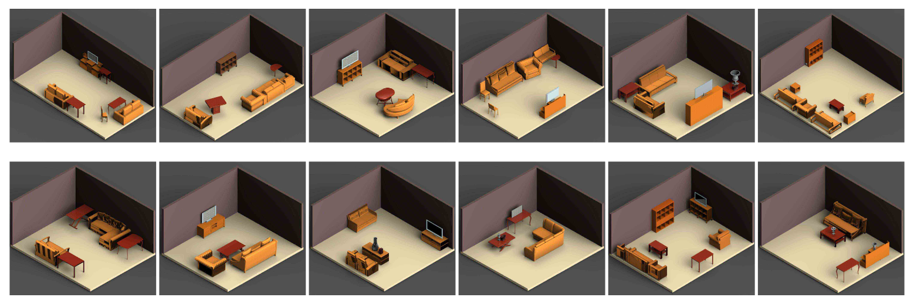      | [GRAINS: Generative Recursive Autoencoders for INdoor Scenes](https://arxiv.org/abs/1807.09193) | 2018 |  TOG  | [](https://github.com/ManyiLi12345/GRAINS)[](https://manyili12345.github.io/Publication/2018/GRAINS/index.html) |
|      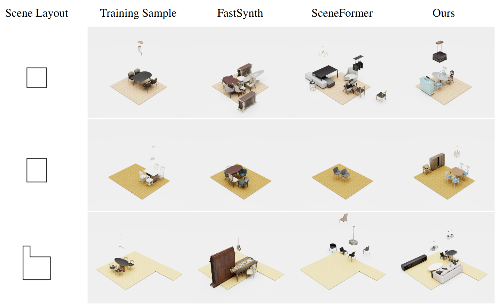      | [ATISS: Autoregressive Transformers for Indoor Scene Synthesis](https://arxiv.org/abs/2110.03675) | 2021 | NIPS  | [](https://github.com/vlongle/nv-tlabs/atiss)[](https://research.nvidia.com/labs/toronto-ai/ATISS/) |
|     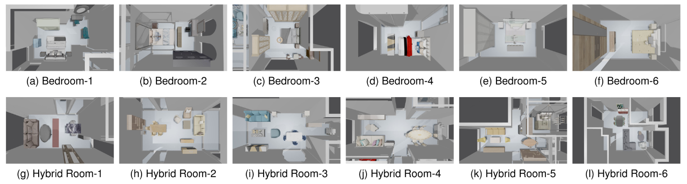      | [Fast 3D Indoor Scene Synthesis by Learning Spatial Relation Priors of Objects](https://cg.cs.tsinghua.edu.cn/course/vis/Shao-Kui/fast3d.pdf) | 2021 | TCVG  |                              /                               |
|   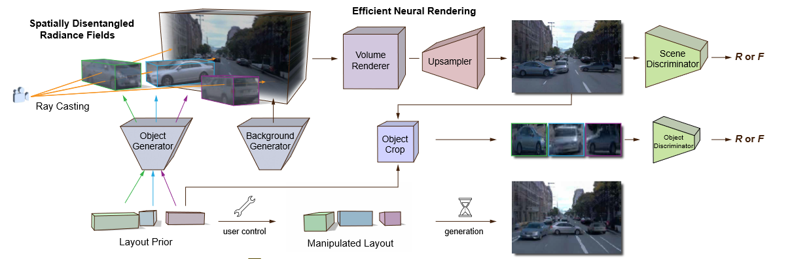    | [DisCoScene: Spatially Disentangled Generative Radiance Fields for Controllable 3D-aware Scene Synthesis](https://arxiv.org/abs/2212.11984) | 2022 | CVPR  | [](https://github.com/snap-research/discoscene)[](https://snap-research.github.io/discoscene/) |
|     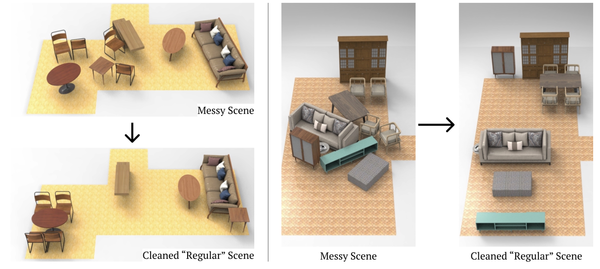     | [LEGO-Net: Learning Regular Rearrangements of Objects in Rooms](https://arxiv.org/abs/2301.09629) | 2023 | Arxiv | [](https://github.com/QiuhongAnnaWei/LEGO-Net)[](https://ivl.cs.brown.edu/research/lego-net.html) |
|      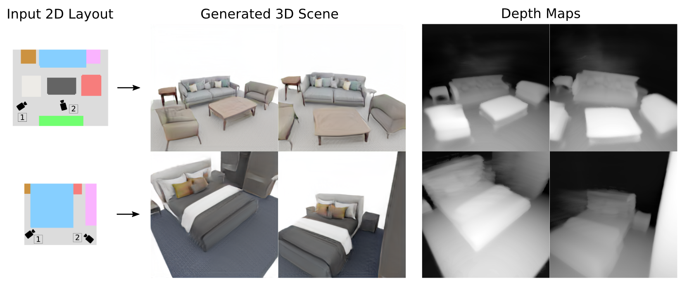       | [CC3D: Layout-Conditioned Generation of Compositional 3D Scenes](https://arxiv.org/abs/2303.12074) | 2023 | ICCV  | [](https://github.com/sherwinbahmani/cc3d)[](https://sherwinbahmani.github.io/cc3d/) |
| 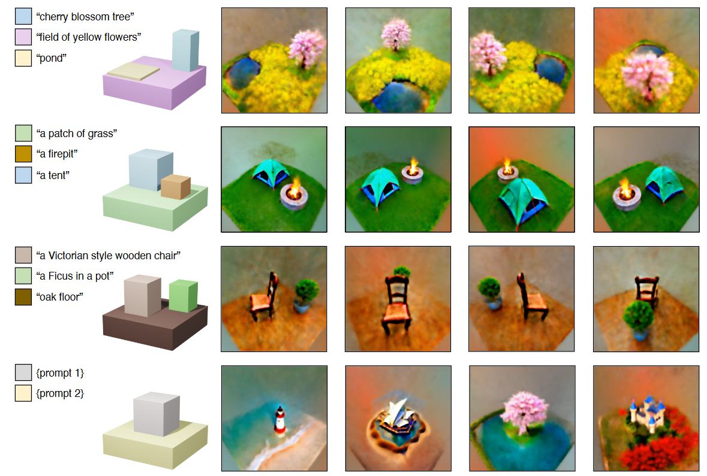 | [Compositional 3D Scene Generation using Locally Conditioned Diffusion](https://arxiv.org/abs/2303.12218) | 2023 | ICLR  | [](https://ryanpo.com/comp3d/) |
|   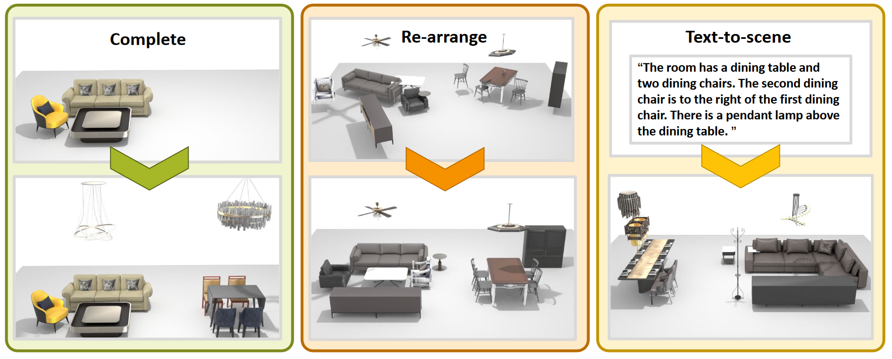    | [DiffuScene: Denoising Diffusion Models for Generative Indoor Scene Synthesis](https://arxiv.org/abs/2303.14207) | 2023 |  3DV  | [](https://github.com/tangjiapeng/DiffuScene)[](https://tangjiapeng.github.io/projects/DiffuScene/) |
|  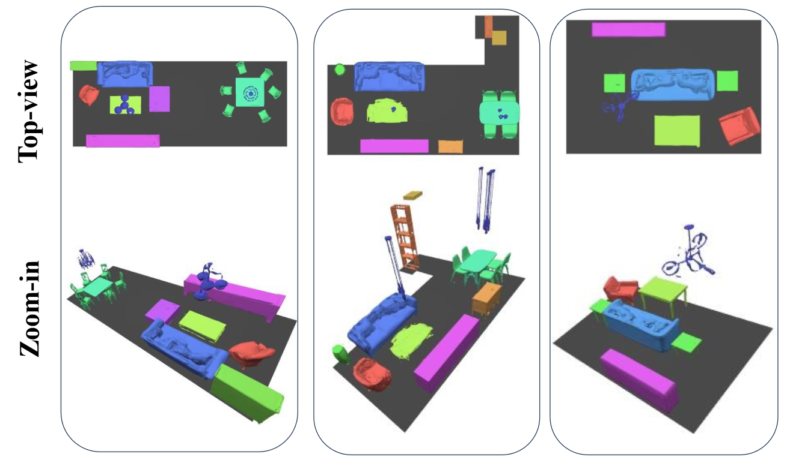   | [RoomDesigner: Encoding Anchor-latents for Style-consistent and Shape-compatible Indoor Scene Generation](https://arxiv.org/abs/2310.10027) | 2023 |  3DV  | [](https://github.com/zhao-yiqun/RoomDesigner) |
| 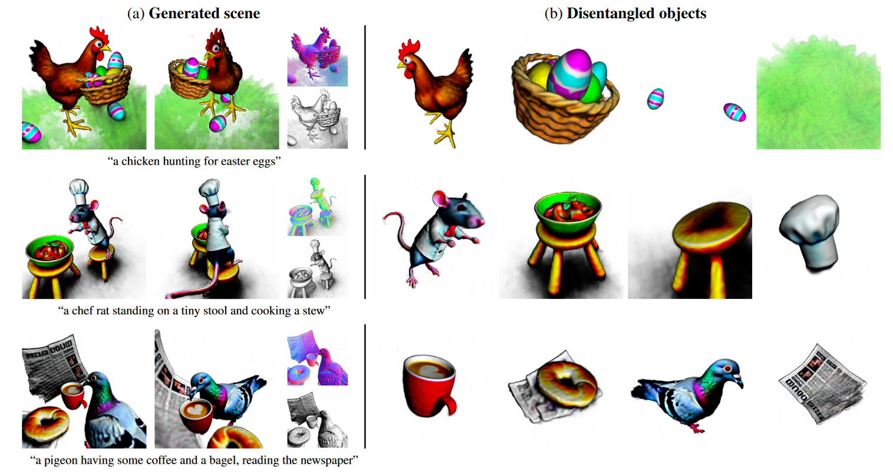  | [Disentangled 3D Scene Generation with Layout Learning](https://arxiv.org/abs/2402.16936) | 2024 | Arxiv |                              /                               |
|    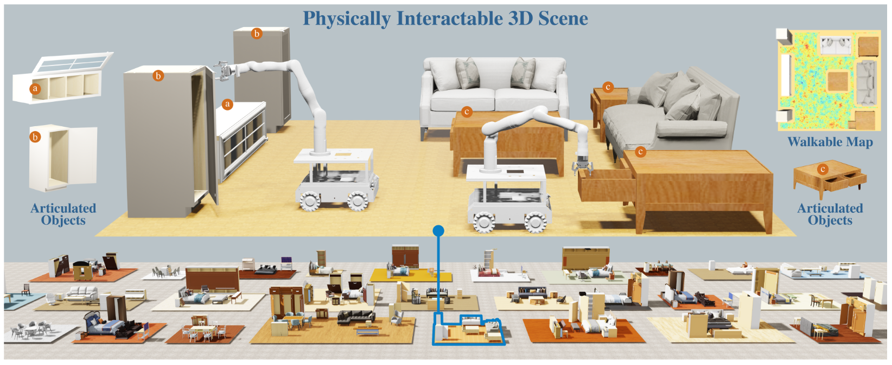     | [PhyScene: Physically Interactable 3D Scene Synthesis for Embodied AI](https://arxiv.org/abs/2404.09465) | 2024 | CVPR  | [](https://github.com/PhyScene/PhyScene)[](https://physcene.github.io/) |
|   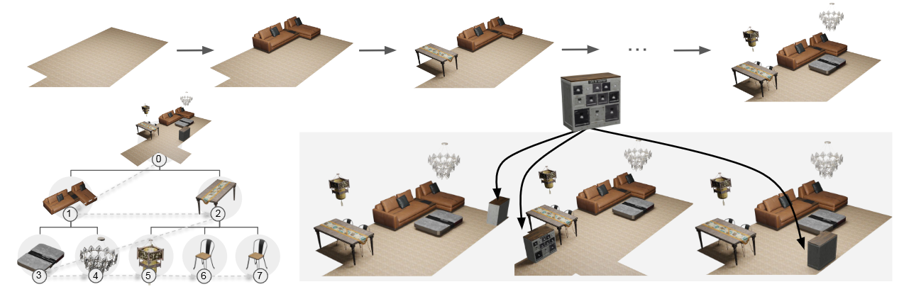    | [Forest2Seq: Revitalizing Order Prior for Sequential Indoor Scene Synthesis](https://arxiv.org/abs/2407.05388) | 2024 | ECCV  |                              /                               |
| 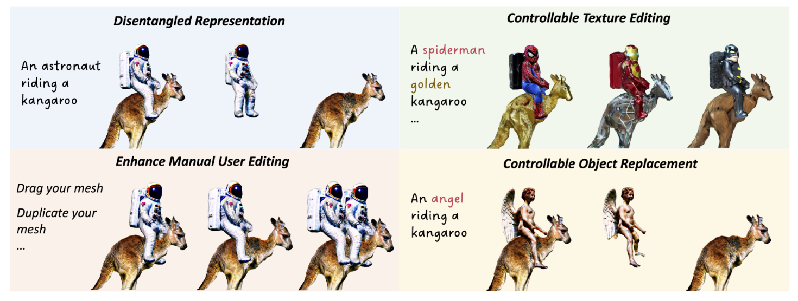  | [DreamDissector: Learning Disentangled Text-to-3D Generation from 2D Diffusion Priors](https://arxiv.org/abs/2407.16260) | 2024 | ECCV  |                              /                               |
|   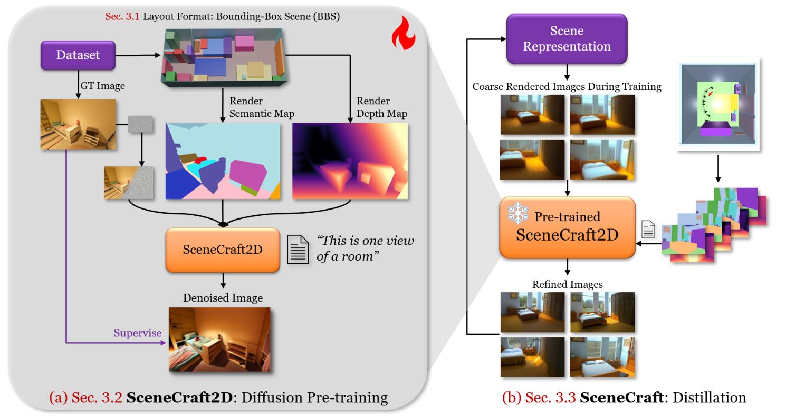   | [SceneCraft: Layout-Guided 3D Scene Generation](https://arxiv.org/abs/2410.09049) | 2024 | NIPS  | [](https://github.com/OrangeSodahub/SceneCraft)[](https://orangesodahub.github.io/SceneCraft/) |
|   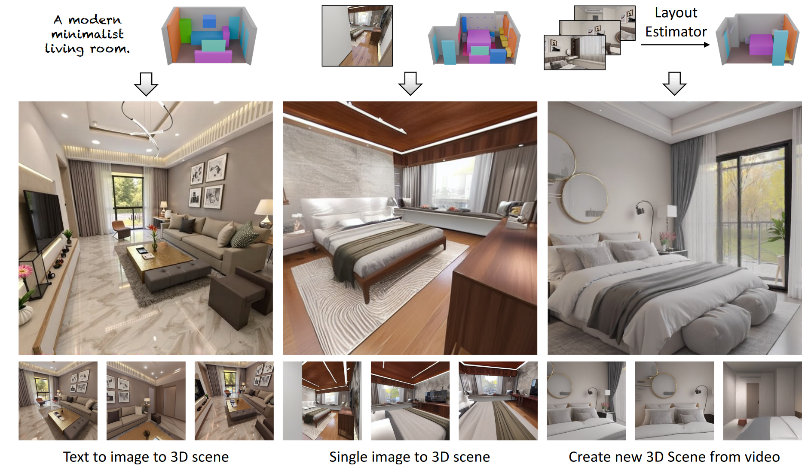    | [SPATIALGEN: Layout-guided 3D Indoor Scene Generation](https://arxiv.org/abs/2509.14981) | 2025 |  3DV  | [](https://github.com/manycore-research/SpatialGen)[](https://manycore-research.github.io/SpatialGen/) |

**BEV**

|                     Preview                      | Title                                                        | Year | Pub.  |                            Links                             |
| :----------------------------------------------: | ------------------------------------------------------------ | ---- | :---: | :----------------------------------------------------------: |
| 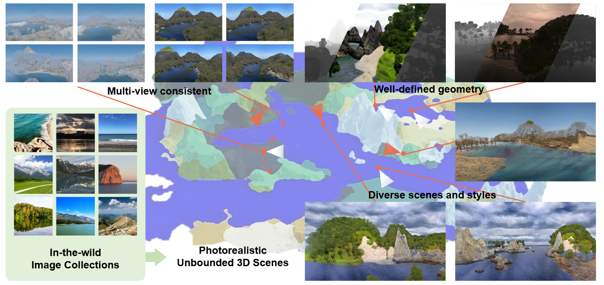 | [SceneDreamer: Unbounded 3D Scene Generation from 2D Image Collections](https://arxiv.org/abs/2302.01330) | 2023 | TPAMI | [](https://github.com/FrozenBurning/SceneDreamer)[](https://scene-dreamer.github.io/) |
| 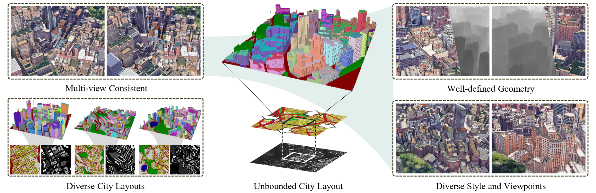  | [CityDreamer: Compositional Generative Model of Unbounded 3D Cities](https://arxiv.org/abs/2309.00610) | 2023 | CVPR  | [](https://github.com/hzxie/CityDreamer)[](https://www.infinitescript.com/project/city-dreamer/) |
|  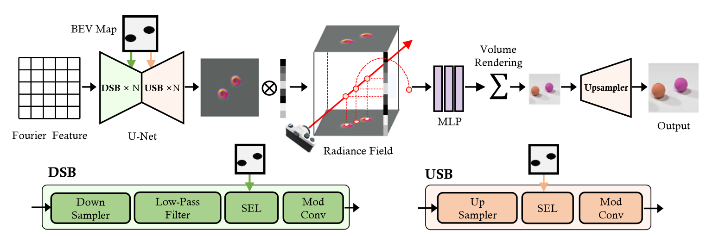   | [BerfScene: Bev-conditioned Equivariant Radiance Fields for Infinite 3D Scene Generation](https://arxiv.org/abs/2312.02136) | 2023 | CVPR  | [](https://github.com/zqh0253/BerfScene)[](https://zqh0253.github.io/BerfScene/) |
| 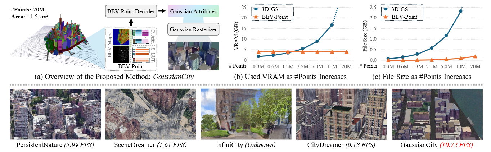 | [Generative Gaussian Splatting for Unbounded 3D City Generation](https://arxiv.org/abs/2406.06526) | 2024 | CVPR  | [](https://github.com/hzxie/GaussianCity)[](https://www.infinitescript.com/project/gaussian-city/) |

**LLM & VLM & Agent**

|                      Preview                       | Title                                                        | Year | Pub.  |                            Links                             |
| :------------------------------------------------: | ------------------------------------------------------------ | ---- | :---: | :----------------------------------------------------------: |
|   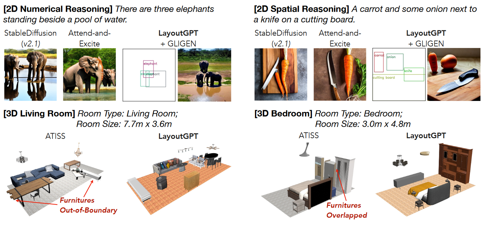    | [LayoutGPT: Compositional Visual Planning and Generation with Large Language Models](https://arxiv.org/abs/2305.15393) | 2023 | NIPS  | [](https://github.com/weixi-feng/LayoutGPT)[](https://layoutgpt.github.io/) |
|   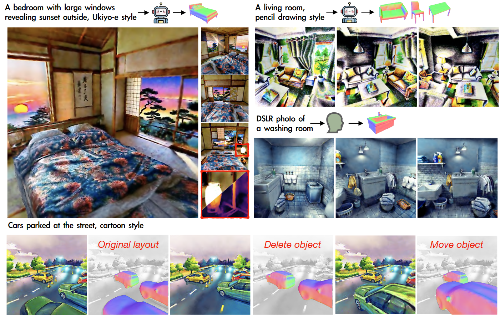   | [SceneWiz3D: Towards Text-guided 3D Scene Composition](https://arxiv.org/abs/2312.08885) | 2023 | CVPR  | [](https://github.com/zqh0253/SceneWiz3D)[](https://zqh0253.github.io/SceneWiz3D/) |
|    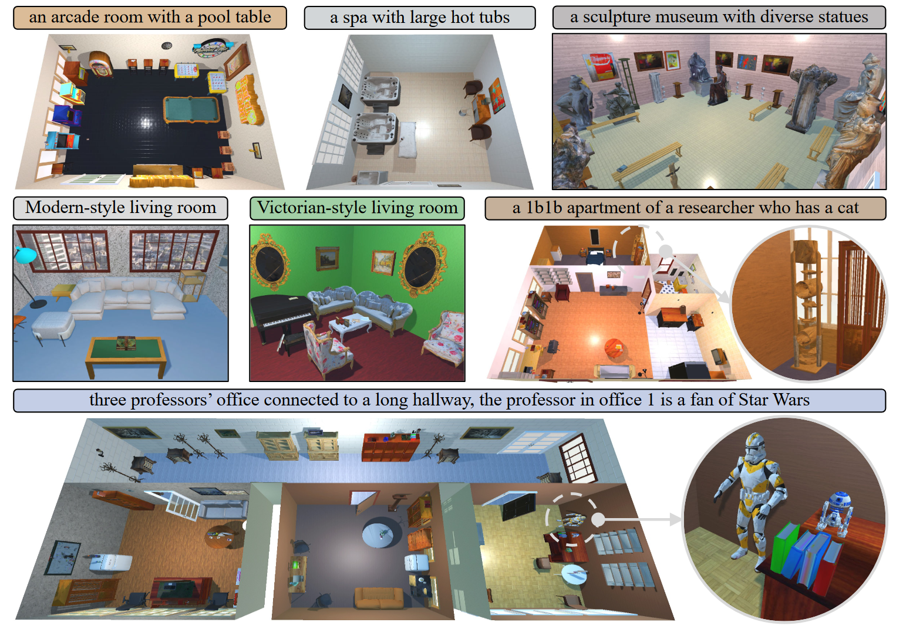    | [Holodeck: Language Guided Generation of 3D Embodied AI Environments](https://arxiv.org/abs/2312.09067) | 2023 |  3DV  | [](https://github.com/allenai/Holodeck)[](https://yueyang1996.github.io/holodeck/) |
|     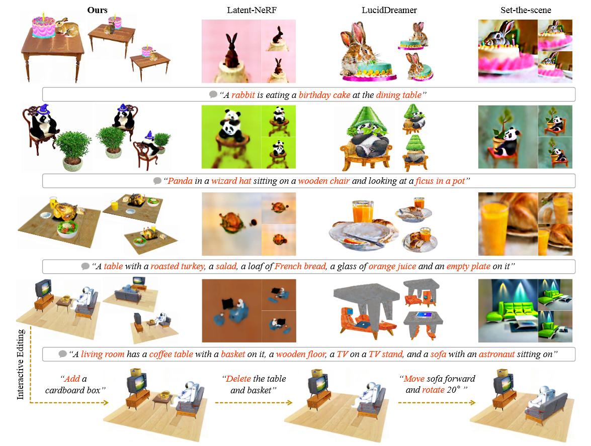     | [GALA3D: Towards Text-to-3D Complex Scene Generation via Layout-guided Generative Gaussian Splatting](https://arxiv.org/abs/2402.07207) | 2024 | ICML  | [](https://github.com/VDIGPKU/GALA3D)[](https://gala3d.github.io/) |
|    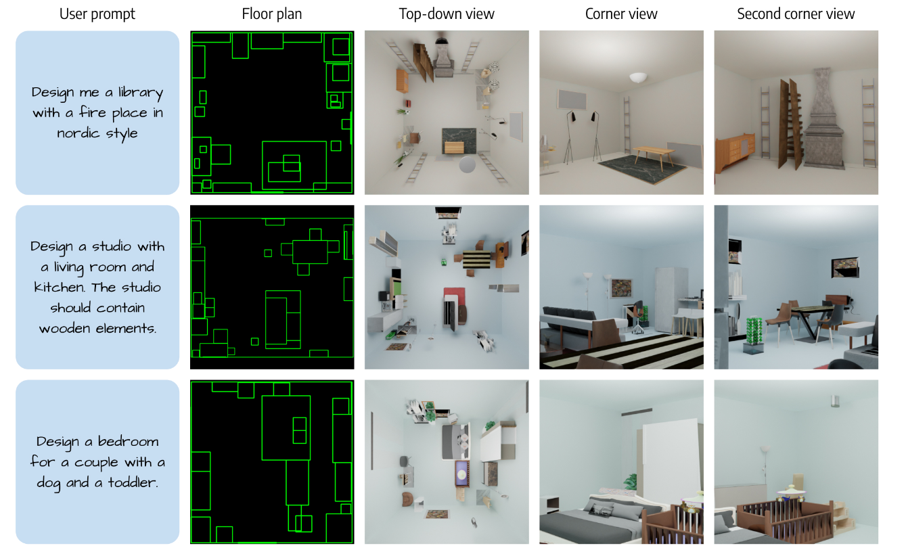     | [I-Design: Personalized LLM Interior Designer](https://arxiv.org/abs/2404.02838) | 2024 | Arxiv | [](https://github.com/atcelen/IDesign/)[](https://atcelen.github.io/I-Design/) |
|   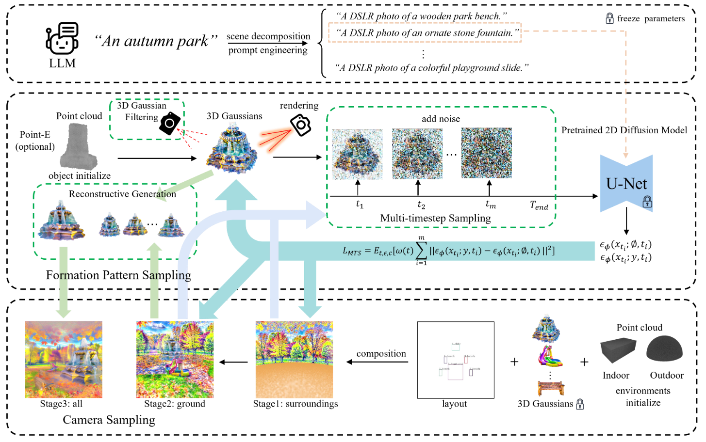   | [DreamScene: 3D Gaussian-based Text-to-3D Scene Generation via Formation Pattern Sampling](https://arxiv.org/abs/2404.03575) | 2024 | ECCV  | [](https://github.com/DreamScene-Project/DreamScene)[](https://dreamscene-project.github.io/) |
|  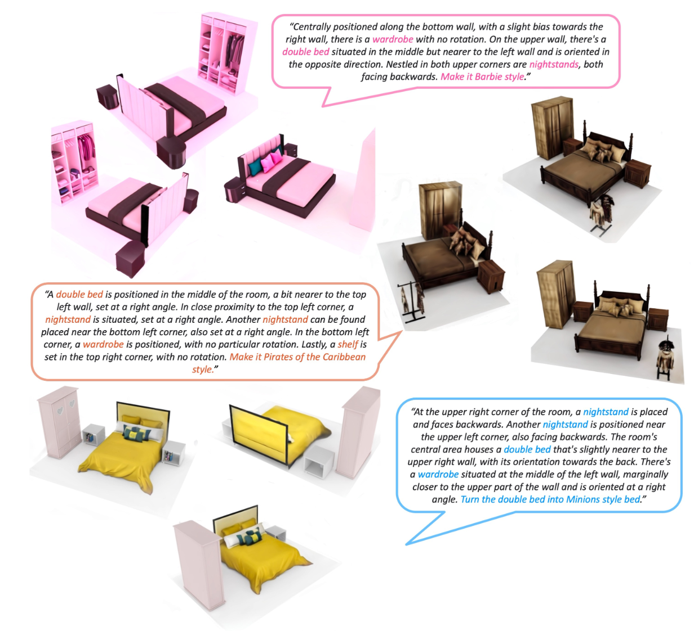   | [SceneTeller: Language-to-3D Scene Generation](https://arxiv.org/abs/2407.20727) | 2024 | ECCV  | [](https://github.com/sceneteller/SceneTeller)[](https://sceneteller.github.io/) |
|   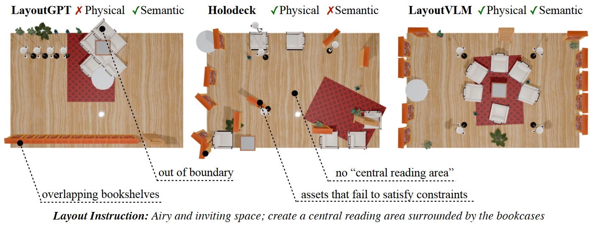    | [LayoutVLM: Differentiable Optimization of 3D Layout via Vision-Language Models](https://arxiv.org/abs/2412.02193) | 2024 | CVPR  | [](https://github.com/sunfanyunn/LayoutVLM)[](https://ai.stanford.edu/~sunfanyun/layoutvlm/) |
|     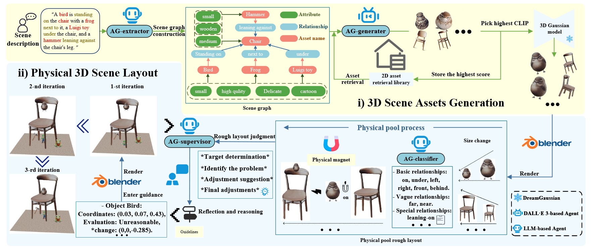      | [PhiP-G: Physics-Guided Text-to-3D Compositional Scene Generation](https://arxiv.org/abs/2502.00708) | 2025 | Arxiv |                              /                               |
| 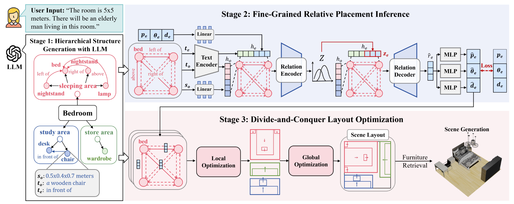 | [Hierarchically-Structured Open-Vocabulary Indoor Scene Synthesis with Pre-trained Large Language Model](https://arxiv.org/abs/2502.10675) | 2025 | Arxiv | [](https://github.com/SunWeiLin-Lynne/Hierarchically-Structured-Open-Vocabulary-Indoor-Scene-Synthesis) |
|  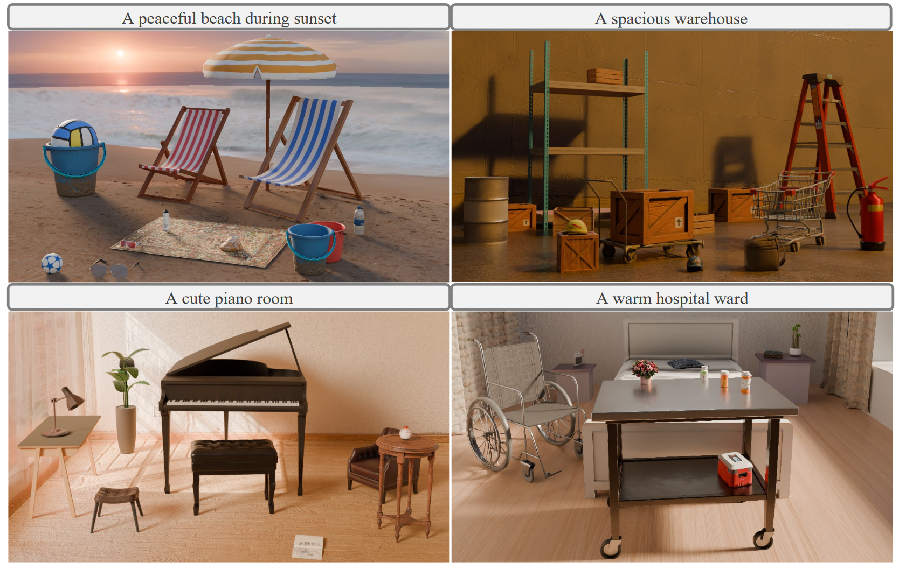   | [Scenethesis: A Language and Vision Agentic Framework for 3D Scene Generation](https://arxiv.org/abs/2505.02836) | 2025 | Arxiv | [](https://research.nvidia.com/labs/dir/scenethesis/) |
|   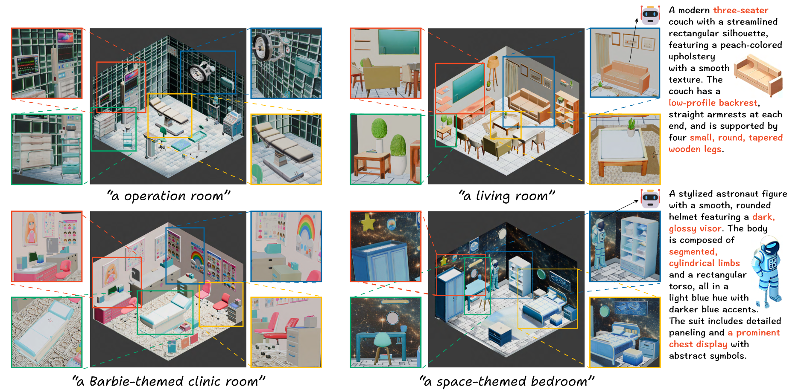    | [ArtiScene: Language-Driven Artistic 3D Scene Generation Through Image Intermediary](https://arxiv.org/abs/2506.00742) | 2025 | CVPR  | [](https://github.com/NVlabs/ArtiScene)[](https://artiscene-cvpr.github.io/) |
|   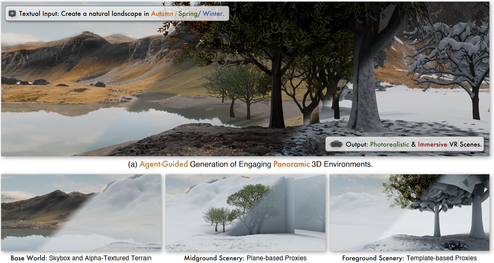   | [ImmerseGen: Agent-Guided Immersive World Generation with Alpha-Textured Proxies](https://arxiv.org/abs/2506.14315) | 2025 | Arxiv | [](https://immersegen.github.io/) |
|  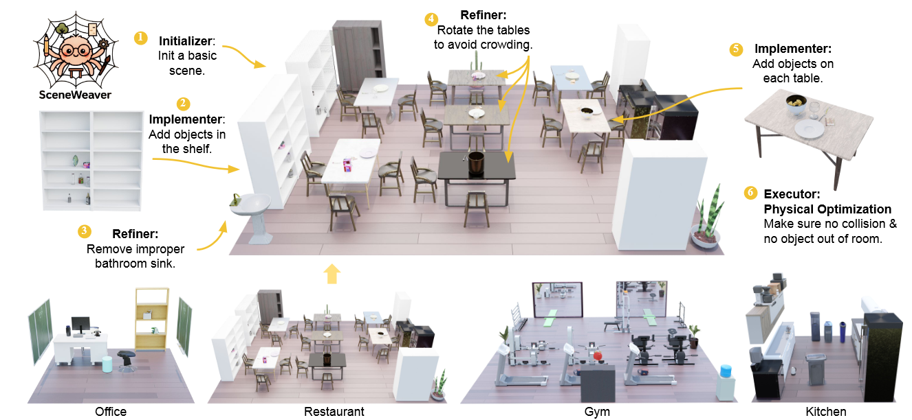   | [SceneWeaver: All-in-One 3D Scene Synthesis with an Extensible and Self-Reflective Agent](https://arxiv.org/abs/2509.20414) | 2025 | NIPS  | [](https://github.com/Scene-Weaver/SceneWeaver)[](https://scene-weaver.github.io/) |
|    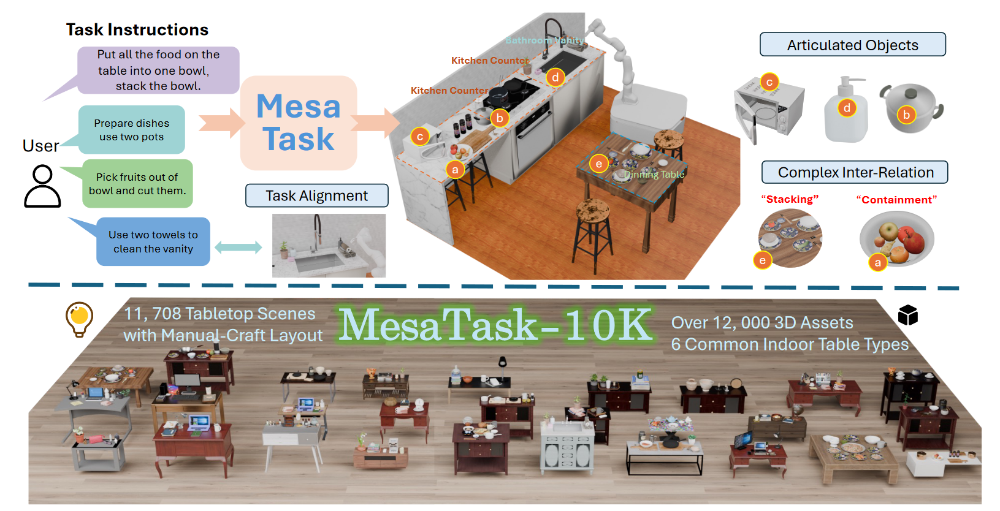    | [MesaTask: Towards Task-Driven Tabletop Scene Generation via 3D Spatial Reasoning](https://arxiv.org/abs/2509.22281) | 2025 | NIPS  | [](https://github.com/InternRobotics/MesaTask)[](https://mesatask.github.io/) |
|     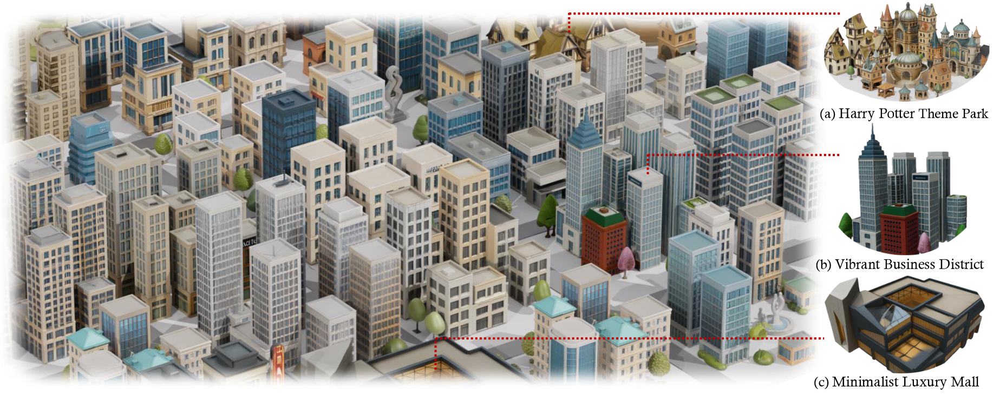     | [Yo'City: Personalized and Boundless 3D Realistic City Scene Generation via Self-Critic Expansion](https://arxiv.org/abs/2511.18734) | 2025 | Arxiv |                              /                               |

**Scene Graph**

|                      Preview                       | Title                                                        | Year |     Pub.      |                            Links                             |
| :------------------------------------------------: | ------------------------------------------------------------ | ---- | :-----------: | :----------------------------------------------------------: |
|    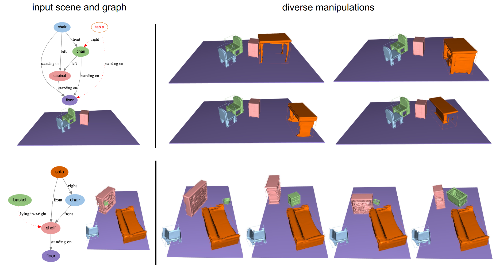    | [Graph-to-3D: End-to-End Generation and Manipulation of 3D Scenes Using Scene Graphs](https://arxiv.org/abs/2108.08841) | 2021 |     ICCV      | [](https://github.com/he-dhamo/graphto3d) |
|  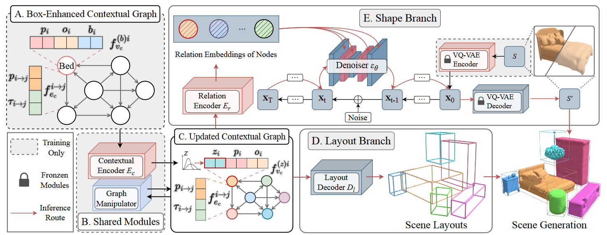   | [CommonScenes: Generating Commonsense 3D Indoor Scenes with Scene Graph Diffusion](https://arxiv.org/abs/2305.16283) | 2023 |     NIPS      | [](https://github.com/ymxlzgy/commonscenes)[](https://sites.google.com/view/commonscenes) |
|  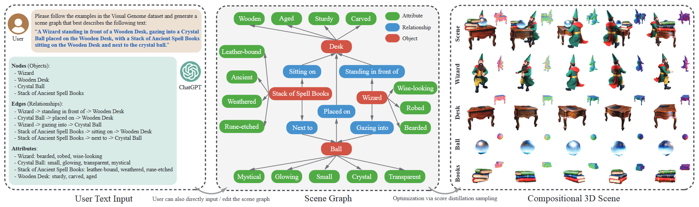  | [GraphDreamer: Compositional 3D Scene Synthesis from Scene Graphs](https://arxiv.org/abs/2312.00093) | 2023 |     CVPR      | [](https://github.com/GGGHSL/GraphDreamer)[](https://graphdreamer.github.io/) |
| 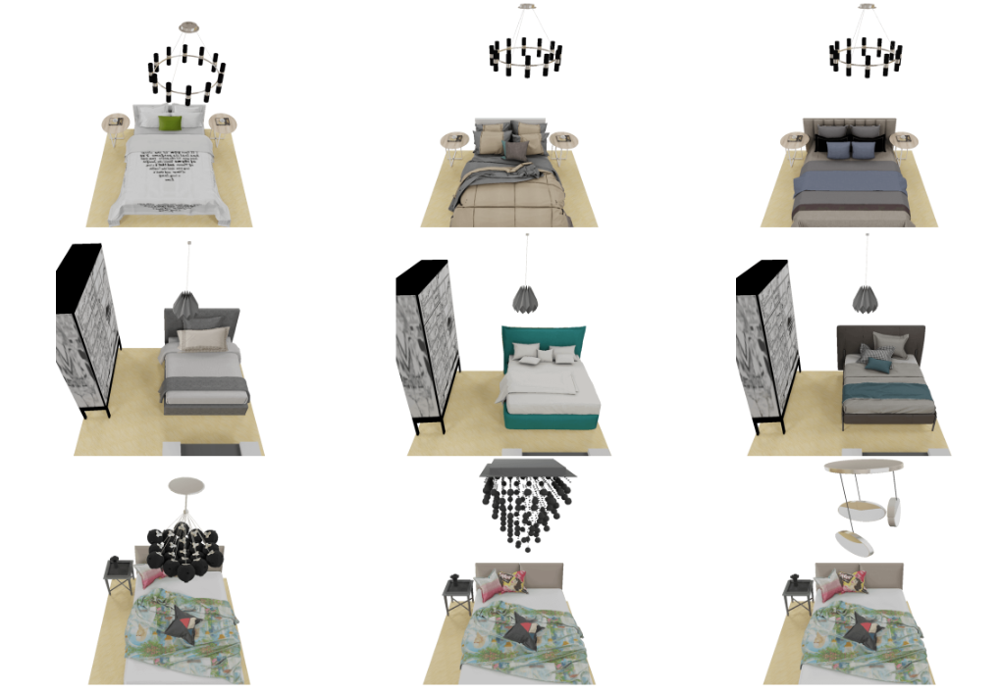  | [InstructScene: Instruction-Driven 3D Indoor Scene Synthesis with Semantic Graph Prior](https://arxiv.org/abs/2402.04717) | 2024 |     ICLR      | [](https://github.com/chenguolin/InstructScene)[](https://chenguolin.github.io/projects/InstructScene/) |
|   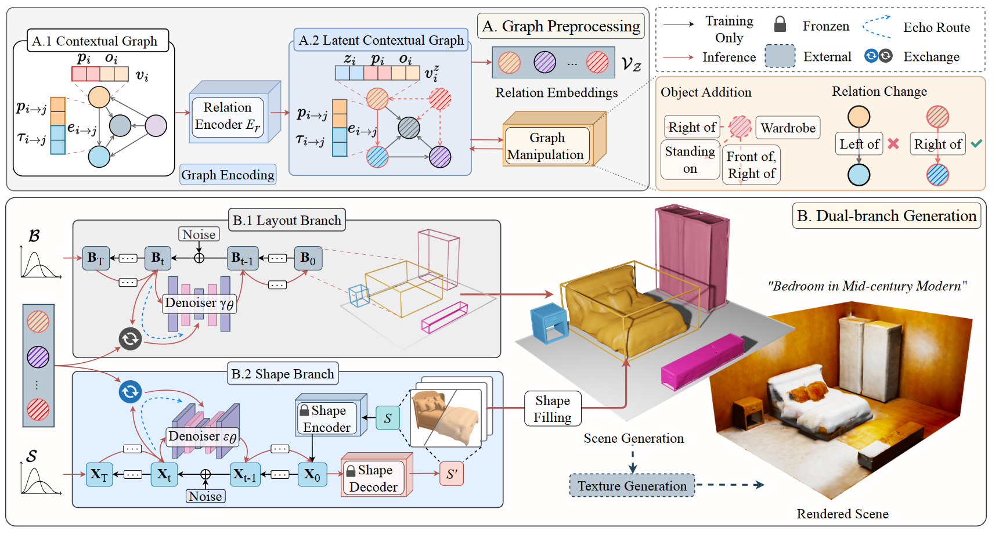    | [EchoScene: Indoor Scene Generation via Information Echo over Scene Graph Diffusion](https://arxiv.org/abs/2405.00915) | 2024 |     ECCV      | [](https://github.com/ymxlzgy/echoscene)[](https://sites.google.com/view/echoscene) |
| 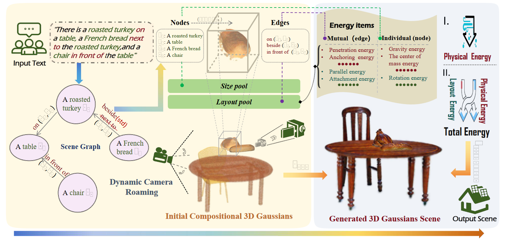  | [LAYOUTDREAMER: Physics-guided Layout for Text-to-3D Compositional Scene Generation](https://arxiv.org/abs/2502.01949) | 2025 |     Arxiv     |                              /                               |
|   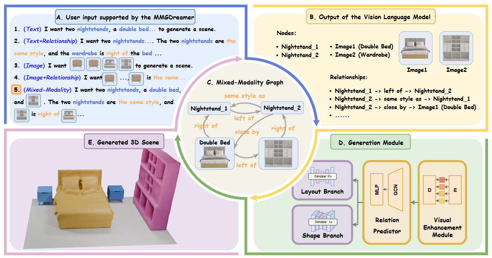   | [MMGDreamer: Mixed-Modality Graph for Geometry-Controllable 3D Indoor Scene Generation](https://arxiv.org/abs/2502.05874) | 2025 |     AAAI      | [](https://github.com/yangzhifeio/MMGDreamer)[](https://yangzhifeio.github.io/project/MMGDreamer/) |
| 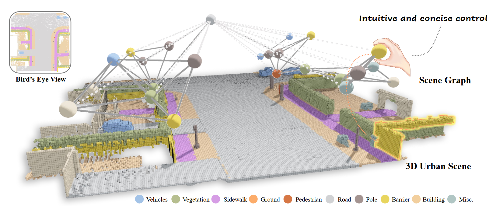 | [Controllable 3D Outdoor Scene Generation via Scene Graphs](https://arxiv.org/abs/2503.07152) | 2025 |     ICCV      | [](https://github.com/yuhengliu02/control-3d-scene)[](https://yuheng.ink/project-page/control-3d-scene/) |
|  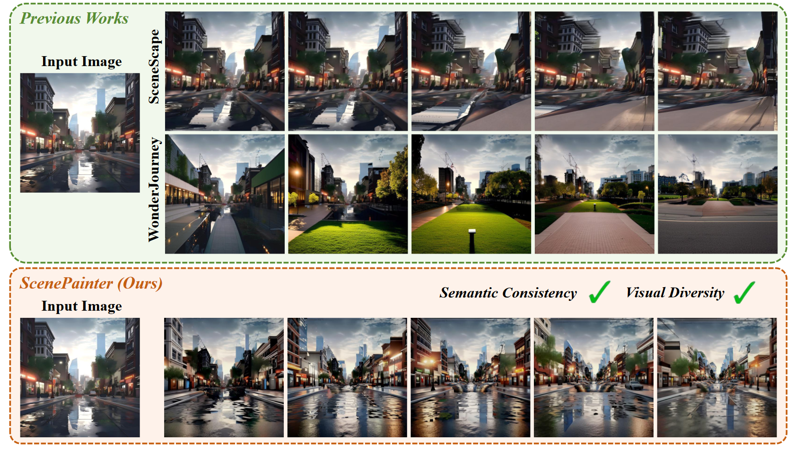  | [ScenePainter: Semantically Consistent Perpetual 3D Scene Generation with Concept Relation Alignment](https://arxiv.org/abs/2507.19058) | 2025 |     ICCV      | [](https://github.com/xiac20/ScenePainter)[](https://xiac20.github.io/ScenePainter/) |
|  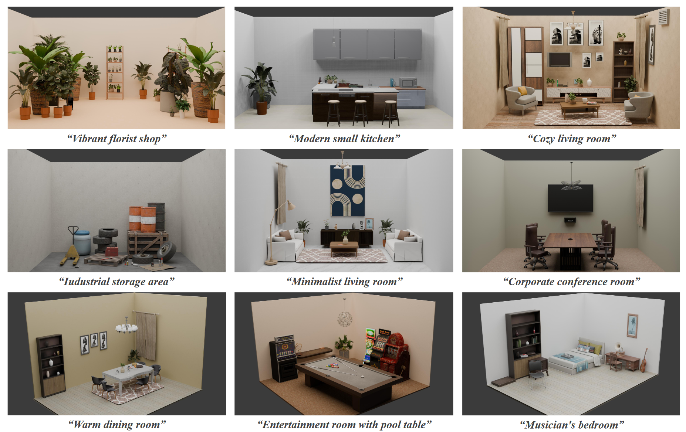   | [Imaginarium: Vision-guided High-Quality 3D Scene Layout Generation](https://arxiv.org/abs/2510.15564) | 2025 | SIGGRAPH Aisa | [](https://github.com/HiHiAllen/Imaginarium)[](https://ydove0324.github.io/Imaginarium/) |

## 2D prior-based

**Iterative**

|                      Preview                       | Title                                                        | Year | Pub.  |                            Links                             |
| :------------------------------------------------: | ------------------------------------------------------------ | ---- | :---: | :----------------------------------------------------------: |
|    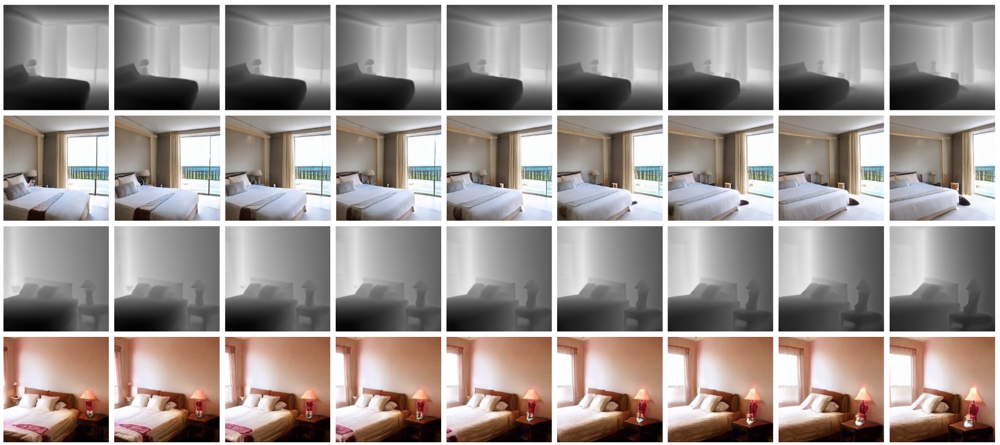     | [3D-Aware Indoor Scene Synthesis with Depth Priors](https://arxiv.org/abs/2202.08553) | 2022 | ECCV  | [](https://github.com/vivianszf/depthgan)[](https://vivianszf.github.io/depthgan/) |
|     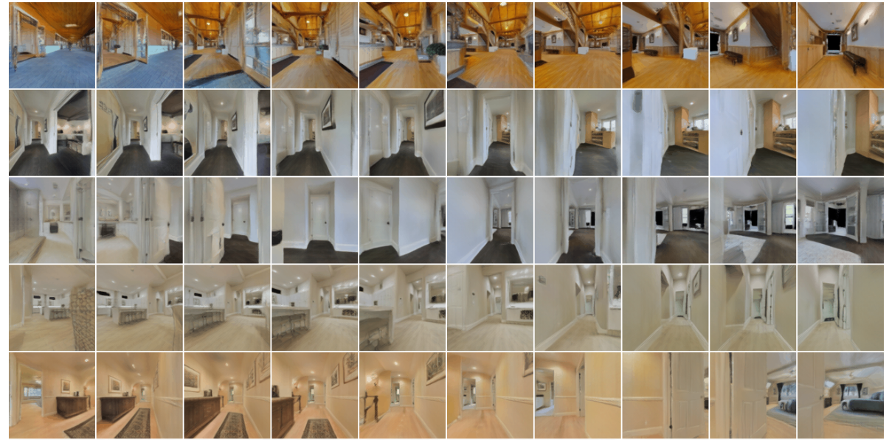      | [GAUDI: A Neural Architect for Immersive 3D Scene Generation](https://arxiv.org/abs/2207.13751) | 2022 | NIPS  | [](https://github.com/apple/ml-gaudi) |
|     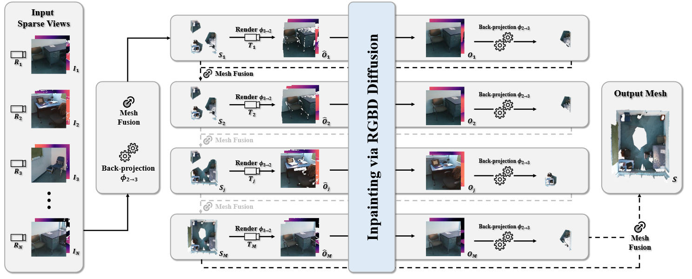      | [RGBD2: Generative Scene Synthesis via Incremental View Inpainting using RGBD Diffusion Models](https://arxiv.org/abs/2212.05993) | 2022 | CVPR  | [](https://github.com/Karbo123/RGBD-Diffusion)[](https://jblei.site/proj/rgbd-diffusion) |
|   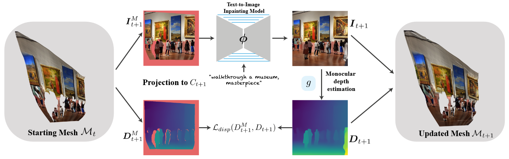   | [SceneScape: Text-Driven Consistent Scene Generation](https://arxiv.org/abs/2302.01133) | 2023 | NIPS  | [](https://github.com/RafailFridman/SceneScape)[](https://scenescape.github.io/) |
|   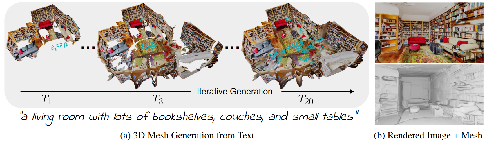    | [Text2Room: Extracting Textured 3D Meshes from 2D Text-to-Image Models](https://arxiv.org/abs/2303.11989) | 2023 | ICCV  | [](https://github.com/lukasHoel/text2room)[](https://lukashoel.github.io/text-to-room/) |
| 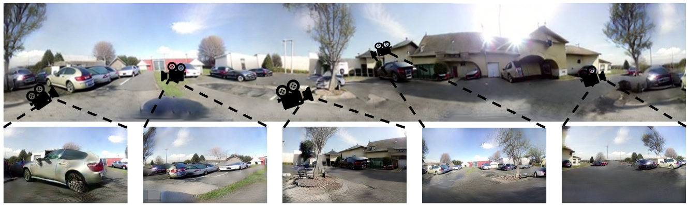 | [NeuralField-LDM: Scene Generation with Hierarchical Latent Diffusion Models](https://arxiv.org/abs/2304.09787) | 2023 | CVPR  | [](https://research.nvidia.com/labs/toronto-ai/NFLDM/) |
|   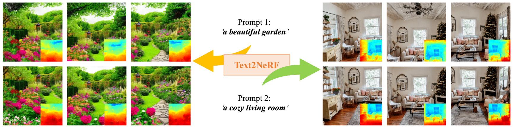    | [Text2NeRF: Text-Driven 3D Scene Generation with Neural Radiance Fields](https://arxiv.org/abs/2305.11588) | 2023 | TVCG  | [](https://github.com/eckertzhang/Text2NeRF) |
| 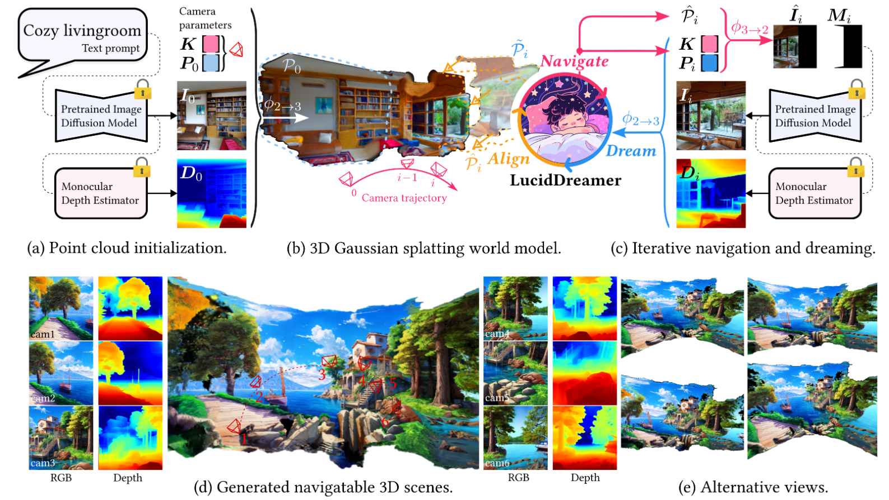  | [LucidDreamer: Domain-free Generation of 3D Gaussian Splatting Scenes](https://arxiv.org/abs/2311.13384) | 2023 | Arxiv | [](https://github.com/luciddreamer-cvlab/LucidDreamer)[](https://luciddreamer-cvlab.github.io/) |
|    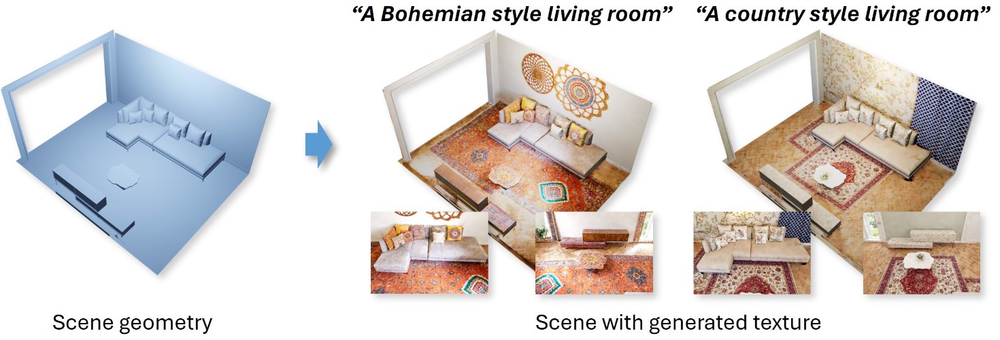    | [SceneTex: High-Quality Texture Synthesis for Indoor Scenes via Diffusion Priors](https://arxiv.org/abs/2311.17261) | 2023 | CVPR  | [](https://github.com/daveredrum/SceneTex)[](https://daveredrum.github.io/SceneTex/) |
| 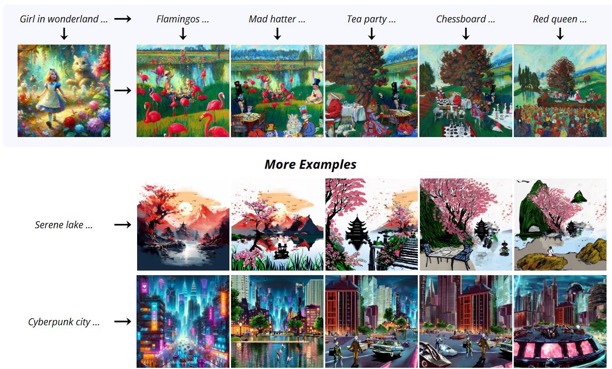  | [WonderJourney: Going from Anywhere to Everywhere](https://arxiv.org/abs/2312.03884) | 2023 | CVPR  | [](https://github.com/KovenYu/WonderJourney)[](https://kovenyu.com/wonderjourney/) |
|  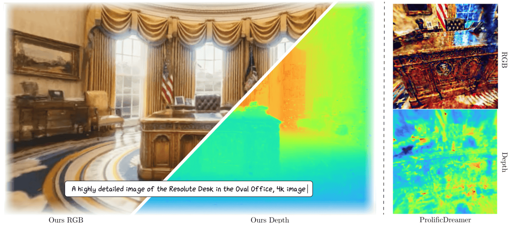   | [RealmDreamer: Text-Driven 3D Scene Generation with Inpainting and Depth Diffusion](https://arxiv.org/abs/2404.07199) | 2024 |  3DV  | [](https://github.com/jaidevshriram/realmdreamer)[](https://realmdreamer.github.io/) |
|   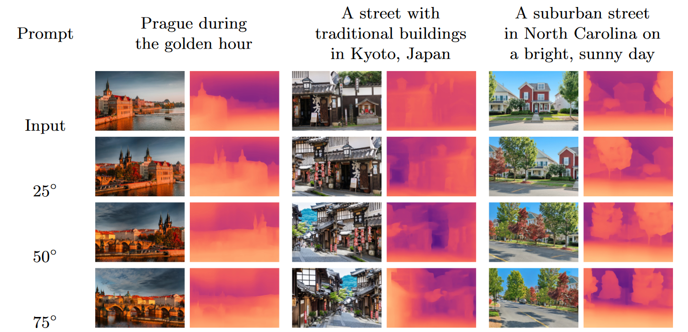    | [Invisible Stitch: Generating Smooth 3D Scenes with Depth Inpainting](https://arxiv.org/abs/2404.19758) | 2024 | Arxiv | [](https://github.com/paulengstler/invisible-stitch)[](https://research.paulengstler.com/invisible-stitch/) |
|  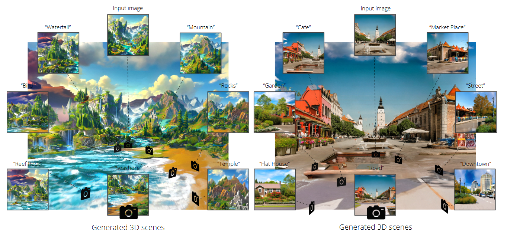   | [WonderWorld: Interactive 3D Scene Generation from a Single Image](https://arxiv.org/abs/2406.09394) | 2024 | CVPR  | [](https://github.com/KovenYu/WonderWorld)[](https://kovenyu.com/wonderworld/) |

**Panorama**

|                       Preview                       | Title                                                        | Year |   Pub.   |                            Links                             |
| :-------------------------------------------------: | ------------------------------------------------------------ | ---- | :------: | :----------------------------------------------------------: |
|   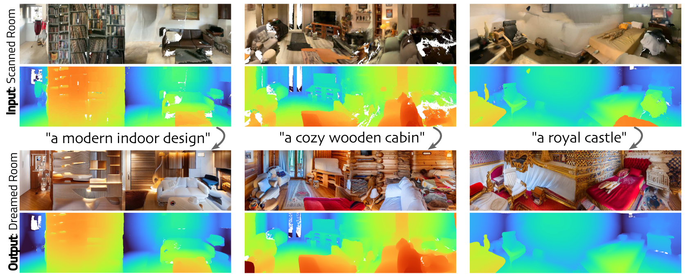   | [RoomDreamer: Text-Driven 3D Indoor Scene Synthesis with Coherent Geometry and Texture](https://arxiv.org/abs/2305.11337) | 2023 |    MM    | [](https://www.youtube.com/watch?v=p4xgwj4QJcQ) |
|      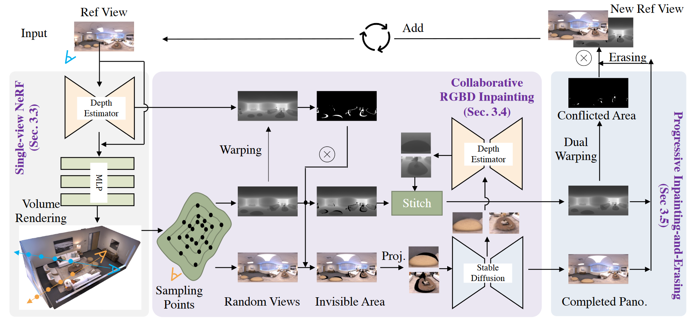       | [PERF: Panoramic Neural Radiance Field from a Single Panorama](https://arxiv.org/abs/2310.16831) | 2023 |  TPAMI   | [](https://github.com/perf-project/PeRF)[](https://perf-project.github.io/) |
|  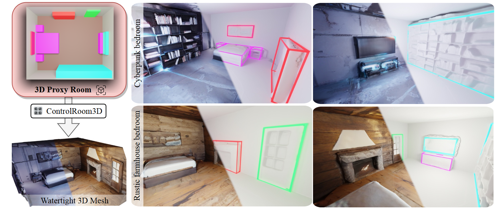  | [ControlRoom3D: Room Generation using Semantic Proxy Rooms](https://arxiv.org/abs/2312.05208) | 2023 |   CVPR   | [](https://jonasschult.github.io/ControlRoom3D/) |
|  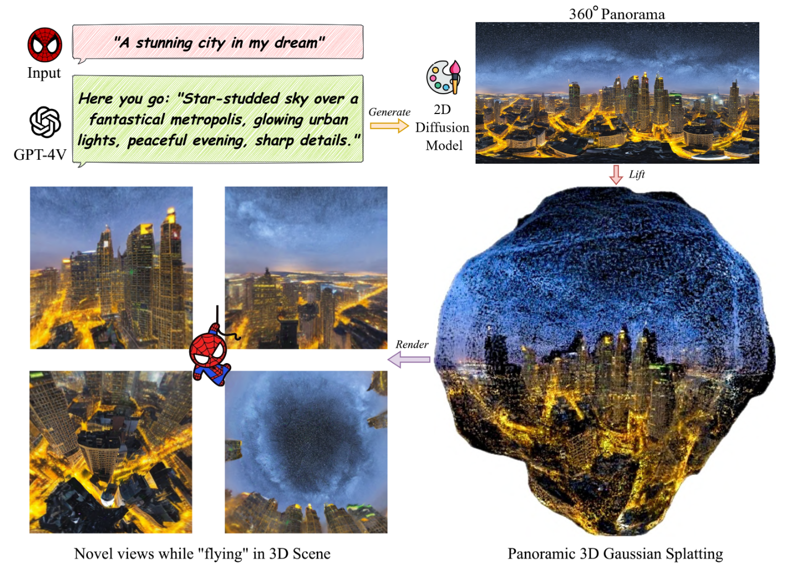  | [DreamScene360: Unconstrained Text-to-3D Scene Generation with Panoramic Gaussian Splatting](https://arxiv.org/abs/2404.06903) | 2024 |   ECCV   | [](https://github.com/ShijieZhou-UCLA/DreamScene360)[](https://dreamscene360.github.io/) |
|    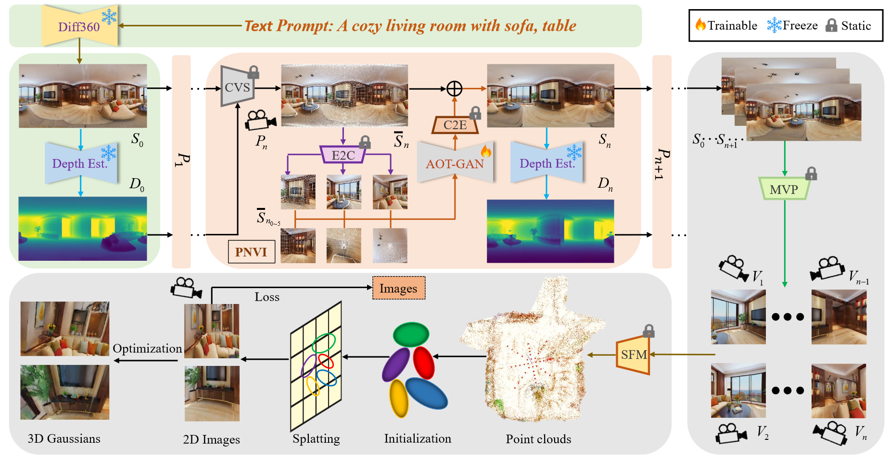    | [FastScene: Text-Driven Fast 3D Indoor Scene Generation via Panoramic Gaussian Splatting](https://arxiv.org/abs/2405.05768) | 2024 |  IJCAI   | [](https://github.com/Mr-Ma-yikun/FastScene) |
|      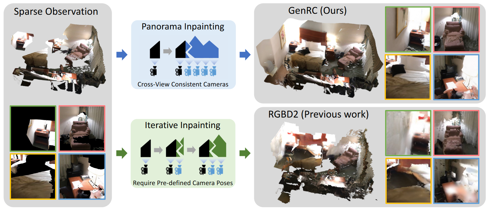      | [GenRC: Generative 3D Room Completion from Sparse Image Collections](https://arxiv.org/abs/2407.12939) | 2024 |   ECCV   | [](https://github.com/minfenli/GenRC)[](https://minfenli.github.io/GenRC/) |
|   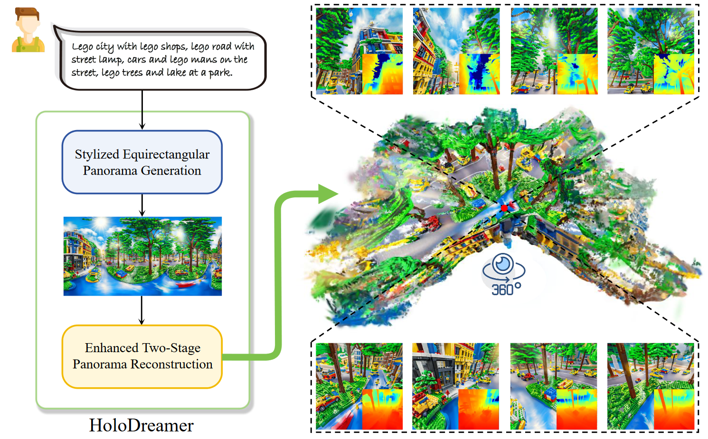   | [HoloDreamer: Holistic 3D Panoramic World Generation from Text Descriptions](https://arxiv.org/abs/2407.15187) | 2024 |  Arxiv   | [](https://github.com/zhouhyOcean/HoloDreamer)[](https://zhouhyocean.github.io/holodreamer/) |
|   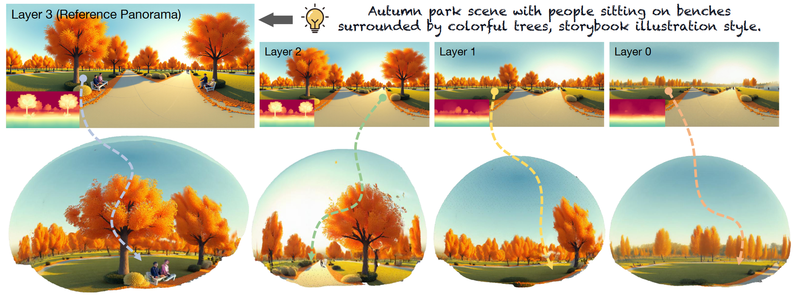   | [LayerPano3D: Layered 3D Panorama for Hyper-Immersive Scene Generation](https://arxiv.org/abs/2408.13252) | 2024 | SIGGRAPH | [](https://github.com/3DTopia/LayerPano3D)[](https://ys-imtech.github.io/projects/LayerPano3D/) |
| 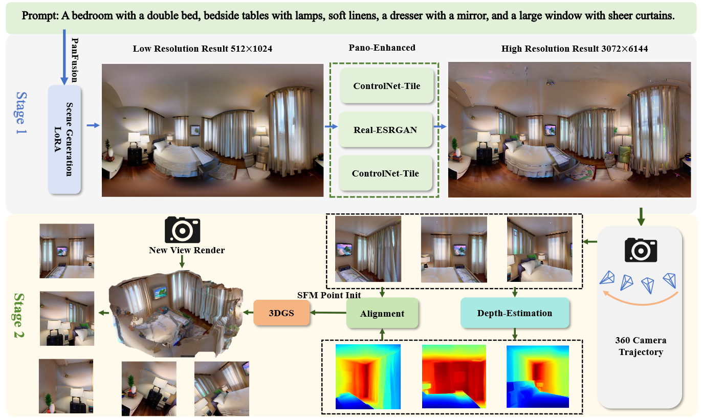 | [SceneDreamer360: Text-Driven 3D-Consistent Scene Generation with Panoramic Gaussian Splatting](https://arxiv.org/abs/2408.13711) | 2024 |  Arxiv   | [](https://github.com/liwrui/SceneDreamer360)[](https://scenedreamer360.github.io/) |
|     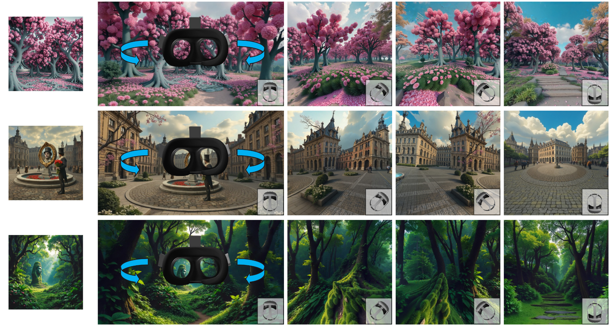     | [A Recipe for Generating 3D Worlds From a Single Image](https://arxiv.org/abs/2503.16611) | 2025 |   ICCV   | [](https://katjaschwarz.github.io/worlds/) |
|    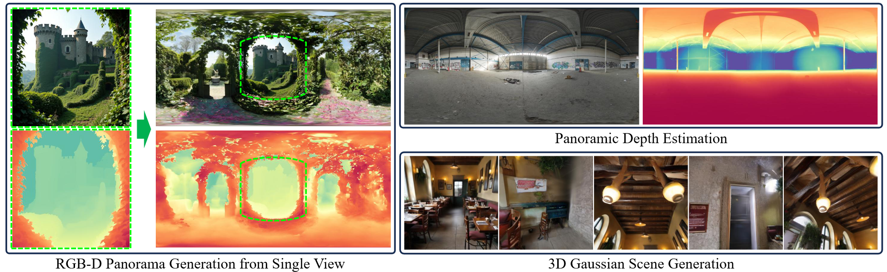    | [DreamCube: 3D Panorama Generation via Multi-plane Synchronization](https://arxiv.org/abs/2506.17206) | 2025 |   ICCV   | [](https://github.com/Yukun-Huang/DreamCube)[](https://yukun-huang.github.io/DreamCube/) |
|  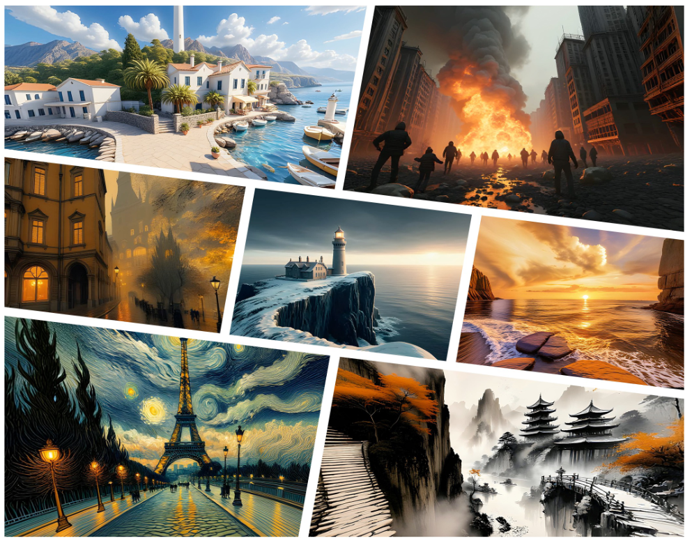   | [HunyuanWorld 1.0: Generating Immersive, Explorable, and Interactive 3D Worlds from Words or Pixels](https://arxiv.org/abs/2507.21809) | 2025 |  Arxiv   | [](https://github.com/Tencent-Hunyuan/HunyuanWorld-Mirror)[](https://3d-models.hunyuan.tencent.com/world/) |
|     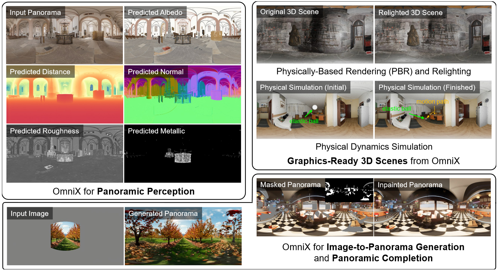      | [OmniX: From Unified Panoramic Generation and Perception to Graphics-Ready 3D Scenes](https://arxiv.org/abs/2510.26800) | 2025 |  Arxiv   | [](https://github.com/HKU-MMLab/OmniX)[](https://yukun-huang.github.io/OmniX/) |

**Single-Image Decomposition and Composition**

|                     Preview                     | Title                                                        | Year |   Pub.   |                            Links                             |
| :---------------------------------------------: | ------------------------------------------------------------ | ---- | :------: | :----------------------------------------------------------: |
| 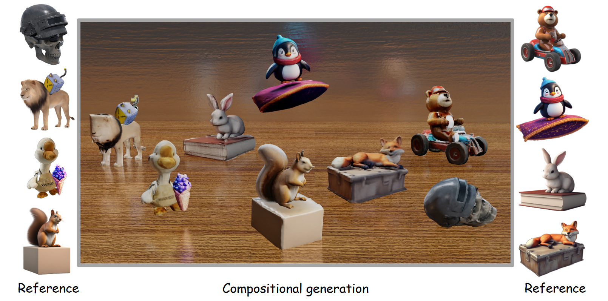  | [ComboVerse: Compositional 3D Assets Creation Using Spatially-Aware Diffusion Guidance](https://arxiv.org/abs/2403.12409) | 2024 |   ECCV   | [](https://cyw-3d.github.io/ComboVerse/) |
|   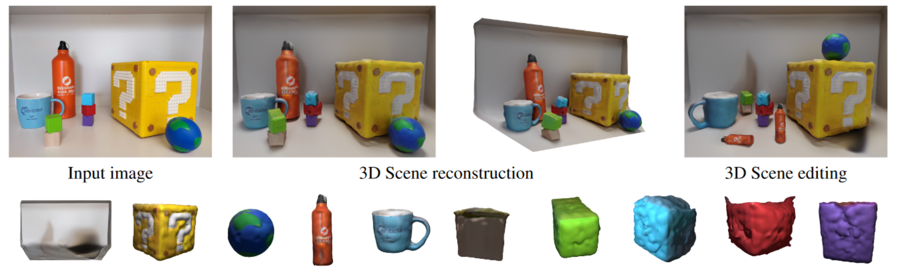   | [Gen3DSR: Generalizable 3D Scene Reconstruction via Divide and Conquer from a Single View](https://arxiv.org/abs/2404.03421) | 2024 |   3DV    | [](https://github.com/AndreeaDogaru/Gen3DSR)[](https://andreeadogaru.github.io/Gen3DSR/) |
|   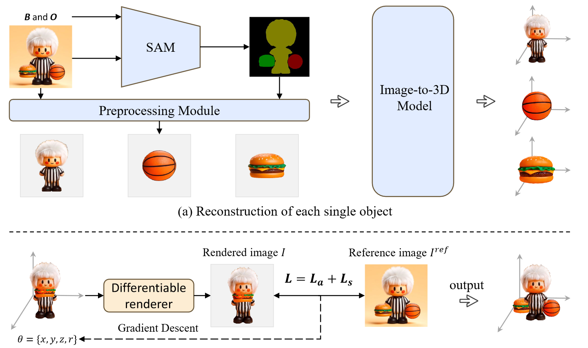    | [REPARO: Compositional 3D Assets Generation with Differentiable 3D Layout Alignment](https://arxiv.org/abs/2405.18525) | 2024 |   CVPR   | [](https://github.com/VincentHancoder/REPARO)[](https://reparo2024.github.io/) |
|  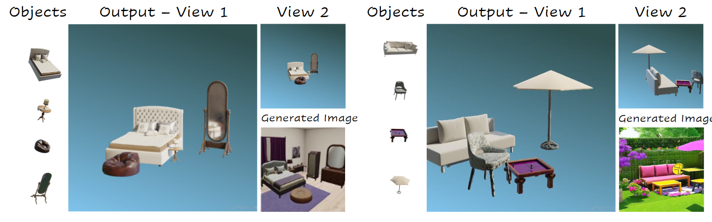  | [Lay-A-Scene: Personalized 3D Object Arrangement Using Text-to-Image Priors](https://arxiv.org/abs/2406.00687) | 2024 |  Arxiv   | [](https://github.com/ohad204/Lay-A-Scene) |
|     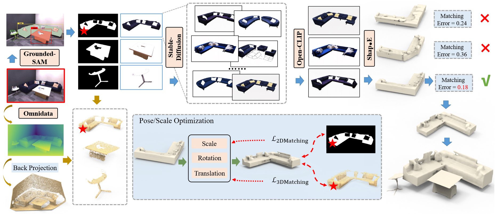     | [Zero-Shot Scene Reconstruction from Single Images with Deep Prior Assembly](https://arxiv.org/abs/2410.15971) | 2024 |   NIPS   | [](https://github.com/junshengzhou/DeepPriorAssembly)[](https://junshengzhou.github.io/DeepPriorAssembly/) |
|   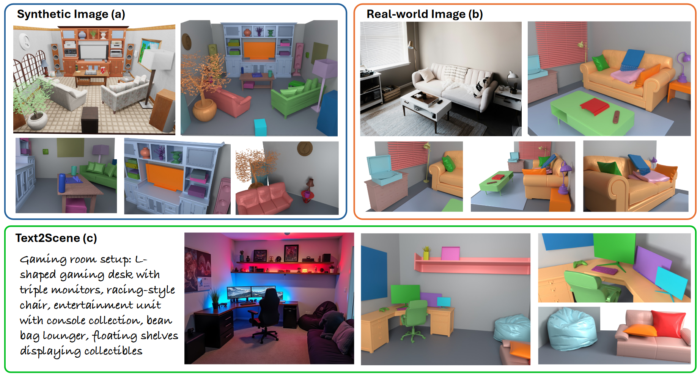   | [Diorama: Unleashing Zero-shot Single-view 3D Indoor Scene Modeling](https://arxiv.org/abs/2411.19492) | 2024 |   ICCV   | [](https://github.com/3dlg-hcvc/diorama)[](https://3dlg-hcvc.github.io/diorama/) |
|    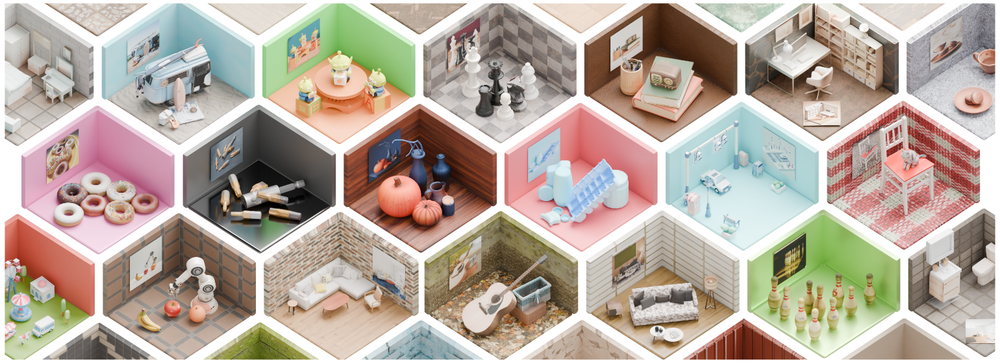     | [CAST: Component-Aligned 3D Scene Reconstruction from an RGB Image](https://arxiv.org/abs/2502.12894) | 2025 | SIGGRAPH | [](https://sites.google.com/view/cast4) |
|   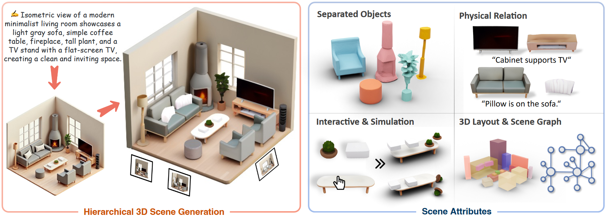   | [HiScene: Creating Hierarchical 3D Scenes with Isometric View Generation](https://arxiv.org/abs/2504.13072) | 2025 |  Arxiv   | [](https://zju3dv.github.io/hiscene/) |
|    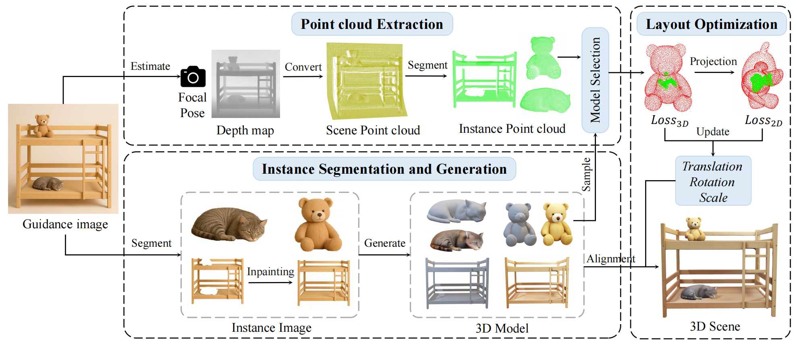     | [Towards Geometric and Textural Consistency 3D Scene Generation via Single Image-guided Model Generation and Layout Optimization](https://arxiv.org/abs/2507.14841) | 2025 |  Arxiv   | [](https://github.com/xdlbw/sing3d)[](https://xdlbw.github.io/sing3d/) |
|  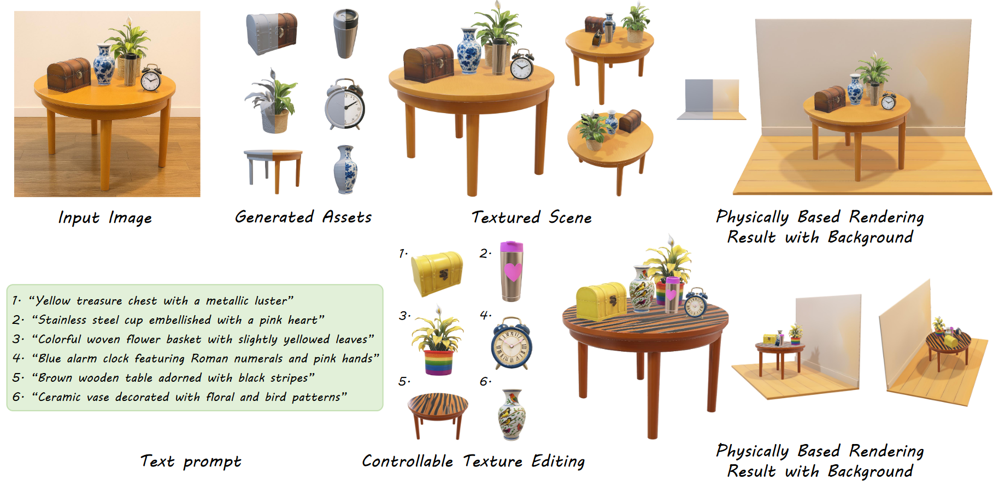  | [ZeroScene: A Zero-Shot Framework for 3D Scene Generation from a Single Image and Controllable Texture Editing](https://arxiv.org/abs/2509.23607) | 2025 |  Arxiv   | [](https://xdlbw.github.io/ZeroScene/) |
| 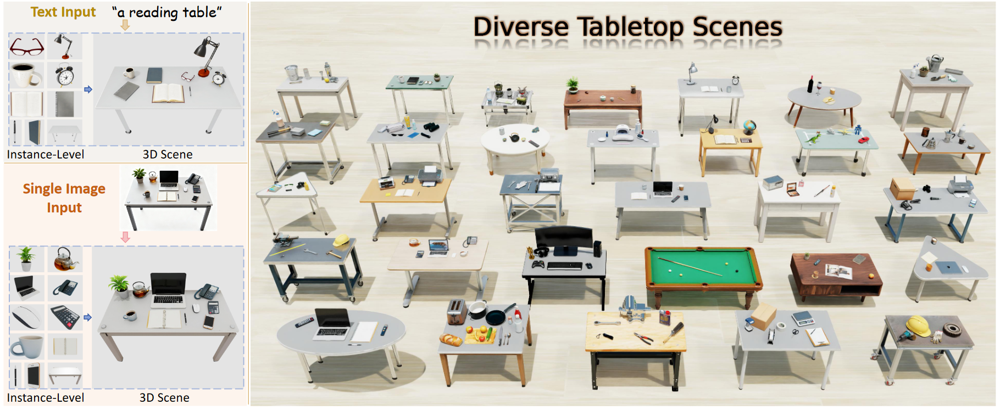 | [TabletopGen: Instance-Level Interactive 3D Tabletop Scene Generation from Text or Single Image](https://arxiv.org/abs/2512.01204v3) | 2025 |  Arxiv   | [](https://d-robotics-ai-lab.github.io/TabletopGen.project/#) |

**Feedforward**

|                    Preview                     | Title                                                        | Year | Pub.  |                            Links                             |
| :--------------------------------------------: | ------------------------------------------------------------ | ---- | :---: | :----------------------------------------------------------: |
|   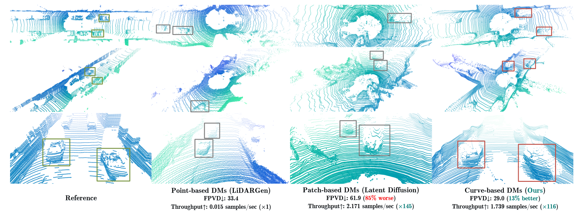    | [Towards Realistic Scene Generation with LiDAR Diffusion Models](https://arxiv.org/abs/2404.00815) | 2024 | CVPR  | [](https://github.com/hancyran/LiDAR-Diffusion)[](https://lidar-diffusion.github.io/) |
| 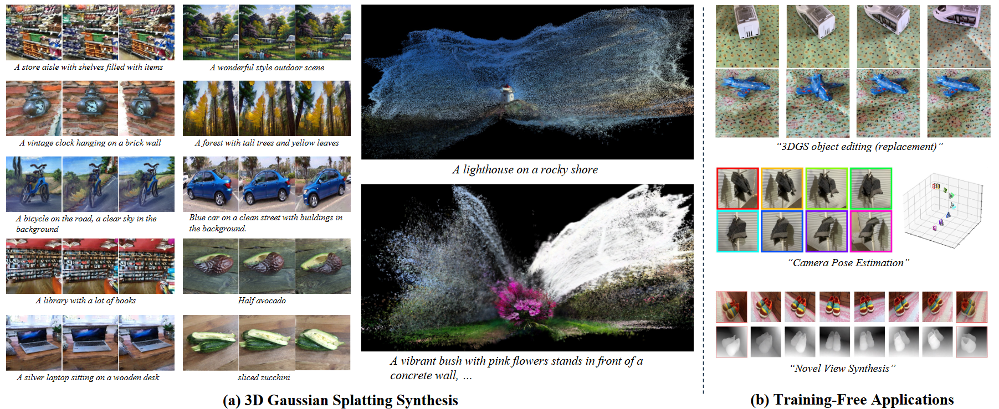  | [SplatFlow: Multi-View Rectified Flow Model for 3D Gaussian Splatting Synthesis](https://arxiv.org/abs/2411.16443) | 2024 | CVPR  | [](https://github.com/gohyojun15/SplatFlow)[](https://gohyojun15.github.io/SplatFlow/) |
|    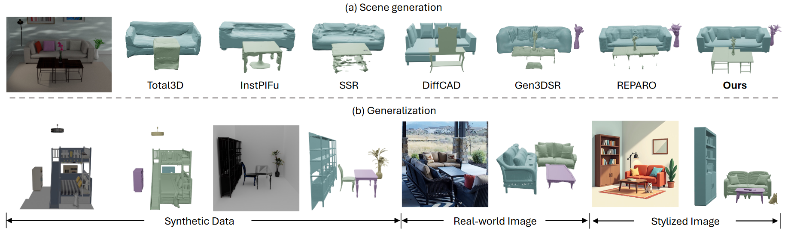    | [MIDI: Multi-Instance Diffusion for Single Image to 3D Scene Generation](https://arxiv.org/abs/2412.03558) | 2024 | CVPR  | [](https://github.com/VAST-AI-Research/MIDI-3D)[](https://huanngzh.github.io/MIDI-Page/) |
| 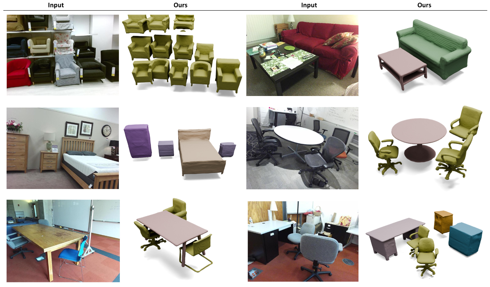 | [Coherent 3D Scene Diffusion From a Single RGB Image](https://arxiv.org/abs/2412.10294) | 2024 | NIPS  | [](https://www.manuel-dahnert.com/research/scene-diffusion) |
| 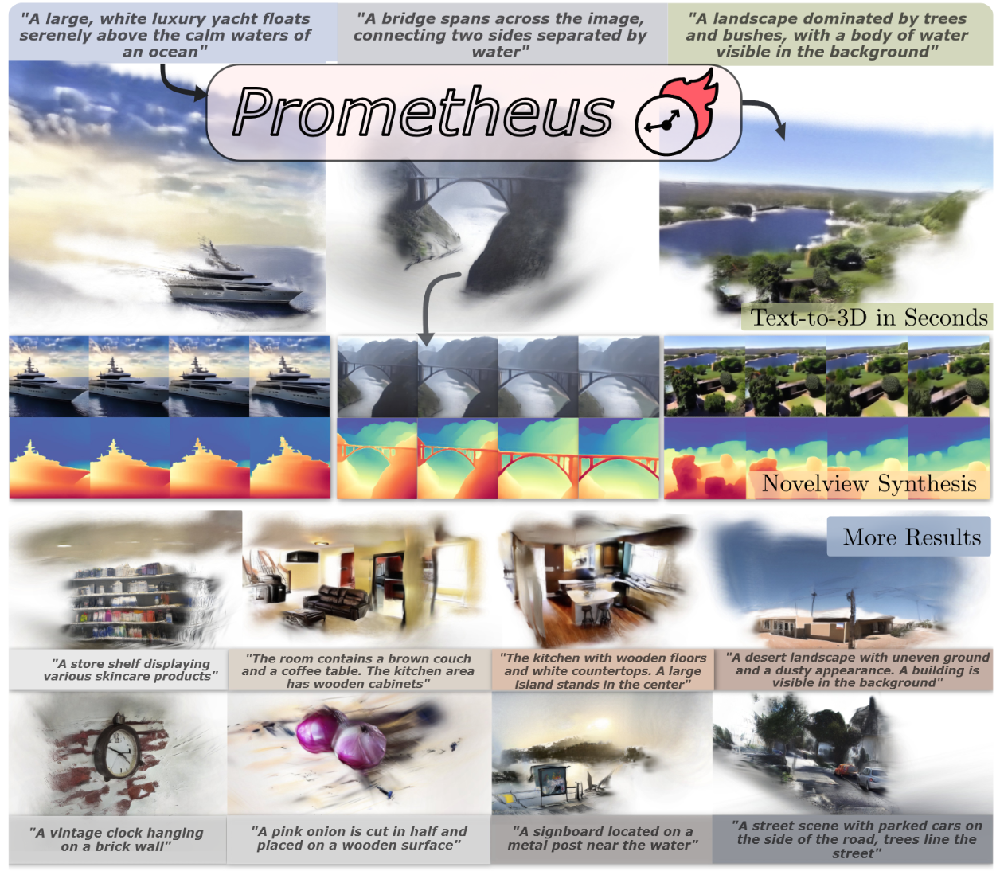 | [Prometheus: 3D-Aware Latent Diffusion Models for Feed-Forward Text-to-3D Scene Generation](https://arxiv.org/abs/2412.21117) | 2024 | CVPR  | [](https://github.com/XDimLab/Prometheus)[](https://freemty.github.io/project-prometheus/) |
|   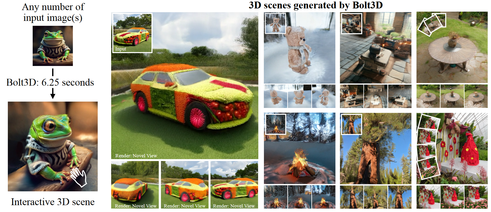   | [Bolt3D: Generating 3D Scenes in Seconds](https://arxiv.org/abs/2503.14445) | 2025 | ICCV  | [](https://szymanowiczs.github.io/bolt3d) |
|  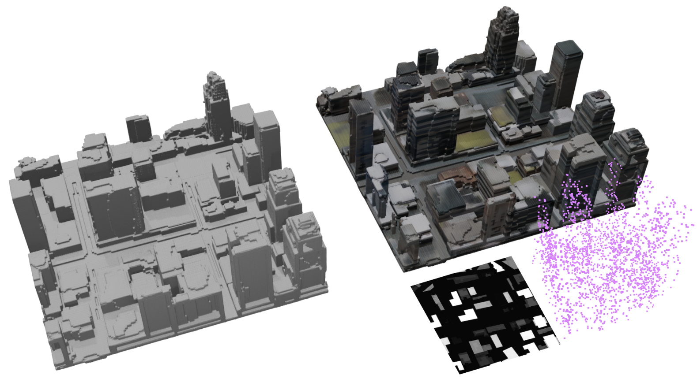  | [Sat2City: 3D City Generation from A Single Satellite Image with Cascaded Latent Diffusion](https://arxiv.org/abs/2507.04403) | 2025 | ICCV  | [](https://ai4city-hkust.github.io/Sat2City/) |
|  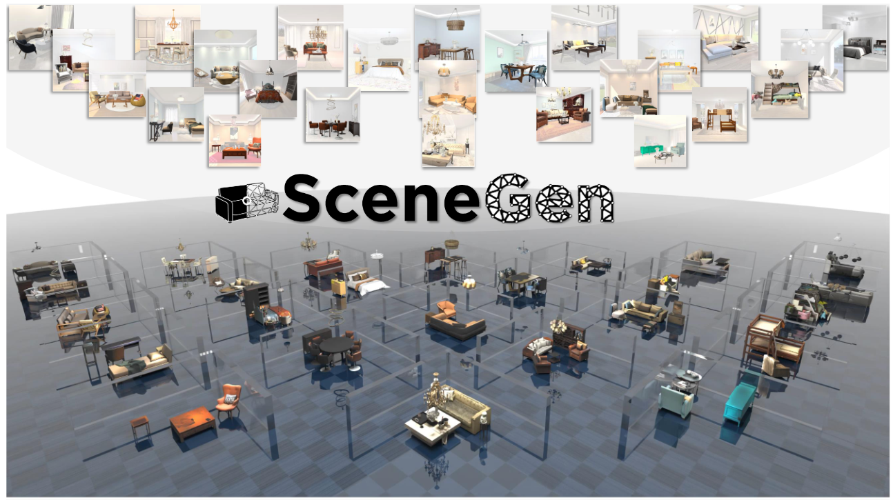  | [SceneGen: Single-Image 3D Scene Generation in One Feedforward Pass](https://arxiv.org/abs/2508.15769) | 2025 |  3DV  | [](https://github.com/Mengmouxu/SceneGen)[](https://mengmouxu.github.io/SceneGen/) |
|   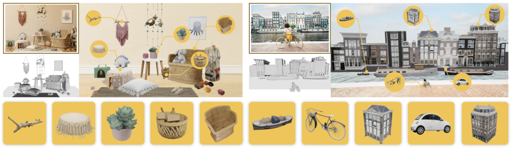    | [SAM 3D: 3Dfy Anything in Images](https://arxiv.org/abs/2511.16624v1) | 2025 | Arxiv | [](https://github.com/facebookresearch/sam-3d-objects)[](https://ai.meta.com/sam3d/) |

## Rule-driven

|                       Preview                       | Title                                                        | Year |     Pub.      |                            Links                             |
| :-------------------------------------------------: | ------------------------------------------------------------ | ---- | :-----------: | :----------------------------------------------------------: |
|      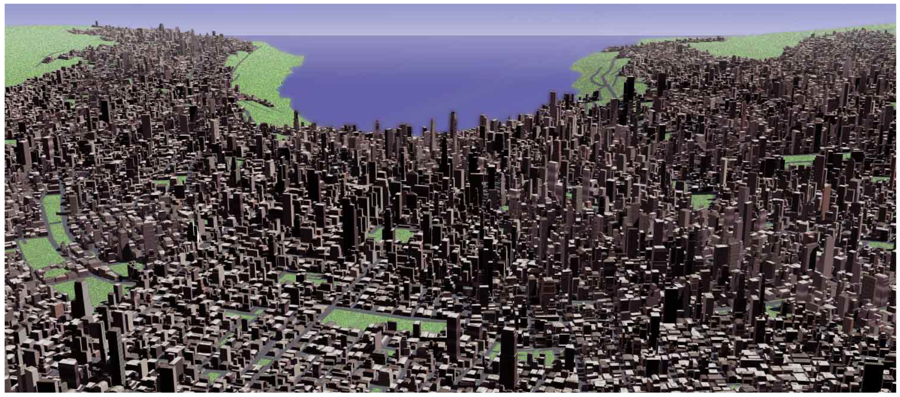       | [Procedural Modeling of Cities](https://cgl.ethz.ch/Downloads/Publications/Papers/2001/p_Par01.pdf) | 2001 |   SIGGRAPH    | [](https://phiresky.github.io/procedural-cities/presentation.html) |
|    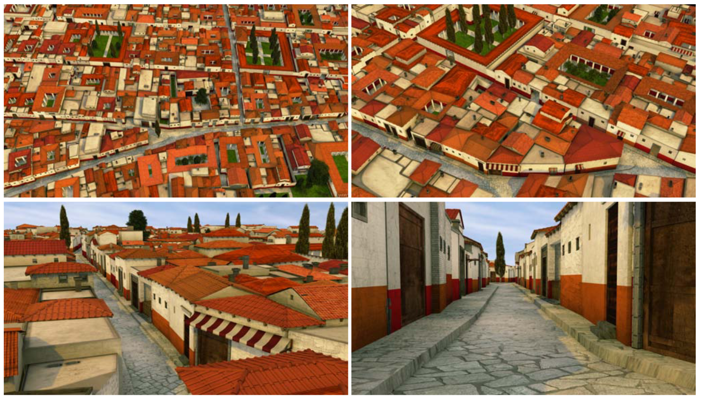     | [Procedural modeling of buildings](https://dl.acm.org/doi/pdf/10.1145/1141911.1141931) | 2006 |      TOG      |                              /                               |
|   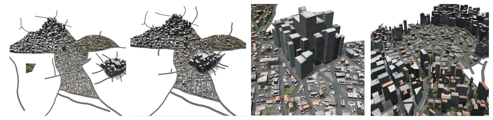   | [Interactive Modeling of City Layouts using Layers of Procedural Content](https://www.cg.tuwien.ac.at/research/publications/2011/lipp2011a/lipp2011a-draft.pdf) | 2011 |      CGF      |                              /                               |
|   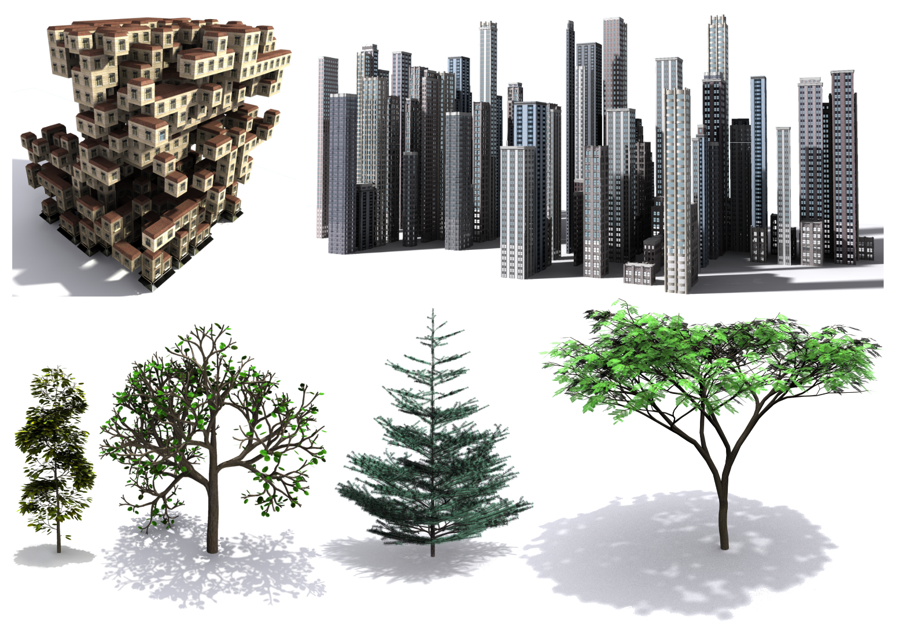    | [Metropolis Procedural Modeling](https://vladlen.info/papers/metropolis.pdf) | 2011 |     ICLR      |                              /                               |
|      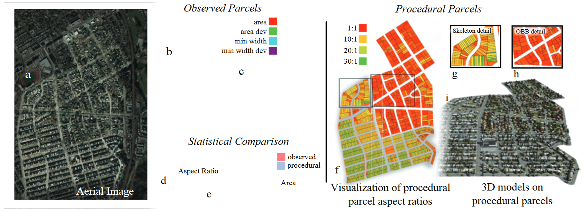      | [Procedural Generation of Parcels in Urban Modeling](https://www.cs.purdue.edu/cgvlab/www/resources/papers/Vanegas-Eurographics-2012-Procedural_Generation_of_Parcels_in_Urban_Modeling.pdf) | 2012 |      CGF      |                              /                               |
|    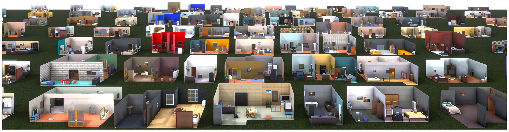     | [ProcTHOR: Large-Scale Embodied AI Using Procedural Generation](https://arxiv.org/abs/2206.06994) | 2022 |     Arxiv     | [](https://github.com/allenai/procthor)[](https://procthor.allenai.org/) |
|    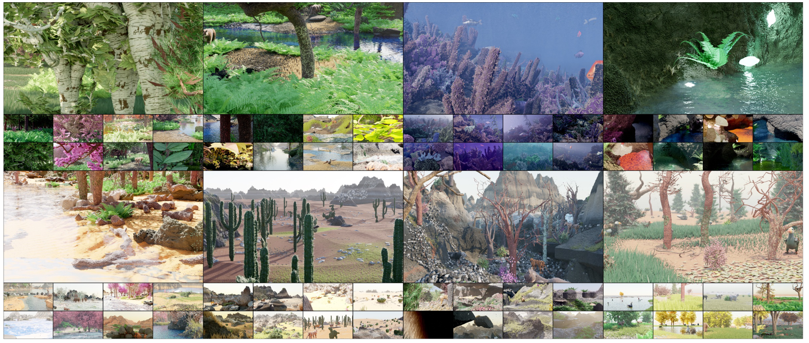    | [Infinite Photorealistic Worlds using Procedural Generation](https://arxiv.org/abs/2306.09310) | 2023 |     CVPR      | [](https://github.com/princeton-vl/infinigen)[](https://infinigen.org/) |
|  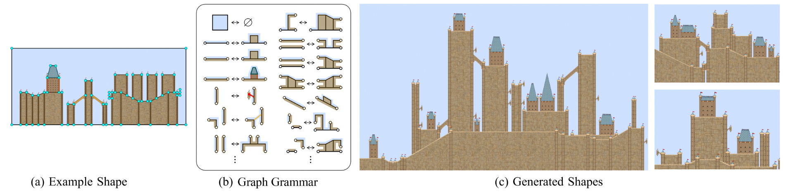   | [Example-Based Procedural Modeling Using Graph Grammars](https://arxiv.org/pdf/2309.00275v1) | 2023 |      TOG      |                              /                               |
|      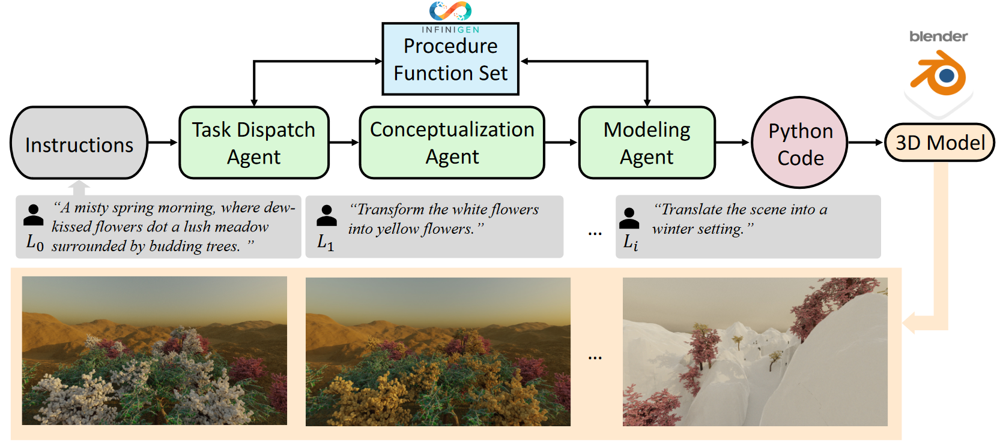      | [3D-GPT: Procedural 3D Modeling with Large Language Models](https://arxiv.org/abs/2310.12945) | 2023 |      3DV      | [](https://github.com/Chuny1/3DGPT)[](https://chuny1.github.io/3DGPT/3dgpt.html) |
|   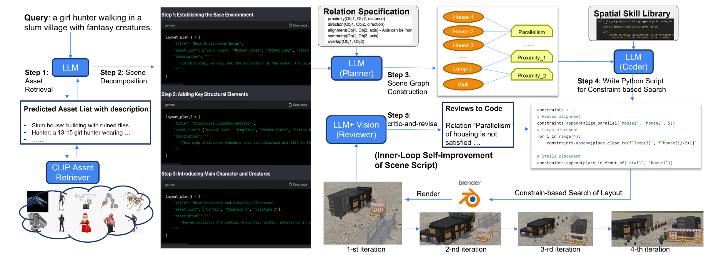   | [SceneCraft: An LLM Agent for Synthesizing 3D Scene as Blender Code](https://arxiv.org/abs/2403.01248) | 2024 |     ICML      |                              /                               |
|     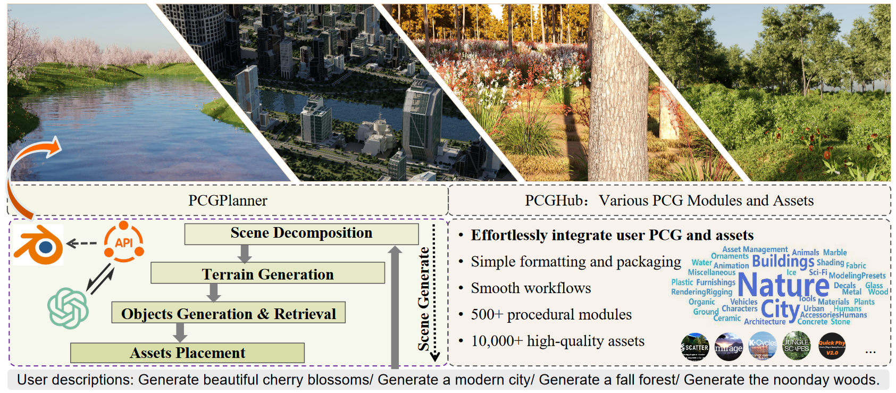      | [SceneX: Procedural Controllable Large-scale Scene Generation](https://arxiv.org/abs/2403.15698) | 2024 |     Arxiv     | [](https://github.com/zhouzq1/SceneX)[](https://zhouzq1.github.io/SceneX-LAB.github.io/) |
| 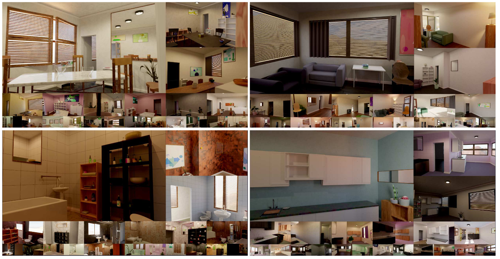 | [Infinigen Indoors: Photorealistic Indoor Scenes using Procedural Generation](https://arxiv.org/abs/2406.11824) | 2024 |     CVPR      | [](https://github.com/princeton-vl/infinigen)[](https://infinigen.org/) |
|      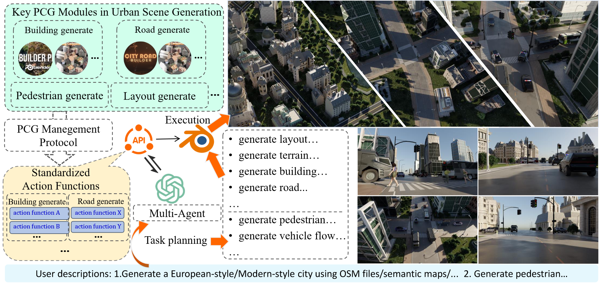      | [CityX: Controllable Procedural Content Generation for Unbounded 3D Cities](https://arxiv.org/abs/2407.17572) | 2024 |     Arixv     | [](https://github.com/cityx-lab/CityX-Lab)[](https://cityx-lab.github.io/) |
|     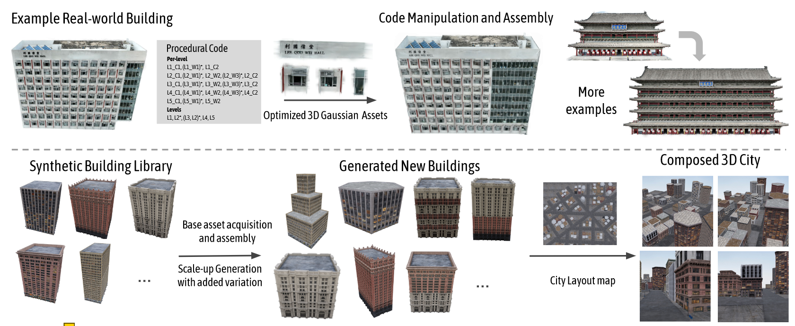      | [Proc-GS: Procedural Building Generation for City Assembly with 3D Gaussians](https://arxiv.org/abs/2412.07660) | 2024 |     Arxiv     | [](https://github.com/city-super/ProcGS)[](https://city-super.github.io/procgs/) |
|      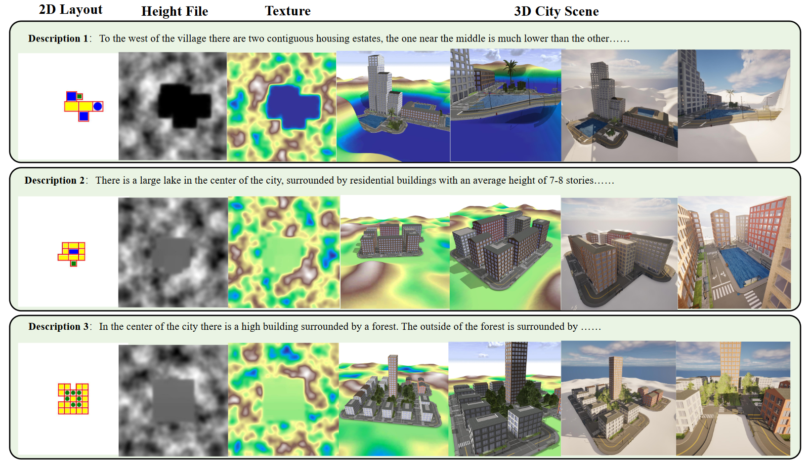       | [Text-Guided Editable 3D City Scene Generation](https://ieeexplore.ieee.org/document/10889459) | 2025 |    ICASSP     |                              /                               |
|     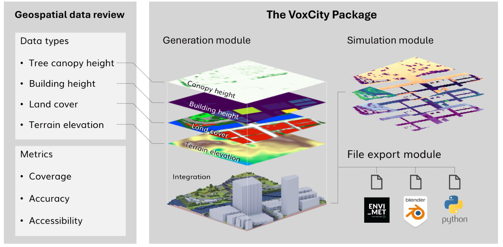     | [VoxCity: A Seamless Framework for Open Geospatial Data Integration, Grid-Based Semantic 3D City Model Generation, and Urban Environment Simulation](https://arxiv.org/abs/2504.13934) | 2025 |     Arxiv     | [](https://github.com/kunifujiwara/VoxCity)[](https://voxcity.readthedocs.io/en/latest/) |
|  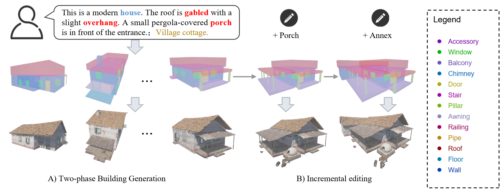  | [BuildingBlock: A Hybrid Approach for Structured Building Generation](https://arxiv.org/abs/2505.04051) | 2025 |   SIGGRAPH    |                              /                               |
|    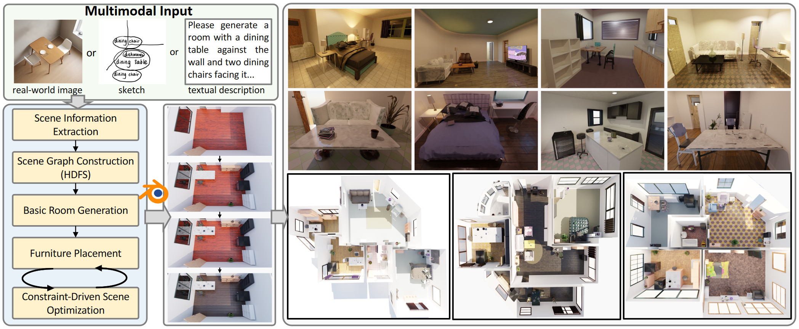    | [RoomCraft: Controllable and Complete 3D Indoor Scene Generation](https://arxiv.org/abs/2506.22291) | 2025 |     ICML      |                              /                               |
| 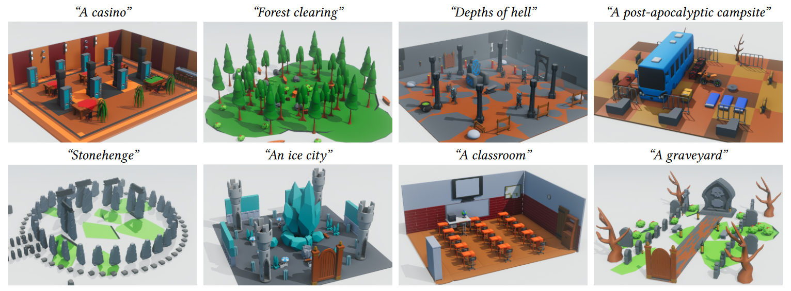 | [Procedural Scene Programs for Open-Universe Scene Generation: LLM-Free Error Correction via Program Search](https://arxiv.org/abs/2510.16147) | 2025 | SIGGRAPH Asia |                              /                               |

# 3D Datasets

